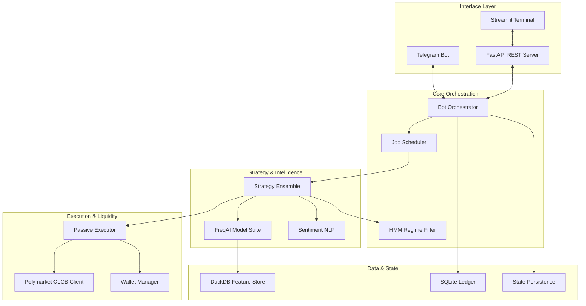

# Quant Agentic Trading Core

<p align="center">
  
</p>

Agentic trading bot for Polymarket CLOB — ingests Telegram signals, sizes via Kelly + HMM regime filter, executes maker-first with passive order placement. Backed by a FastAPI REST API, Streamlit dashboard, MCP tool server, and a continuous-improvement agent system.

## Context7 Policy

This project treats Context7 (`https://github.com/upstash/context7`) as a documentation-only rule for all AI assistants used here, including Gemini, Copilot, OpenCode, and Codex.

- Use Context7 before relying on any external API, SDK, or setup/configuration detail.
- Do not treat Context7 as a runtime dependency.
- The authoritative local instructions are [`CLAUDE.md`](/home/ogj9f33gvvzc/quant-agentic-trading-core-v2/CLAUDE.md) and [`.cursorrules`](/home/ogj9f33gvvzc/quant-agentic-trading-core-v2/.cursorrules).

## Architecture



## 🏗 Architecture & Structure du Projet

Le projet a été restructuré selon une architecture **modulaire et orientée domaine** pour une robustesse institutionnelle. Chaque composant communique via des schémas de données stricts (`src/schemas`).

### 🧩 Composants Clés
*   **Predictive matrix (`src/schemas/prediction`)** : Combine XGBoost, LightGBM et TimesFM pour des prévisions calibrées.
*   **Risk Layer (`src/services/portfolio_risk_engine.py`)** : Applique le critère de Kelly et des filtres de régime HMM.
*   **Execution Engine (`src/polymarket/execution`)** : Gère les ordres Maker-first et les stratégies TWAP fragmentées.

Consultez la [Documentation Architecturale](docs/schemas/architecture_overview.md) pour plus de détails.

### 📂 Organisation des Dossiers
*   **`src/app/`** : Points d'entrée de l'application (CLI, TUI, Dashboard).
*   **`src/core/`** : Orchestration centrale, sécurité et gestion du cycle de vie.
*   **`src/polymarket/`** : Logique spécifique à Polymarket CLOB, exécution et gestion de portefeuille.
*   **`src/strategies/`** : Implémentations quantitatives (Arbitrage, ML Forecasting, NLP Sentiment).
*   **`src/services/`** : Services autonomes (Risk Engine, Cognitive Brain, Metrics).
*   **`src/schemas/`** : Modèles de données partagés et contrats inter-modules.
*   **`src/agents/`** : Personas de trading agentiques et swarms.
*   **`src/utils/`** : Utilitaires techniques partagés (Logging, Config, Vault).

## Intelligence & Tools

### AI Ensemble

The bot utilizes a multi-model ensemble for high-conviction signals:
*   **HybridQuantModel**: Stacking XGBoost, LightGBM, and RandomForest.
*   **TimesFM**: Zero-shot time-series forecasting via Google's Foundation Model.
*   **Sentiment NLP**: Real-time Groq/Llama-3 analysis of Telegram context.

### Codebase Intelligence (`/understand`)

Powered by the `understand-anything` suite, providing deep insights into the bot's own logic:

| Commande | Usage |
|---|---|
| `/understand` | Analyser un codebase → graphe de connaissance interactif |
| `/understand_explain` | Explication détaillée d'un fichier/fonction/module |
| `/understand_chat` | Poser des questions sur le code via le graphe |
| `/understand_diff` | Analyser des diffs/PRs |
| `/understand_dashboard` | Dashboard web interactif (FastAPI) |
| `/understand_domain` | Extraire la connaissance métier |
| `/understand_onboard` | Générer des guides d'onboarding |

---

All volatile data and state are managed in the `runtime/` directory:
*   `runtime/database/`: SQLite and DuckDB files.
*   `runtime/logs/`: Detailed execution logs.
*   `runtime/user_data/`: Model weights (.pkl), FreqAI metadata, and strategy artifacts.
*   `runtime/agent_memory/`: Long-term agent context and semantic state.

| File | Purpose |
|---|---|
| `constants.py` | Regime labels, sizing multipliers, execution mode set, fusion modes, default maker timeout |
| `ledger_schema.sql` | SQLite DDL for capital allocation, positions, transactions, paper_positions, execution_config |
| `agent_integrations.json` | External agent framework catalog (Scrapling, Hermes, PraisonAI, etc.) |
| `ai_specialists.json` | 10 specialist AI roles with priority files, output contracts, provider policies |
| `free_ai_provider_sources.json` | Ethical free-tier AI provider discovery config |
| `llm_council.json` | OpenRouter-backed LLM Council config (4 models, safety guardrails) |
| `mcp_tools.json` | 29 MCP tool schema definitions |
| `mirofish.json` | MiroFish swarm simulation config (5 agent cohorts, guardrails) |
| `project_contexts.json` | Context index for 7 external projects + 4 local skills |

### Ledger (`ledger/`)

| File | Purpose |
|---|---|
| `ledger_db.py` | SQLite persistence for capital allocation, positions, transactions, paper positions, execution config |

### Utils (`utils/`)

| File | Purpose |
|---|---|
| `vault_handler.py` | HashiCorp Vault client — fetches required trading secrets plus optional agent/provider keys |
| `feature_store.py` | DuckDB columnar storage — 5 tables (microstructure, features, signals, decisions, replay cursor) |
| `data_archiver.py` | Hot/warm/cold tiered storage — Parquet ZSTD export, log compression, warm archive cleanup |
| `signal_parser.py` | Deterministic regex parser (`BUY SOL @ 0.50`) + semantic keyword classifier |
| `scrapling_adapter.py` | Optional Scrapling adapter for lightweight CSS-selector web scraping |
| `derive_clob_creds.py` | Derives Polymarket CLOB API credentials from an Ethereum private key |
| `exceptions.py` | `QuantFatal` — non-recoverable system error |
| `llm_council.py` | OpenRouter-backed LLM Council: first opinions, anonymized review, chairman synthesis |
| `ai_specialists.py` | Specialist AI role resolver with provider routing |
| `project_context.py` | Context loader for project/agent integration |
| `mirofish_adapter.py` | Bounded swarm simulation adapter for prediction research briefs |
| `regime_utils.py` | HMM regime label mapping and utility helpers |

### Scripts (`scripts/`)

| File | Purpose |
|---|---|
| `train_all.py` | Full hyperparameter search across 6 tickers with 10 configs each, walk-forward validation, top-1% config selection |
| `llm_council.py` | CLI for running LLM Council queries via OpenRouter |
| `mirofish_plan.py` | CLI for building MiroFish-style swarm simulation plans |
| `sync_optional_vault_keys.py` | Syncs allowlisted optional provider keys from env to Vault |
| `discover_free_ai_providers.py` | Ethical discovery of free-tier AI providers |
| `dump_project.py` | Dumps all source files into one text file for LLM context |
| `dump_project.sh` | Bash equivalent of dump_project.py |

### Continuous Improvement (`continuous_improvement/`)

| File | Purpose |
|---|---|
| `ci_agent.py` | Continuous improvement agent core — monitors performance, suggests improvements |
| `knowledge_base.py` | Structured knowledge base for trading patterns and past decisions |
| `analyzer.py` | Analyzes execution outcomes and suggests strategy tweaks |
| `skills/` | 9 skill modules (arbitrage, risk assessment, execution tuning, etc.) |

### Entry Points

| File | Purpose |
|---|---|
| `main_agentic_clob.py` | CLI: `--mode REPLAY|PAPER|SHADOW|PROD`, `--dry-run`, `--resolve-chat`, `--maintenance` |
| `api/api_server.py` | FastAPI REST server — 13 endpoints for ledger, regime, circuit breaker, execution mode, arbitrage, sentiment, feature store |
| `api/dashboard.py` | Streamlit dashboard — metric cards, positions table, arbitrage scanner, sentiment widget, execution controls |

### Documentation

| File | Purpose |
|---|---|
| `docs/README.md` | Documentation index |
| `docs/web_first_architecture.md` | Web-first ingestion, CLOB snapshots, output formatting, FeatureStore persistence |
| `docs/api_and_mcp.md` | HTTP API and MCP server surface |
| `docs/execution_and_risk.md` | Risk engine, execution modes, and safety gates |
| `docs/telegram_ingestion.md` | Telegram listener, command routing, and signal intake |
| `docs/ledger_and_wallets.md` | Ledger persistence and wallet storage |
| `docs/configuration.md` | Constants and secret-loading policy |
| `docs/scripts_and_training.md` | Training and maintenance scripts |

## Execution Modes

| Mode | Logging | Capital | Real Orders | Use Case |
|---|---|---|---|---|
| `REPLAY` | Feature store only | None | No | Backtest against historical signals |
| `PAPER` | Feature store + paper ledger | Virtual | No | Strategy validation |
| `SHADOW` | Full ledger | Real (1% mini) | Yes (maker-first) | Dry-run with minimal risk |
| `PROD` | Full ledger | Real (full size) | Yes (maker-first) | Production |

## Installation

```bash
# Prerequisites: Python 3.11, HashiCorp Vault
./setup.sh
```

The setup script provisions:
- Python 3.11 virtual environment (`.venv/`)
- Python dependencies (freqtrade, torch, scikit-learn, py-clob-client, etc.)
- HashiCorp Vault dev server
- PM2 process manager config
- systemd service

## Configuration

### `config/` vs `.env`

- `config/health.json` and `config/trading.json` hold non-secret operational defaults.
- `.env` holds secrets, deployment-specific overrides, and live access flags.
- The runtime loads `config/*.json` first, then lets `.env` override explicit keys when present.
- Move business thresholds out of `.env` unless they are meant to vary per deployment.
- Keep secrets out of `config/*.json`; they belong in `.env` or Vault.

Current division:

- `config/health.json`: staleness, memory, wallet drift thresholds.
- `config/trading.json`: trade fee estimates, calibration and execution policy defaults.

### Vault Secrets

Inject 7 required secrets:
 
 ```bash
 vault kv put secret/quant-trade \
   TELEGRAM_BOT_TOKEN="your_bot_token" \
   CLOB_PRIVATE_KEY="0x..." \
   GROQ_API_KEY="gsk_..." \
   ENCRYPTION_KEY="your_fernet_key"
 ```

Optional agent/provider keys can be patched into the same Vault path when needed:

```bash
vault kv patch secret/quant-trade \
  OPENAI_API_KEY="sk-..." \
  ANTHROPIC_API_KEY="sk-ant-..." \
  OPENROUTER_API_KEY="sk-or-..."
```

Or sync allowlisted optional keys already present in the process environment:

```bash
source .vault_env
export OPENROUTER_API_KEY="sk-or-..."
python scripts/sync_optional_vault_keys.py --dry-run
python scripts/sync_optional_vault_keys.py
```

The sync command only accepts keys listed in `utils/vault_handler.py` and never
prints secret values.

Derive and inject CLOB credentials:

```bash
python -c "
from utils.derive_clob_creds import derive_clob_credentials
c = derive_clob_credentials('0x...')
import subprocess
subprocess.run(['vault', 'kv', 'patch', 'secret/quant-trade',
  f'CLOB_API_KEY={c[\"CLOB_API_KEY\"]}',
  f'CLOB_API_SECRET={c[\"CLOB_API_SECRET\"]}',
  f'CLOB_API_PASSPHRASE={c[\"CLOB_API_PASSPHRASE\"]}'])
"
```

### Environment Variables

| Variable | Required | Default | Description |
|---|---|---|---|
| `VAULT_ADDR` | No | `http://127.0.0.1:8200` | HashiCorp Vault address |
| `VAULT_TOKEN` | Yes | — | Vault authentication token |
| `CHAT_ID` | No | — | Telegram chat ID (numeric, e.g. `-1002222224501`) |
| `TARGET_CHANNEL` | No | — | Telegram @channel username |
| `TELEGRAM_PRIVATE_CHAT_IDS` | No | — | Comma-separated list of allowed private chat IDs (e.g. `123,-456`) |
| `TELEGRAM_PRIVATE_ENABLED` | No | `1` | Set to `0` to disable private message handling entirely |
| `ENCRYPTION_KEY` | No | — | Fernet key for `data/default.enc` (auto-generated if missing) |

### Telegram Private Chat Configuration

The bot supports private 1-on-1 messages in addition to channel/group listening:

- **`TELEGRAM_PRIVATE_CHAT_IDS`** — restrict private chat access to specific user/group IDs. If unset, all private chats are accepted (a warning is logged).
- **`TELEGRAM_PRIVATE_ENABLED=0`** — disable private message processing entirely.

Private chat handling includes:
- Commands (`/help`, `/status`, `/mode`) always reply privately
- Authorized private signals are processed the same as channel messages
- Unrecognized private messages trigger an automated help response
- Unauthorized private chats receive a rejection message

### Optional Agent/Web Integrations

The optional integration registry lives in `config/agent_integrations.json`:

| Integration | Use |
|---|---|
| Scrapling | Adaptive web scraping via `utils.scrapling_adapter.scrape_text()` |
| Hermes Agent | External reference for self-improving agent, skills, memory, tools, and MCP patterns |
| PraisonAI | Optional Python multi-agent SDK (`praisonaiagents`) |
| Meta-Agent-with-More-Agents | External reference for meta-agent delegation patterns |
| Solana Jupiter Arbitrage Bot | External reference for Jupiter quote/swap arbitrage; isolated from Polymarket CLOB execution |
| LLM Council | Local OpenRouter-backed council pattern: first opinions, anonymized review, chairman synthesis |
| MiroFish | Local planning adapter for bounded swarm simulation and prediction research briefs |
| Graphify | Recommended context-compression tool (`graphifyy`) for queryable codebase knowledge graphs |
| Claude-Mem | External reference for progressive persistent memory and compact observation retrieval |
| Everything Claude Code | External reference for Codex-compatible skills, AGENTS.md patterns, and cost-aware workflows |
| Superpowers | External reference for spec-first, TDD-oriented agent methodology |
| Ruflo | External reference for bounded multi-agent orchestration and RAG workflow patterns |
| OpenBB | External reference for financial data aggregation, research dashboards, and agent-friendly market data tooling |
| Market Intelligence Platform App | Local Python adapter for crypto/Polymarket market intelligence reports |

For low-token agent workflows, use `config/project_contexts.json` or the MCP tools
`list_project_contexts`, `get_project_context`, and `list_local_skill_contexts`
before loading any full external project content.

Project prompt memory is available through `continuous_improvement/knowledge_base/project_memory.json`,
`utils.prompt_memory`, and MCP tools:

| Tool | Use |
|---|---|
| `get_project_prompt_context` | Builds a compact prompt bundle with agent rules, persistent memory, recent decisions, context cards, and Graphify availability |
| `list_project_memory` | Reads durable compact notes by component/tag |
| `record_project_memory` | Adds a durable note for future prompts; never store secrets or raw private data |

Local CLI equivalent:

```bash
python scripts/project_memory.py context --task "Review execution risk" --specialist-id execution_engineer
python scripts/project_memory.py record execution "Maker-first fallback must preserve ledger reservations." --kind decision --tag risk
```

Graphify is the preferred local codebase map when an agent needs cross-file
understanding without paying for a full repository dump:

```bash
pip install graphifyy
graphify install --platform codex
graphify update .
graphify cluster-only . --no-viz
graphify query "How does a Telegram signal reach the risk engine?"
```

The `.graphifyignore` file excludes runtime state, secrets, caches, logs,
databases, encrypted user data, model artifacts, and large dumps. Keep using
`scripts/dump_project.py` only for explicit full-context exports.

Crypto market intelligence, adapted in Python from the Market Intelligence
Platform App reference:

```bash
python scripts/crypto_market_intelligence.py --limit 30
python scripts/crypto_market_intelligence.py --query bitcoin --json
```

The REST API exposes the same advisory report:

```bash
curl "http://127.0.0.1:8000/v1/market-intelligence/crypto?limit=30&as_text=true"
```

This layer ranks crypto prediction markets and risk flags only. It does not
execute trades or bypass parser, risk, ledger, HMM, or execution-mode checks.

Specialized AI roles live in `config/ai_specialists.json`. Provider discovery is
configured in `config/free_ai_provider_sources.json` and is intentionally
quota-aware: it supports legitimate free tiers and local models, not rate-limit
bypass or key scraping.

Use the `project_fusion_architect` specialist before adding a new external repo.
It is responsible for license/dependency review, context cards, isolated adapters,
MCP exposure, guardrails, tests, and rollback notes.

```bash
python scripts/discover_free_ai_providers.py
```

LLM Council dry-run and live execution:

```bash
python scripts/llm_council.py "Should this trading change ship?" --dry-run
python scripts/llm_council.py "Review this architecture decision" --max-models 2
```

Live execution requires `OPENROUTER_API_KEY` from the environment or Vault. Council
answers are advisory only; they do not bypass parser, risk, ledger, or execution
mode guardrails.

MiroFish-style simulation plans:

```bash
python scripts/mirofish_plan.py "What could move SOL-related prediction markets this week?" \
  --seed "Recent market/news/sentiment summary" \
  --rounds 12 \
  --agents 24
```

The adapter is planning-only and does not vendor upstream AGPL code. Use it to
create compact swarm-simulation briefs before asking local agents or an LLM
council to reason over the scenario.

## Usage

```bash
# Dry-run validation (no external connections)
python main_agentic_clob.py --dry-run

# Discover Telegram chat ID
python main_agentic_clob.py --resolve-chat

# Paper trading (default)
python main_agentic_clob.py

# Production — real capital at risk
python main_agentic_clob.py --mode PROD

# Replay historical signals from feature store
python main_agentic_clob.py --mode REPLAY

# Archive maintenance
python main_agentic_clob.py --maintenance

# Train models with progress bar
python scripts/train_all.py

# Dump the source project into one text file for review or LLM context
python scripts/dump_project.py -o project_dump.txt

# FastAPI REST server
uvicorn api.api_server:app --host 0.0.0.0 --port 8000

# Streamlit dashboard
streamlit run api/dashboard.py

# PM2 managed
pm2 start ecosystem.config.js

# systemd managed
sudo systemctl start quant-agentic-trading-core
```

## Signal Format

### Deterministic (Regex)

```
BUY SOL @ 0.50
SELL BTC @ 0.75
LONG ETH @ 0.62
SHORT LINK @ 0.41
```

Supported assets: `SOL`, `BTC`, `ETH`, `USDC`, `POLY`, `LINK`, `ARB`, `OP`

### Semantic (LLM)

Any message containing trading keywords (`buy`, `sell`, `long`, `short`, `entry`, `exit`, `tp`, `sl`, `signal`, etc.) is forwarded to the LLM for extraction.

## MCP Server

Exposes 29 tools over stdio transport (configured in `config/mcp_tools.json`):

| Tool | Description |
|---|---|
| `get_ledger_state` | Active positions, capital allocation, available capital |
| `get_market_regime` | HMM regime label, dissimilarity index, trading allowed |
| `emergency_circuit_breaker` | Freeze/unfreeze all outbound trading |
| `set_execution_mode` | Change mode at runtime (REPLAY/PAPER/SHADOW/PROD) |
| `get_executor_metrics` | PassiveExecutor fill-rate, queue depth, fallback stats |
| `get_arbitrage_opportunities` | Current arbitrage scanner opportunities |
| `get_feature_store_stats` | Row counts per DuckDB table |
| `get_feature_history` | Historical feature values by ticker |
| `friction_model_*` | Friction/impact model tools |
| `lobstar_signal_bridge` | Bridge between LOBSTAR semantic signals and execution |
| `project_context_*` | Project context listing, retrieval, and skill context tools |
| `ai_specialist_*` | Specialist role resolver and provider routing |
| `llm_council_*` | Council orchestration and results retrieval |
| `mirofish_*` | Swarm simulation planning and execution |

## API Server (FastAPI)

`api/api_server.py` exposes 13 REST endpoints:

| Endpoint | Method | Description |
|---|---|---|
| `/health` | GET | Health check |
| `/v1/ledger` | GET | Ledger state |
| `/v1/regime` | GET | Market regime (query param: `ticker`) |
| `/v1/circuit-breaker` | POST | Engage/disengage circuit breaker |
| `/v1/execution-mode` | GET/POST | Get or set execution mode |
| `/v1/executor/metrics` | GET | PassiveExecutor fill-rate, queue depth |
| `/v1/arbitrage` | GET | Current arbitrage opportunities |
| `/v1/arbitrage/scan-mispricing` | POST | Run IPV mispricing scan |
| `/v1/sentiment` | POST | Analyze single text sentiment |
| `/v1/sentiment/batch` | POST | Batch sentiment analysis |
| `/v1/feature-store` | GET | Feature store table stats |
| `/v1/features/{ticker}/{feature_name}` | GET | Historical feature values |

```bash
uvicorn api.api_server:app --host 0.0.0.0 --port 8000
```

## Dashboard (Streamlit)

`api/dashboard.py` provides a browser-based UI with:
- 4-column metric cards (total capital, available, execution mode, open positions, beta exposure, market regime, feature store rows)
- Open positions data table
- Feature store stats table
- Sentiment Analyzer interactive widget
- Arbitrage Scanner (mispricing_ipv, sum_inefficiency, conditional_overpricing)
- Execution Mode control (dropdown + apply)

```bash
streamlit run api/dashboard.py
```

## Continuous Improvement Agent

The `continuous_improvement/` module provides an autonomous CI agent system:

- **ci_agent.py** — monitors execution outcomes, analyzes performance drift, suggests strategy improvements
- **knowledge_base.py** — structured knowledge base cataloging trading patterns, past decisions, and outcomes
- **analyzer.py** — performs post-hoc analysis of filled vs. unfilled orders, slippage patterns, regime prediction accuracy
- **skills/** — 9 modular skill files covering arbitrage detection, risk assessment, execution tuning, feature importance analysis, and more

The CI agent integrates with the MCP server and can be queried via the `ci_agent_*` MCP tools.

## Tests

```bash
pytest tests/ -v
# 224 tests across 13 test files
```

## Security Scan

```bash
make bandit
```

| Test File | Tests | Coverage |
|---|---|---|
| `test_portfolio_risk_engine.py` | 44 | Kelly, vol target, regime multiplier, concentration, drawdown, beta exposure |
| `test_hybrid_quant_model.py` | 24 | Fit, predict, save/load, feature importance, edge cases |
| `test_training_pipeline.py` | 18 | Training, rolling train, walk-forward, auto-retrain |
| `test_feature_store.py` | 18 | Schema, CRUD, replay, purge, export |
| `test_execution_modes.py` | 14 | REPLAY/PAPER/SHADOW/PROD mode routing |
| `test_probability_calibrator.py` | 10 | Platt, Isotonic, Ensemble, Brier tracking |
| `test_core_pipeline.py` | 9 | Circuit breaker, capital validation, order imbalance, TAM |
| `test_arbitrage_scanner.py` | 8 | Sum inefficiency, conditional overpricing, signal conversion |
| `test_data_archiver.py` | 6 | Log compression, archive cleanup, disk usage |
| `test_passive_executor.py` | 18 | Maker-first, taker fallback, timeouts, concurrent orders, edge cases |
| `test_sentiment_analyzer.py` | + | NLP sentiment scoring, batch processing |
| `test_regime_utils.py` | + | Regime label mapping helpers |
| `test_ci_agent.py` | + | CI agent analysis and knowledge base queries |

## Risk Controls

- **Kelly Criterion** — fraction of capital sized by win probability × win/loss ratio (default 25% max)
- **HMM Regime Filter** — 3-state Gaussian HMM; zero allocation in `ERRATIC_VOLATILITY` regime
- **Concentration Cap** — 30% max per asset
- **Correlated Drawdown** — 15% net beta exposure limit
- **Circuit Breaker** — ledger enforces `allocated_pct` hard cap; MCP tool for emergency freeze
- **Maker-First Execution** — post-only orders avoid toxic spread; taker fallback on timeout
- **4 Execution Modes** — graduated capital deployment from REPLAY → PROD

## 📂 Structure du Projet

Le projet suit une architecture modulaire et domaine-orientée, centralisée dans le dossier `src/`.

```text
quant-agentic-trading-core/
├── src/
│   ├── agents/          # Personas de trading (PolyBot, etc.)
│   ├── app/             # Entrées CLI, API FastAPI et TUI Streamlit
│   ├── core/            # Logique d'orchestration, scheduler et sécurité
│   ├── database/        # Moteur SQLite (Ledger)
│   ├── interface/       # Interface Telegram et gestion des commandes
│   ├── polymarket/      # Moteur d'exécution, SDK CLOB et Wallet Manager
│   ├── schemas/         # Contrats de données et modèles techniques
│   ├── services/        # Services autonomes (Risk Engine, IA, Metrics)
│   ├── strategies/      # Algorithmes quantitatifs (Arbitrage, ML, Sentiment)
│   └── utils/           # Utilitaires globaux (Logging, Config, Vault, Tickers)
├── runtime/             # État volatil (Bases de données, Logs, Modèles IA)
├── tests/               # Suite de tests complète (815 tests passés)
├── configs/             # Configuration métier (Trading, Risk, Agents)
├── scripts/             # Scripts d'entraînement et utilitaires CLI
├── .env.example         # Template des variables d'environnement
├── main_agentic_clob.py # Point d'entrée principal
└── ecosystem.config.js  # Configuration PM2 pour le déploiement
```

## License

MIT — see [LICENSE](LICENSE).
