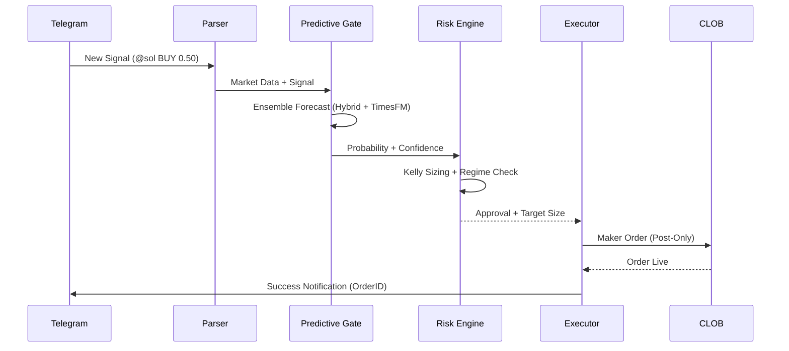

# Project Architecture

## Global Workflow

## Modular Components

### 1. Predictive Matrix
The `PolymarketPredictiveEngine` combines:
- **XGBoost/LightGBM/RF** for tabular feature extraction.
- **TimesFM** for zero-shot trend analysis.
- **Isotonic Calibration** for Brier score optimization.

### 2. Risk Layer
The `PortfolioRiskEngine` enforces:
- **Net Beta Exposure** limits across all positions.
- **Correlated Drawdown** protections.
- **HMM-Based Regime Filtering** (Multiplier reduction in erratic markets).

### 3. Execution Engine
The `PassiveExecutor` manages:
- **Maker-First Logic**: Minimizing slippage and fees.
- **Dynamic Replacements**: Updating price/size as orderbook moves.
- **Taker Fallback**: Ensuring fills if trade objective is critical.
