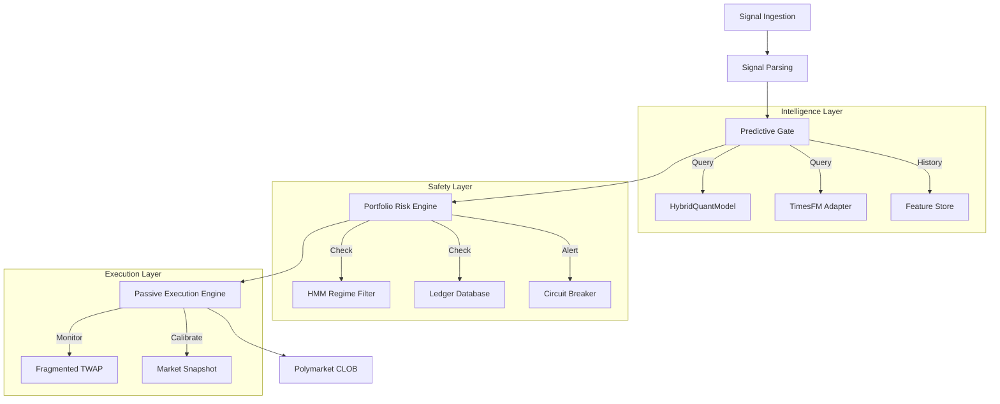

# Lobstar Quant Agentic Trading Core - High-Level Architecture

## Overview
The Lobstar system is an agentic trading architecture designed specifically for the Polymarket CLOB. It follows a modular, reactive design where each component communicates through strictly defined data schemas.

## Component Map

## Modular Structure (`src/`)

- `agents/`: High-level trading personas and swarms.
- `app/`: Application entry points and lifecycle management.
- `core/`: Fundamental logic, initialization, and security.
- `polymarket/`: Polymarket-specific implementation (SDK, Execution).
- `schemas/`: Data contracts between modules.
- `services/`: Specialized engines (Risk, Cognitive Brain, Metrics).
- `strategies/`: Core mathematical strategies (Arbitrage, ML, Sentiment).
- `utils/`: Reusable utilities (Logging, Config, Localization).

## Data Flow Schemas

### 1. Signal Schema
All incoming signals are normalized into a `StrategySignal` object:
- `ticker`: Target asset.
- `side`: BUY/SELL.
- `price`: Target execution price.
- `confidence`: Confidence score (0.0 - 1.0).

### 2. Decision Schema
The `UnifiedScoringOutput` (from `HybridQuantModel`) contains:
- `ml_calibrated_score`: Probabilistic forecast.
- `estimated_edge`: (Score - Odds).
- `ood_alert`: Out-of-Distribution warning.

### 3. Execution Schema
Trades are passed to the `PassiveExecutor` with:
- `maker_only`: Boolean flag for Post-Only orders.
- `slippage_tolerance`: Max deviation allowed.
- `twap_slices`: Number of fragments for large orders.
