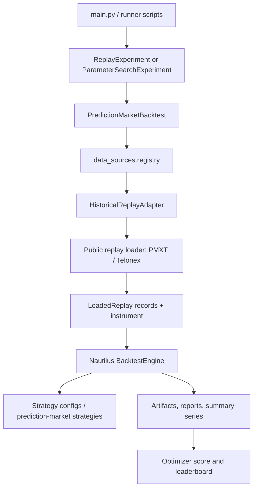

# Codebase UML Inventory

This file is generated from Python AST metadata and excludes `tests/` plus cache, virtualenv, and dot directories.
Generated: 2026-05-16T21:06:08+00:00
Modules: 136 | Classes: 181 | Functions/methods: 1897

## Backtesting Data Flow

## Module Inventory

### `backtests/__init__.py`
- Imports: none

### `backtests/_beffer45_trade_data.py`
- Imports: `__future__`

### `backtests/_script_helpers.py`
- Imports: `__future__, importlib, pathlib, sys`
- Function L8: `ensure_repo_root(script_path: str | Path) -> Path`
- Function L23: `parse_csv_env(raw: str) -> list[str]`
- Function L27: `parse_bool_env(raw: str, *, default: bool = True) -> bool`

### `backtests/polymarket_beffer45_trade_replay_telonex.py`
- Imports: `__future__, collections, csv, datetime, decimal, pathlib, re, typing`
- Function L44: `_decimal(value: object) -> Decimal`
- Function L48: `_trade_notional(trade: Mapping[str, object]) -> Decimal`
- Function L52: `_trade_timestamp(trade: Mapping[str, object]) -> datetime`
- Function L56: `_iso(timestamp: datetime) -> str`
- Function L60: `_group_trades_by_instrument(trades: Iterable[Mapping[str, object]]) -> dict[tuple[str, int], tuple[dict[str, object], ...]]`
- Function L72: `_replay_window(*, slug: str, trades: Sequence[Mapping[str, object]]) -> tuple[str, str]`
- Function L91: `_ledger_cash_pnl(trades: Sequence[Mapping[str, object]]) -> Decimal`
- Function L102: `_ledger_open_quantity(trades: Sequence[Mapping[str, object]]) -> Decimal`
- Function L113: `_ledger_settlement_pnl(trades: Sequence[Mapping[str, object]], realized_outcome: object) -> Decimal | None`
- Function L121: `_sum_notional(trades: Iterable[Mapping[str, object]], *, side: str) -> Decimal`
- Function L128: `_build_replays() -> tuple[Any, ...]`
- Function L160: `_print_ledger_header() -> None`
- Function L187: `_write_comparison_csv(rows: Sequence[Mapping[str, object]]) -> None`
- Function L209: `_print_backtest_comparison(results: Sequence[Mapping[str, Any]]) -> None`
- Function L277: `run() -> None`

### `backtests/polymarket_book_ema_crossover.py`
- Imports: `__future__, decimal`
- Function L18: `run() -> None`

### `backtests/polymarket_book_ema_optimizer.py`
- Imports: `__future__, decimal`
- Function L18: `run() -> None`

### `backtests/polymarket_book_joint_portfolio_runner.py`
- Imports: `__future__, decimal`
- Function L18: `run() -> None`

### `backtests/polymarket_btc_5m_late_favorite_taker_hold.py`
- Imports: `__future__, datetime, decimal`
- Function L26: `_utc_iso(value: datetime) -> str`
- Function L30: `_btc_5m_windows() -> tuple[tuple[str, datetime, datetime], ...]`
- Function L42: `_btc_5m_replays() -> Any`
- Function L65: `run() -> None`

### `backtests/polymarket_btc_5m_pair_arbitrage.py`
- Imports: `__future__, datetime, decimal`
- Function L24: `_utc_iso(value: datetime) -> str`
- Function L28: `_btc_5m_windows() -> tuple[tuple[str, str, str], ...]`
- Function L40: `_btc_5m_replays() -> Any`
- Function L56: `run() -> None`

### `backtests/polymarket_pmxt_book_100_replay_runner.py`
- Imports: `__future__, decimal`
- Function L126: `run() -> None`

### `backtests/polymarket_telonex_book_100_replay_runner.py`
- Imports: `__future__, decimal`
- Function L126: `run() -> None`

### `backtests/polymarket_telonex_book_joint_portfolio_runner.py`
- Imports: `__future__, decimal`
- Function L18: `run() -> None`

### `backtests/private/__init__.py`
- Imports: none

### `backtests/private/telonex_binance_btc_download.py`
- Imports: `__future__, argparse, datetime, dotenv, httpx, os, pathlib, time`
- Function L31: `_parse_date(value: str) -> date`
- Function L35: `_dates(start: date, end: date) -> list[date]`
- Function L44: `_target_path(root: Path, channel: str, day: date) -> Path`
- Function L48: `_download_one(*, client: httpx.Client, base_url: str, api_key: str, root: Path, market_id: str, channel: str, day: date, overwrite: bool, retries: int) -> str`
- Function L95: `main() -> int`

### `backtests/private/telonex_btc_5m_late_favorite_chunked_forward_validate.py`
- Imports: `__future__, backtests, csv, datetime, decimal, dotenv, importlib, json, os, pathlib, subprocess, sys, typing, uuid`
- Function L68: `_run_label() -> str`
- Function L77: `_initial_cash() -> float`
- Function L81: `_parse_utc(value: str) -> datetime`
- Function L85: `_late_favorite_replays(windows: tuple[tuple[str, str, str], ...], *, activation_seconds_before_close: int) -> tuple[object, ...]`
- Function L114: `_deserialize_params(payload: dict[str, str]) -> dict[str, Any]`
- Function L131: `_serialize_params(params: dict[str, Any]) -> dict[str, str]`
- Function L135: `_forward_params() -> dict[str, Any]`
- Function L145: `_strategy_config(params: dict[str, Any]) -> dict[str, Any]`
- Function L157: `_run_experiment(*, name: str, replays: tuple[object, ...], params: dict[str, Any]) -> list[dict[str, Any]]`
- Function L211: `_evaluate_trial_direct(*, trial_id: int, phase: str, replays: tuple[object, ...], params: dict[str, Any]) -> Any`
- Function L232: `_worker_payload(evaluation: object) -> dict[str, Any]`
- Function L248: `_evaluate_trial(*, trial_id: int, phase: str, replays: tuple[object, ...], params: dict[str, Any]) -> Any`
- Function L301: `_aggregate_rows(rows: list[dict[str, Any]], params: dict[str, object]) -> dict[str, Any]`
- Function L346: `run() -> None`

### `backtests/private/telonex_btc_5m_microprice_imbalance_chunked_forward_validate.py`
- Imports: `__future__, backtests, csv, datetime, decimal, dotenv, importlib, json, os, pathlib, subprocess, sys, typing, uuid`
- Function L72: `_run_label() -> str`
- Function L81: `_initial_cash() -> float`
- Function L85: `_deserialize_params(payload: dict[str, str]) -> dict[str, Any]`
- Function L103: `_serialize_params(params: dict[str, Any]) -> dict[str, str]`
- Function L107: `_forward_params() -> dict[str, Any]`
- Function L117: `_strategy_config(params: dict[str, Any]) -> dict[str, Any]`
- Function L125: `_run_experiment(*, name: str, replays: tuple[object, ...], params: dict[str, Any]) -> list[dict[str, Any]]`
- Function L179: `_evaluate_trial_direct(*, trial_id: int, phase: str, replays: tuple[object, ...], params: dict[str, Any]) -> Any`
- Function L200: `_worker_payload(evaluation: object) -> dict[str, Any]`
- Function L216: `_evaluate_trial(*, trial_id: int, phase: str, replays: tuple[object, ...], params: dict[str, Any]) -> Any`
- Function L269: `_aggregate_rows(rows: list[dict[str, Any]], params: dict[str, object]) -> dict[str, Any]`
- Function L314: `run() -> None`

### `backtests/private/telonex_btc_5m_pair_arbitrage_chunked_forward_validate.py`
- Imports: `__future__, backtests, csv, datetime, decimal, dotenv, importlib, json, os, pathlib, subprocess, sys, typing, uuid`
- Function L69: `_run_label() -> str`
- Function L78: `_initial_cash() -> float`
- Function L82: `_serialize_params(params: dict[str, Any]) -> dict[str, str]`
- Function L86: `_deserialize_params(payload: dict[str, str]) -> dict[str, Any]`
- Function L103: `_forward_params() -> dict[str, Any]`
- Function L113: `_strategy_config(params: dict[str, Any]) -> dict[str, Any]`
- Function L125: `_run_experiment(*, name: str, replays: tuple[object, ...], params: dict[str, Any]) -> list[dict[str, Any]]`
- Function L179: `_evaluate_trial_direct(*, trial_id: int, phase: str, replays: tuple[object, ...], params: dict[str, Any]) -> _Evaluation`
- Function L200: `_worker_payload(evaluation: _Evaluation) -> dict[str, Any]`
- Function L216: `_evaluate_trial(*, trial_id: int, phase: str, replays: tuple[object, ...], params: dict[str, Any]) -> _Evaluation`
- Function L269: `_aggregate_rows(rows: list[dict[str, Any]], params: dict[str, object]) -> dict[str, Any]`
- Function L314: `run() -> None`

### `backtests/private/telonex_btc_5m_passive_pair_accumulation_search.py`
- Imports: `__future__, csv, dataclasses, datetime, decimal, dotenv, importlib, json, os, pathlib, random, subprocess, sys, typing, uuid`
- Function L87: `_env_int(name: str, default: int) -> int`
- Function L94: `_env_float(name: str, default: float) -> float`
- Function L101: `_initial_cash() -> float`
- Function L105: `_run_label() -> str`
- Function L114: `_utc_iso(value: datetime) -> str`
- Function L118: `_start_time() -> datetime`
- Function L125: `_btc_5m_windows(*, start: datetime, count: int) -> tuple[tuple[str, str, str], ...]`
- Function L137: `_btc_5m_replays(windows: tuple[tuple[str, str, str], ...]) -> tuple[object, ...]`
- Function L153: `_replays_from_payload(payload: list[dict[str, Any]]) -> tuple[object, ...]`
- Function L168: `_replays_to_payload(replays: tuple[object, ...]) -> list[dict[str, Any]]`
- Function L181: `_candidate(**overrides) -> dict[str, Any]`
- Function L187: `_parameter_samples(*, max_trials: int, random_seed: int) -> list[dict[str, Any]]`
- Function L275: `_serialize_params(params: dict[str, Any]) -> dict[str, str]`
- Function L279: `_deserialize_params(payload: dict[str, str]) -> dict[str, Any]`
- Function L310: `_strategy_config(params: dict[str, Any]) -> dict[str, Any]`
- Function L326: `_run_experiment(*, name: str, replays: tuple[object, ...], params: dict[str, Any]) -> list[dict[str, Any]]`
- Function L380: `_as_float(value: object, *, default: float = 0.0) -> float`
- Function L384: `_as_int(value: object, *, default: int = 0) -> int`
- Function L388: `_parse_time(value: object) -> datetime | None`
- Function L400: `_event_side(result: dict[str, Any], event: dict[str, Any]) -> str`
- Function L407: `_rolling_cash_required(results: list[dict[str, Any]]) -> float`
- Function L462: `_evaluate_results(*, trial_id: int, phase: str, params: dict[str, Any], results: list[dict[str, Any]], replay_count: int) -> _Evaluation`
- Function L526: `_worker_payload(evaluation: _Evaluation) -> dict[str, Any]`
- Function L542: `_evaluation_from_worker_payload(*, trial_id: int, phase: str, params: dict[str, Any], payload: dict[str, Any]) -> _Evaluation`
- Function L567: `_evaluate_trial_direct(*, trial_id: int, phase: str, replays: tuple[object, ...], params: dict[str, Any]) -> _Evaluation`
- Function L590: `_evaluate_trial(*, trial_id: int, phase: str, replays: tuple[object, ...], params: dict[str, Any]) -> _Evaluation`
- Function L645: `_evaluation_row(evaluation: _Evaluation) -> dict[str, Any]`
- Function L664: `_write_artifacts(evaluations: list[_Evaluation]) -> tuple[Path, Path]`
- Function L697: `run() -> None`
- Class L70: `_Evaluation`

### `backtests/private/telonex_btc_5m_passive_pair_chunked_forward_validate.py`
- Imports: `__future__, backtests, csv, datetime, dotenv, importlib, json, os, pathlib, typing`
- Function L43: `_run_label() -> str`
- Function L52: `_forward_params() -> dict[str, object]`
- Function L62: `_aggregate_rows(rows: list[dict[str, Any]], params: dict[str, object]) -> dict[str, Any]`
- Function L108: `run() -> None`

### `backtests/private/telonex_btc_5m_passive_pair_forward_validate.py`
- Imports: `__future__, backtests, csv, datetime, dotenv, importlib, json, os, pathlib`
- Function L41: `_run_label() -> str`
- Function L50: `_forward_params() -> dict[str, object]`
- Function L60: `run() -> None`

### `backtests/private/telonex_btc_5m_polymarket_download.py`
- Imports: `__future__, argparse, asyncio, dataclasses, datetime, dotenv, hashlib, httpx, os, pathlib, prediction_market_extensions`
- Function L45: `_parse_date(value: str) -> date`
- Function L49: `_floor_5m(ts: int) -> int`
- Function L53: `_jobs(start: date, end: date) -> list[Job]`
- Function L67: `_cache_path(*, cache_root: Path, base_url: str, job: Job) -> Path`
- Function L79: `_url(*, base_url: str, job: Job) -> str`
- Function L86: `async _download_one(*, client: httpx.AsyncClient, sem: asyncio.Semaphore, api_key: str, base_url: str, cache_root: Path, job: Job, overwrite: bool, retries: int) -> str`
- Function L130: `async _run_async(args: argparse.Namespace) -> int`
- Function L175: `main() -> int`
- Class L38: `Job`

### `backtests/private/telonex_btc_5m_snapshot_model_research.py`
- Imports: `__future__, asyncio, csv, dataclasses, datetime, dotenv, duckdb, importlib, json, math, numpy, os, pathlib, prediction_market_extensions, typing`
- Function L220: `_env_int(name: str, default: int) -> int`
- Function L227: `_env_float(name: str, default: float) -> float`
- Function L234: `_env_bool(name: str, default: bool = False) -> bool`
- Function L241: `_run_label() -> str`
- Function L250: `_normalize_spot_symbol(symbol: str) -> str`
- Function L257: `_extra_spot_symbols() -> tuple[str, ...]`
- Function L273: `_spot_feature_prefix(symbol: str) -> str`
- Function L280: `_extra_spot_feature_columns(symbols: tuple[str, ...]) -> tuple[str, ...]`
- Function L288: `_spot_quote_feature_columns(symbols: tuple[str, ...]) -> tuple[str, ...]`
- Function L296: `_feature_columns(extra_spot_symbols: tuple[str, ...] | None = None, *, use_spot_quotes: bool | None = None) -> tuple[str, ...]`
- Function L315: `_date_strings(start_ts: int, end_ts: int) -> list[str]`
- Function L322: `_spot_trade_paths(symbol: str, start_ts: int, end_ts: int) -> list[str]`
- Function L332: `_btc_trade_paths(start_ts: int, end_ts: int) -> list[str]`
- Function L336: `_spot_quote_path(symbol: str, date: str) -> Path | None`
- Function L341: `_spot_book_snapshot_path(symbol: str, date: str) -> Path | None`
- Function L346: `_btc_book_snapshot_path(date: str) -> Path | None`
- Function L350: `_spot_book_paths(symbol: str, start_ts: int, end_ts: int) -> list[str]`
- Function L361: `_btc_book_paths(start_ts: int, end_ts: int) -> list[str]`
- Function L365: `_book_snapshot_path(slug: str, outcome: str, date: str) -> Path | None`
- Function L374: `_load_spot_features(symbol: str, start_ts: int, end_ts: int, *, book_depth_levels: int = 5, book_max_age_seconds: int = 8) -> BtcFeatureStore`
- Function L435: `_load_btc_features(start_ts: int, end_ts: int, *, book_depth_levels: int = 5, book_max_age_seconds: int = 8) -> BtcFeatureStore`
- Function L451: `_level_from_row(row: dict[str, Any], *, side: str, index: int) -> tuple[float, float] | None`
- Function L462: `_spot_book_features(row: dict[str, Any], *, levels: int, target_ts: int, prefix: str) -> dict[str, float] | None`
- Function L510: `_spot_quote_features(row: dict[str, Any], *, target_ts: int, prefix: str) -> dict[str, float] | None`
- Function L551: `_btc_book_features(row: dict[str, Any], *, levels: int, target_ts: int) -> dict[str, float] | None`
- Function L560: `_load_spot_book_snapshots(symbol: str, *, starts: tuple[int, ...], snapshot_seconds: tuple[int, ...], max_age_seconds: int, depth_levels: int, prefix: str) -> dict[int, dict[str, float]]`
- Function L632: `_load_btc_book_snapshots(*, starts: tuple[int, ...], snapshot_seconds: tuple[int, ...], max_age_seconds: int, depth_levels: int) -> dict[int, dict[str, float]]`
- Function L649: `_load_spot_quote_snapshots(symbol: str, *, starts: tuple[int, ...], snapshot_seconds: tuple[int, ...], max_age_seconds: int, prefix: str) -> dict[int, dict[str, float]]`
- Function L724: `_coerce_level(level: object) -> tuple[float, float] | None`
- Function L737: `_book_features(bids: object, asks: object, *, levels: int) -> dict[str, float] | None`
- Function L772: `_snapshot_targets_by_date(market_start_ts: int, snapshot_seconds: tuple[int, ...]) -> dict[str, list[tuple[int, int]]]`
- Function L783: `_query_book_snapshots(conn: duckdb.DuckDBPyConnection, path: Path, targets: list[tuple[int, int]], *, max_age_seconds: int, depth_levels: int) -> dict[int, dict[str, float]]`
- Function L832: `_market_snapshot_features(conn: duckdb.DuckDBPyConnection, *, slug: str, outcome: str, market_start_ts: int, snapshot_seconds: tuple[int, ...], max_age_seconds: int, depth_levels: int) -> dict[int, dict[str, float]]`
- Function L859: `_bps_return(current: float, prior: float) -> float`
- Function L865: `_add_spot_quote_features(row: dict[str, Any], *, prefix: str, quote: dict[str, float], trade_price: float, book_mid: float) -> bool`
- Function L897: `_add_extra_spot_features(row: dict[str, Any], *, prefix: str, store: BtcFeatureStore, books: dict[int, dict[str, float]], quote: dict[str, float] | None = None, market_start_ts: int, snapshot_ts: int, use_spot_quotes: bool = False) -> bool`
- Function L963: `async _resolved_up(slug: str) -> float | None`
- Function L997: `_spot_resolved_up(btc: BtcFeatureStore, market_start_ts: int) -> float | None`
- Function L1005: `async _resolved_up_labels(starts: tuple[int, ...], *, btc: BtcFeatureStore | None = None) -> dict[int, float | None]`
- Function L1076: `_market_slug(market_start_ts: int) -> str`
- Function L1080: `async _build_dataset(*, start_ts: int, windows: int, market_starts: tuple[int, ...] | None = None, snapshot_seconds: tuple[int, ...], max_age_seconds: int, depth_levels: int, extra_spot_symbols: tuple[str, ...] = (), use_spot_quotes: bool = False, quote_max_age_seconds: int = 3) -> list[dict[str, Any]]`
- Function L1316: `_matrix(rows: list[dict[str, Any]], columns: tuple[str, ...]) -> tuple[np.ndarray, np.ndarray]`
- Function L1322: `_fit_logistic(rows: list[dict[str, Any]], *, columns: tuple[str, ...], learning_rate: float, steps: int, l2: float) -> LogisticModel`
- Function L1354: `_predict(model: LogisticModel, rows: list[dict[str, Any]]) -> np.ndarray`
- Function L1363: `_auc(y: np.ndarray, p: np.ndarray) -> float | None`
- Function L1375: `_classification_metrics(rows: list[dict[str, Any]], probs: np.ndarray, *, columns: tuple[str, ...] = _FEATURE_COLUMNS) -> dict[str, float | None]`
- Function L1395: `_max_drawdown(equity_values: list[float]) -> float`
- Function L1404: `_release_due(releases: list[tuple[int, float]], cash: float, now_ts: int) -> tuple[float, list[tuple[int, float]]]`
- Function L1416: `_selected_direction(side: str) -> float`
- Function L1420: `_passes_momentum_alignment(row: dict[str, Any], *, side: str, mode: str) -> bool`
- Function L1446: `_passes_context_quality_gates(row: dict[str, Any], *, side: str, selected_probability: float) -> bool`
- Function L1494: `_passes_research_quality_gates(row: dict[str, Any], *, side: str, ask_price: float, selected_probability: float) -> bool`
- Function L1541: `_evaluate_policy(rows: list[dict[str, Any]], probs: np.ndarray, policy: Policy, *, quantity: float, initial_cash: float, taker_fee_rate: float, settlement_delay_seconds: int) -> dict[str, Any]`
- Function L1671: `_policy_grid(snapshot_seconds: tuple[int, ...]) -> list[Policy]`
- Function L1698: `_split_rows(rows: list[dict[str, Any]], *, train_windows: int) -> tuple[list[dict[str, Any]], list[dict[str, Any]]]`
- Function L1708: `_split_rows_three(rows: list[dict[str, Any]], *, train_windows: int, validation_windows: int) -> tuple[list[dict[str, Any]], list[dict[str, Any]], list[dict[str, Any]]]`
- Function L1723: `_write_csv(path: Path, rows: list[dict[str, Any]]) -> None`
- Function L1737: `_available_cached_btc_market_starts() -> list[int]`
- Function L1748: `_write_cached_market_manifest() -> Path`
- Function L1772: `_json_default(value: object) -> object`
- Function L1782: `_resolved_up_cache() -> dict[str, float | None]`
- Function L1799: `_resolved_up_from_payload(payload: dict[str, Any]) -> float | None`
- Function L1828: `_local_gamma_resolved_up_cache() -> dict[str, float]`
- Function L1853: `_flush_resolved_up_cache(*, force: bool = False) -> None`
- Function L1864: `async _run_async() -> None`
- Function L2091: `run() -> None`
- Class L113: `BtcFeatureStore`
  - Method L124: `_offset(self, ts: int) -> int`
  - Method L127: `price_at(self, ts: int) -> float`
  - Method L133: `momentum(self, ts: int, seconds: int) -> float`
  - Method L140: `volume(self, ts: int, seconds: int) -> float`
  - Method L145: `volatility(self, ts: int, seconds: int) -> float`
  - Method L158: `book_features_at(self, ts: int) -> dict[str, float] | None`
- Class L201: `LogisticModel`
- Class L210: `Policy`
  - Method L215: `name(self) -> str`

### `backtests/private/telonex_btc_5m_snapshot_model_runner_validate.py`
- Imports: `__future__, backtests, datetime, decimal, dotenv, html, json, os, pathlib, subprocess, sys, typing, uuid`
- Function L53: `_run_label() -> str`
- Function L62: `_model_path() -> str`
- Function L69: `_parse_utc(value: str) -> datetime`
- Function L73: `_replays(windows: tuple[tuple[str, str, str], ...]) -> tuple[object, ...]`
- Function L89: `_replays_from_payload(payload: list[dict[str, Any]]) -> tuple[object, ...]`
- Function L104: `_replays_to_payload(replays: tuple[object, ...]) -> list[dict[str, Any]]`
- Function L117: `_snapshot_seconds() -> tuple[int, ...]`
- Function L125: `_strategy_config() -> dict[str, Any]`
- Function L204: `_run_experiment(*, name: str, replays: tuple[object, ...]) -> list[dict[str, Any]]`
- Function L252: `_evaluate_chunk(*, chunk_index: int, windows: tuple[tuple[str, str, str], ...]) -> _Evaluation`
- Function L321: `_worker_payload(evaluation: _Evaluation, *, fill_diagnostics: list[dict[str, Any]] | None = None) -> dict[str, Any]`
- Function L342: `_evaluation_from_payload(*, chunk_index: int, payload: dict[str, Any]) -> _Evaluation`
- Function L415: `_evaluate_chunk_worker(*, chunk_index: int, replays: tuple[object, ...]) -> tuple[_Evaluation, list[dict[str, Any]]]`
- Function L452: `_resolved_up_from_result(result: dict[str, Any]) -> float | None`
- Function L464: `_enrich_fill_diagnostics(*, diagnostics_path: Path, results: list[dict[str, Any]]) -> list[dict[str, Any]]`
- Function L510: `_run_worker() -> None`
- Function L590: `_aggregate(chunks: list[dict[str, Any]]) -> dict[str, Any]`
- Function L611: `_svg_line_chart(*, title: str, values: list[float], labels: list[str], width: int = 980, height: int = 320) -> str`
- Function L668: `_html_table(rows: list[tuple[str, object]]) -> str`
- Function L675: `_write_html_report(*, path: Path, summary: dict[str, Any], chunks: list[dict[str, Any]], fills: list[dict[str, Any]], skipped: list[dict[str, Any]]) -> None`
- Function L792: `main() -> None`
- Function L928: `run() -> None`

### `backtests/private/telonex_btc_5m_snapshot_model_walkforward.py`
- Imports: `__future__, backtests, collections, csv, datetime, importlib, json, math, os, pathlib, statistics, typing`
- Function L43: `_run_label() -> str`
- Function L52: `_latest_dataset_path() -> Path`
- Function L72: `_parse_value(key: str, value: str) -> Any`
- Function L85: `_read_rows(path: Path) -> list[dict[str, Any]]`
- Function L96: `_summary_path_for_dataset(path: Path) -> Path | None`
- Function L106: `_feature_columns_for_dataset(path: Path, rows: list[dict[str, Any]]) -> tuple[str, ...]`
- Function L123: `_date(value: int) -> str`
- Function L127: `_fold_rows(rows: list[dict[str, Any]], *, indexes: list[int], start: int, train_windows: int, validation_windows: int, holdout_windows: int) -> tuple[list[dict[str, Any]], list[dict[str, Any]], list[dict[str, Any]]]`
- Function L147: `_chunked_validation_rows(rows: list[dict[str, Any]], *, indexes: list[int], start: int, windows: int, chunk_windows: int, min_rows: int) -> list[list[dict[str, Any]]]`
- Function L166: `_stable_policy_rows(validation_chunks: list[list[dict[str, Any]]], validation_chunk_probs: list[Any], grid: list[Any], policy_kwargs: dict[str, Any]) -> list[dict[str, Any]]`
- Function L219: `_aggregate_selected(rows: list[dict[str, Any]]) -> dict[str, Any]`
- Function L244: `main() -> None`

### `backtests/private/telonex_general_market_value_rebound_search.py`
- Imports: `__future__, backtests, csv, dataclasses, decimal, dotenv, importlib, json, os, pathlib, subprocess, sys, typing, uuid`
- Function L65: `_run_label() -> str`
- Function L74: `_initial_cash() -> float`
- Function L78: `_candidate_payload(candidate: Candidate) -> dict[str, Any]`
- Function L87: `_candidate_from_payload(payload: dict[str, Any]) -> Candidate`
- Function L110: `_candidates() -> list[Candidate]`
- Function L191: `_strategy_config(candidate: Candidate) -> dict[str, Any]`
- Function L199: `_market_slugs() -> tuple[str, ...]`
- Function L204: `_replays(slugs: tuple[str, ...]) -> tuple[object, ...]`
- Function L224: `_run_experiment(*, name: str, replays: tuple[object, ...], candidate: Candidate) -> list[dict[str, Any]]`
- Function L278: `_evaluate_trial_direct(*, trial_id: int, phase: str, replays: tuple[object, ...], candidate: Candidate) -> Any`
- Function L304: `_worker_payload(evaluation: object) -> dict[str, Any]`
- Function L320: `_evaluate_trial(*, trial_id: int, phase: str, replays: tuple[object, ...], candidate: Candidate) -> Any`
- Function L377: `_write_csv(path: Path, rows: list[dict[str, Any]]) -> None`
- Function L388: `run() -> None`
- Class L58: `Candidate`

### `backtests/private/telonex_resolved_sports_research.py`
- Imports: `__future__, asyncio, backtests, datetime, decimal, dotenv, json, os, pathlib, prediction_market_extensions, subprocess, sys, typing, uuid`
- Function L52: `_run_label() -> str`
- Function L61: `_utc_iso(value: datetime) -> str`
- Function L65: `_bool_env(name: str, default: bool) -> bool`
- Function L72: `_candidate_strategies() -> list[dict[str, Any]]`
- Function L123: `async _discover_markets() -> list[dict[str, Any]]`
- Function L134: `async _build_replays() -> tuple[tuple[object, ...], list[dict[str, Any]]]`
- Function L185: `_replays_from_payload(payload: list[dict[str, Any]]) -> tuple[object, ...]`
- Function L200: `_replays_to_payload(replays: tuple[object, ...]) -> list[dict[str, Any]]`
- Function L213: `_run_experiment(*, name: str, replays: tuple[object, ...], strategy_spec: dict[str, Any]) -> list[dict[str, Any]]`
- Function L272: `_strategy_by_name(name: str) -> dict[str, Any]`
- Function L279: `_worker_payload(evaluation: object) -> dict[str, Any]`
- Function L295: `_evaluate_strategy_worker(*, trial_id: int, strategy_spec: dict[str, Any], replays: tuple[object, ...]) -> dict[str, Any]`
- Function L326: `_run_worker() -> None`
- Function L348: `_aggregate(rows: list[dict[str, Any]]) -> dict[str, Any]`
- Function L363: `async _run_async() -> None`
- Function L433: `main() -> None`

### `backtests/sitecustomize.py`
- Imports: `__future__, importlib, pathlib, sys`

### `live/btc_eth_sol_snapshot_model_sandbox.py`
- Imports: `__future__, asyncio, live, os, pathlib, sys, typing`
- Function L30: `_configure_env_defaults() -> None`
- Function L39: `async _main(argv: Sequence[str] | None = None, *, force_run: bool = False) -> None`
- Function L44: `run() -> None`

### `live/btc_snapshot_model_sandbox.py`
- Imports: `__future__, argparse, asyncio, decimal, dotenv, json, nautilus_trader, os, pathlib, prediction_market_extensions, sys, typing`
- Function L56: `_model_path() -> str`
- Function L60: `_trade_size() -> Decimal`
- Function L64: `_env_float(name: str, default: float) -> float`
- Function L68: `_env_bool(name: str, default: bool) -> bool`
- Function L75: `_diagnostics_path() -> str | None`
- Function L83: `_settlement_path() -> str | None`
- Function L92: `_split_csv(raw: str | None) -> tuple[str, ...]`
- Function L98: `_instrument_id_for_spot_prefix(prefix: str) -> InstrumentId`
- Function L103: `_model_extra_spot_prefixes(model_path: str) -> tuple[str, ...]`
- Function L120: `_extra_spot_instrument_ids(model_path: str) -> tuple[InstrumentId, ...]`
- Function L129: `_strategy_parameters() -> dict[str, object]`
- Function L189: `_build_strategy_config(*, instrument_ids: tuple[InstrumentId, ...], btc_instrument_id: InstrumentId, extra_spot_instrument_ids: tuple[InstrumentId, ...] = ()) -> ImportableStrategyConfig`
- Function L208: `_parse_args(argv: Sequence[str] | None = None) -> argparse.Namespace`
- Function L281: `_resolve_btc_data_source(args: argparse.Namespace) -> str`
- Function L287: `_default_btc_instrument_id(btc_data_source: str) -> InstrumentId`
- Function L291: `_btc_data_source_label(btc_data_source: str) -> str`
- Function L297: `_policy_label(config: dict[str, object]) -> str`
- Function L311: `async _main(argv: Sequence[str] | None = None, *, force_run: bool = False) -> None`
- Function L406: `run() -> None`

### `main.py`
- Imports: `__future__, argparse, ast, asyncio, functools, importlib, inspect, json, os, pathlib, re, string, subprocess, sys, time, typing`
- Function L70: `_configure_mode(mode: str) -> None`
- Function L83: `_parse_args(argv: list[str] | tuple[str, ...]) -> argparse.Namespace`
- Function L94: `_env_flag_enabled(name: str) -> bool`
- Function L101: `_discoverable_backtest_paths(backtests_root: Path) -> list[Path]`
- Function L119: `_warn(message: str) -> None`
- Function L123: `_literal_string(node: ast.AST | None) -> str | None`
- Function L133: `_assignment_targets(node: ast.Assign | ast.AnnAssign) -> list[str]`
- Function L141: `_has_assignment(module_ast: ast.Module, target_name: str) -> bool`
- Function L150: `_call_name(node: ast.AST) -> str | None`
- Function L158: `_literal_runner_kwargs(call: ast.Call) -> dict[str, str]`
- Function L168: `_experiment_constructor_kwargs(module_ast: ast.Module) -> dict[str, str] | None`
- Function L191: `_has_run_entrypoint(module_ast: ast.Module) -> bool`
- Function L198: `_load_runner_metadata(path: Path) -> dict[str, Any] | None`
- Function L238: `_notebook_source_text(cell: dict[str, Any]) -> str`
- Function L245: `_notebook_description(cells: list[dict[str, Any]]) -> str`
- Function L260: `_load_notebook_metadata(path: Path, *, project_root: Path) -> dict[str, Any] | None`
- Function L302: `discover() -> list[dict]`
- Function L315: `_relative_parts(backtest: dict[str, Any]) -> tuple[str, ...]`
- Function L324: `_relative_runner_path(backtest: dict[str, Any]) -> Path`
- Function L328: `_runner_stem(backtest: dict[str, Any]) -> str`
- Function L332: `_menu_label(backtest: dict[str, Any]) -> str`
- Function L336: `_textual_menu_label(backtest: dict[str, Any], shortcut: str | None) -> str`
- Function L343: `_runner_search_text(backtest: dict[str, Any]) -> str`
- Function L355: `_filter_backtests(backtests: list[dict[str, Any]], query: str) -> list[int]`
- Function L366: `_shortcut_candidates(backtest: dict[str, Any]) -> list[str]`
- Function L397: `_assign_shortcuts(backtests: list[dict[str, Any]]) -> dict[str, str | None]`
- Function L415: `_runner_file_preview(path: Path) -> str`
- Function L422: `_runner_preview(backtest: dict[str, Any]) -> str`
- Function L426: `_runner_preview_lexer(backtest: dict[str, Any]) -> str`
- Function L435: `_runner_preview_renderable(backtest: dict[str, Any]) -> Any`
- Function L724: `_load_runner(backtest: dict[str, Any]) -> Any`
- Function L775: `_install_runtime_patches() -> None`
- Function L781: `_supports_textual_menu() -> bool`
- Function L802: `_show_basic_menu(backtests: list[dict[str, Any]]) -> int`
- Function L831: `_show_textual_menu(backtests: list[dict[str, Any]]) -> int`
- Function L841: `_build_menu_tree(backtests: list[dict[str, Any]]) -> dict[str, Any]`
- Function L852: `_render_menu_tree(node: dict[str, Any], *, prefix: str = '') -> list[str]`
- Function L879: `show_menu(backtests: list[dict]) -> int`
- Function L889: `main(argv: list[str] | tuple[str, ...] = ()) -> None`

### `prediction_market_extensions/__init__.py`
- Imports: `__future__`
- Function L8: `install_commission_patch() -> None`

### `prediction_market_extensions/_native.py`
- Imports: `__future__, collections, importlib, os, pathlib, types, typing`
- Function L20: `_env_enabled(name: str) -> bool | None`
- Function L32: `_extension_module() -> ModuleType | None`
- Function L63: `_required_extension_module() -> ModuleType`
- Function L74: `native_available() -> bool`
- Function L81: `_required_native_function(module: ModuleType, name: str) -> Any`
- Function L91: `_validate_semantics(semantics: str) -> WindowSemantics`
- Function L98: `source_days_for_window_ns(start_ns: int, end_ns: int, *, semantics: str = 'inclusive') -> list[str]`
- Function L106: `telonex_source_days_for_window_ns(start_ns: int, end_ns: int) -> list[str]`
- Function L111: `telonex_day_window_ns(date: str, start_ns: int, end_ns: int) -> tuple[int, int] | None`
- Function L119: `telonex_flat_book_snapshot_diff_rows(*, timestamp_ns: Sequence[int], bid_prices: Sequence[Sequence[str]], bid_sizes: Sequence[Sequence[str]], ask_prices: Sequence[Sequence[str]], ask_sizes: Sequence[Sequence[str]], start_ns: int, end_ns: int) -> tuple[int | None, list[int], list[int], list[int], list[float], list[float], list[int], list[int], list[int], list[int]]`
- Function L175: `telonex_nested_book_snapshot_diff_rows(*, timestamp_ns: Sequence[int], bids: Sequence[object], asks: Sequence[object], start_ns: int, end_ns: int) -> tuple[int | None, list[int], list[int], list[int], list[float], list[float], list[int], list[int], list[int], list[int]]`
- Function L228: `telonex_parquet_book_snapshot_diff_rows(*, path: str, row_groups: Sequence[int], start_ns: int, end_ns: int) -> tuple[int | None, list[int], list[int], list[int], list[float], list[float], list[int], list[int], list[int], list[int]]`
- Function L279: `telonex_onchain_fill_trade_rows(*, timestamp_ns: Sequence[int], prices: Sequence[object], sizes: Sequence[object], sides: Sequence[object] | None, ids: Sequence[object] | None, start_ns: int, end_ns: int, token_suffix: str) -> tuple[list[float], list[float], list[int], list[str], list[int], list[int]]`
- Function L325: `decimal_seconds_to_ns(value: object) -> int`
- Function L331: `float_seconds_to_ms_string(value: float) -> str`
- Function L336: `fixed_raw_values(values: Sequence[object], precision: int) -> list[int]`
- Function L347: `pmxt_payload_sort_key(update_type: str, payload_text: str) -> tuple[int, int]`
- Function L353: `pmxt_sort_payload_columns(update_type_columns: Sequence[Sequence[str]], payload_text_columns: Sequence[Sequence[str]]) -> list[tuple[int, int, str, str]]`
- Function L368: `pmxt_payload_delta_rows(*, update_type_columns: Sequence[Sequence[str]], payload_text_columns: Sequence[Sequence[str]], token_id: str, start_ns: int, end_ns: int, has_snapshot: bool, last_payload_key: tuple[int, int] | None) -> tuple[bool, tuple[int, int] | None, dict[str, list[object]]]`
- Function L429: `pmxt_fixed_delta_rows(*, event_type_columns: Sequence[Sequence[str]], timestamp_ns_columns: Sequence[Sequence[int]], asset_id_columns: Sequence[Sequence[str]], bids_json_columns: Sequence[Sequence[object]], asks_json_columns: Sequence[Sequence[object]], price_columns: Sequence[Sequence[object]], size_columns: Sequence[Sequence[object]], side_columns: Sequence[Sequence[object]], token_id: str, start_ns: int, end_ns: int, has_snapshot: bool, last_payload_key: tuple[int, int] | None) -> tuple[bool, tuple[int, int] | None, dict[str, list[object]]]`
- Function L502: `polymarket_trade_sort_key(trade: Mapping[str, object]) -> tuple[int, str, str, str, str, str]`
- Function L515: `polymarket_trade_sort_keys(trades: Sequence[Mapping[str, object]]) -> list[tuple[int, str, str, str, str, str]]`
- Function L545: `polymarket_trade_id(transaction_hash: str, asset: str, sequence: int) -> str`
- Function L550: `polymarket_trade_ids(rows: Sequence[tuple[str, str, int]]) -> list[str]`
- Function L555: `polymarket_normalize_trade_side(side: str) -> str`
- Function L560: `polymarket_normalize_trade_sides(sides: Sequence[str]) -> list[str]`
- Function L565: `polymarket_is_tradable_probability_price(price: str) -> bool`
- Function L570: `polymarket_are_tradable_probability_prices(prices: Sequence[str]) -> list[bool]`
- Function L577: `polymarket_trade_event_timestamp_ns(base_timestamp_ns: int, occurrence_in_second: int) -> int`
- Function L585: `polymarket_trade_event_timestamp_ns_batch(rows: Sequence[tuple[int, int]]) -> list[int]`
- Function L592: `polymarket_public_trade_rows(trades: Sequence[Mapping[str, object]], *, token_id: str, sort: bool = False) -> tuple[list[float], list[float], list[int], list[str], list[int], list[int], list[tuple[int, str]], list[tuple[int, float]]]`
- Function L647: `replay_merge_plan(*, book_ts_events: Sequence[int], book_ts_inits: Sequence[int], trade_ts_events: Sequence[int], trade_ts_inits: Sequence[int]) -> list[tuple[int, int]]`
- Function L667: `pmxt_archive_hours_for_window_ns(start_ns: int, end_ns: int) -> list[int]`
- Function L672: `telonex_source_label_kind(source: str) -> str | None`
- Function L678: `telonex_stage_for_source(source: str) -> str`
- Function L683: `telonex_api_url(*, base_url: str, channel: str, date: str, market_slug: str, token_index: int, outcome: str | None) -> str`
- Function L696: `telonex_api_cache_relative_path(*, base_url_key: str, channel: str, date: str, market_slug: str, token_index: int, outcome: str | None) -> Path`
- Function L715: `telonex_deltas_cache_relative_path(*, channel: str, date: str, market_slug: str, token_index: int, outcome: str | None, instrument_key: str, start_ns: int, end_ns: int) -> Path`
- Function L743: `telonex_trade_ticks_cache_relative_path(*, channel: str, date: str, market_slug: str, token_index: int, outcome: str | None, instrument_key: str, start_ns: int, end_ns: int) -> Path`
- Function L771: `telonex_local_consolidated_candidate_paths(*, root: Path, channel: str, market_slug: str, token_index: int, outcome: str | None) -> tuple[Path, ...]`
- Function L788: `telonex_local_daily_candidate_paths(*, root: Path, channel: str, date: str, market_slug: str, token_index: int, outcome: str | None) -> tuple[Path, ...]`

### `prediction_market_extensions/_runtime_log.py`
- Imports: `__future__, collections, contextlib, dataclasses, datetime, inspect, json, os, pathlib, re, sys, threading, time, typing, urllib`
- Function L39: `format_utc_timestamp_ns(epoch_ns: int) -> str`
- Function L45: `_normalize_level(level: str) -> str`
- Function L52: `_caller_origin(*, stacklevel: int) -> str`
- Function L66: `_json_safe(value) -> Any`
- Function L80: `_env_flag_enabled(value: str | None, *, default: bool = True) -> bool`
- Function L86: `loader_progress_enabled(environ: Mapping[str, str] | None = None) -> bool`
- Function L91: `loader_progress_logs_enabled(environ: Mapping[str, str] | None = None) -> bool`
- Function L100: `_progress_log_interval_secs(environ: Mapping[str, str] | None = None) -> float`
- Function L204: `_format_status(value: str) -> str`
- Function L208: `_format_source_kind(event: LoaderEvent) -> str | None`
- Function L217: `_format_elapsed_ms(elapsed_ms: float | None) -> str | None`
- Function L223: `_format_int_count(value: int | None, label: str) -> str | None`
- Function L229: `_format_bytes(value: int | None) -> str | None`
- Function L244: `_format_progress_bytes(value: int | None) -> str`
- Function L249: `_progress_source_time_label(source: str) -> str | None`
- Function L263: `_infer_progress_source_kind(vendor: str, source: str, source_kind: str | None) -> str | None`
- Function L279: `_progress_source_kind_label(vendor: str, source_kind: str | None) -> str | None`
- Function L285: `_progress_source_label(vendor: str, source: str, source_kind: str | None) -> str`
- Function L298: `_progress_message(*, vendor: str, mode: str, source: str, source_kind: str | None, downloaded_bytes: int | None, total_bytes: int | None, scanned_batches: int | None, scanned_rows: int | None, matched_rows: int | None, finished: bool) -> str`
- Function L338: `emit_loader_progress_snapshot(*, owner: object, vendor: str, mode: str, source: str, source_kind: str | None = None, downloaded_bytes: int | None = None, total_bytes: int | None = None, scanned_batches: int | None = None, scanned_rows: int | None = None, matched_rows: int | None = None, finished: bool = False, clock: Callable[[], float] = time.monotonic) -> None`
- Function L416: `_event_time_label(event: LoaderEvent) -> str | None`
- Function L424: `_event_request_count(event: LoaderEvent) -> int | None`
- Function L436: `_event_error(event: LoaderEvent) -> str | None`
- Function L443: `_event_reason(event: LoaderEvent) -> str | None`
- Function L450: `_event_count_label(event: LoaderEvent) -> str | None`
- Function L462: `_event_location_label(event: LoaderEvent) -> str | None`
- Function L483: `_event_operation_label(event: LoaderEvent) -> str`
- Function L507: `_should_format_loader_event(event: LoaderEvent) -> bool`
- Function L529: `format_loader_event_message(event: LoaderEvent) -> str`
- Function L564: `_is_standard_stream(stream: TextIO) -> bool`
- Function L568: `_tqdm_write_line(line: str, *, stream: TextIO) -> bool`
- Function L579: `_write_console_line(line: str, *, stream: TextIO) -> None`
- Function L624: `loader_event_sinks_from_env(environ: Mapping[str, str] | None = None, *, include_console: bool = True) -> tuple[LoaderEventSink, ...]`
- Function L640: `format_log_line(message: object, *, level: str, origin: str, timestamp_ns: int) -> str`
- Function L655: `get_loader_event_sinks() -> tuple[LoaderEventSink, ...]`
- Function L660: `set_loader_event_sinks(sinks: Sequence[LoaderEventSink]) -> None`
- Function L666: `register_loader_event_sink(sink: LoaderEventSink) -> None`
- Function L671: `configure_loader_event_sinks_from_env(environ: Mapping[str, str] | None = None) -> None`
- Function L676: `loader_event_sinks(sinks: Sequence[LoaderEventSink]) -> Iterator[None]`
- Function L686: `capture_loader_events() -> Iterator[CaptureEventSink]`
- Function L692: `_emit_event(event: LoaderEvent, *, sinks: Sequence[LoaderEventSink] | None = None) -> None`
- Function L699: `emit_loader_event(message: object, *, level: LogLevel = 'INFO', stage: str = 'runtime', vendor: str = 'repo', status: str = 'complete', origin: str | None = None, clock_ns: Callable[[], int] = time.time_ns, stacklevel: int = 2, sinks: Sequence[LoaderEventSink] | None = None, **fields) -> None`
- Function L763: `log_message(message: object, *, level: LogLevel = 'INFO', origin: str | None = None, stream: TextIO | None = None, clock_ns: Callable[[], int] = time.time_ns, stacklevel: int = 2) -> None`
- Function L783: `log_debug(message: object, *, origin: str | None = None, stacklevel: int = 2) -> None`
- Function L787: `log_info(message: object, *, origin: str | None = None, stacklevel: int = 2) -> None`
- Function L791: `log_warning(message: object, *, origin: str | None = None, stacklevel: int = 2) -> None`
- Function L795: `log_error(message: object, *, origin: str | None = None, stacklevel: int = 2) -> None`
- Function L799: `clone_event(event: LoaderEvent, **changes) -> LoaderEvent`
- Class L112: `LoaderEvent`
  - Method L140: `__post_init__(self) -> None`
  - Method L149: `to_dict(self) -> dict[str, Any]`
- Class L188: `LoaderEventSink(Protocol)`
  - Method L189: `emit(self, event: LoaderEvent) -> None`
- Class L586: `ConsoleEventSink`
  - Method L589: `emit(self, event: LoaderEvent) -> None`
- Class L603: `JsonlEventSink`
  - Method L606: `emit(self, event: LoaderEvent) -> None`
- Class L614: `CaptureEventSink`
  - Method L617: `emit(self, event: LoaderEvent) -> None`

### `prediction_market_extensions/adapters/__init__.py`
- Imports: none

### `prediction_market_extensions/adapters/kalshi/__init__.py`
- Imports: none

### `prediction_market_extensions/adapters/kalshi/config.py`
- Imports: `__future__, nautilus_trader, os`
- Class L22: `KalshiDataClientConfig(LiveDataClientConfig)`
  - Method L58: `resolved_api_key_id(self) -> str | None`
  - Method L62: `resolved_private_key_pem(self) -> str | None`
  - Method L66: `has_credentials(self) -> bool`

### `prediction_market_extensions/adapters/kalshi/data.py`
- Imports: `__future__, asyncio, nautilus_trader, prediction_market_extensions, typing`
- Class L55: `KalshiDataClient(LiveMarketDataClient)`
  - Method L84: `__init__(self, loop: asyncio.AbstractEventLoop, msgbus: MessageBus, cache: Cache, clock: LiveClock, instrument_provider: KalshiInstrumentProvider, config: KalshiDataClientConfig, name: str | None) -> None`
  - Method L105: `async _connect(self) -> None`
  - Method L109: `async _disconnect(self) -> None`
  - Method L112: `_send_all_instruments_to_data_engine(self) -> None`
  - Method L119: `_log_unsupported(self, action: str) -> None`
  - Method L124: `async _subscribe_order_book_deltas(self, command: SubscribeOrderBook) -> None`
  - Method L127: `async _subscribe_quote_ticks(self, command: SubscribeQuoteTicks) -> None`
  - Method L130: `async _subscribe_trade_ticks(self, command: SubscribeTradeTicks) -> None`
  - Method L133: `async _subscribe_bars(self, command: SubscribeBars) -> None`
  - Method L136: `async _subscribe_instrument_status(self, command: SubscribeInstrumentStatus) -> None`
  - Method L139: `async _subscribe_instrument_close(self, command: SubscribeInstrumentClose) -> None`
  - Method L142: `async _unsubscribe_order_book_deltas(self, command: UnsubscribeOrderBook) -> None`
  - Method L145: `async _unsubscribe_quote_ticks(self, command: UnsubscribeQuoteTicks) -> None`
  - Method L148: `async _unsubscribe_trade_ticks(self, command: UnsubscribeTradeTicks) -> None`
  - Method L151: `async _unsubscribe_bars(self, command: UnsubscribeBars) -> None`
  - Method L154: `async _unsubscribe_instrument_status(self, command: UnsubscribeInstrumentStatus) -> None`
  - Method L157: `async _unsubscribe_instrument_close(self, command: UnsubscribeInstrumentClose) -> None`
  - Method L160: `async _request_instrument(self, request: RequestInstrument) -> None`
  - Method L168: `async _request_instruments(self, request: RequestInstruments) -> None`
  - Method L178: `async _request_quote_ticks(self, request: RequestQuoteTicks) -> None`
  - Method L181: `async _request_trade_ticks(self, request: RequestTradeTicks) -> None`
  - Method L184: `async _request_bars(self, request: RequestBars) -> None`

### `prediction_market_extensions/adapters/kalshi/factories.py`
- Imports: `__future__, asyncio, nautilus_trader, prediction_market_extensions, typing`
- Class L31: `KalshiLiveDataClientFactory(LiveDataClientFactory)`
  - Method L37: `create(loop: asyncio.AbstractEventLoop, name: str, config: KalshiDataClientConfig, msgbus: MessageBus, cache: Cache, clock: LiveClock) -> KalshiDataClient`

### `prediction_market_extensions/adapters/kalshi/fee_model.py`
- Imports: `__future__, datetime, decimal, nautilus_trader, prediction_market_extensions`
- Class L31: `KalshiProportionalFeeModelConfig(FeeModelConfig)`
- Class L45: `KalshiProportionalFeeModel(FeeModel)`
  - Method L97: `__init__(self, fee_rate: Decimal = KALSHI_TAKER_FEE_RATE, config: KalshiProportionalFeeModelConfig | None = None) -> None`
  - Method L107: `_fee_rate_for_fill(order, instrument, default_fee_rate: Decimal) -> Decimal`
  - Method L139: `get_commission(self, order, fill_qty, fill_px, instrument) -> Money`

### `prediction_market_extensions/adapters/kalshi/loaders.py`
- Imports: `__future__, hashlib, msgspec, nautilus_trader, pandas, prediction_market_extensions, typing, warnings`
- Class L47: `KalshiDataLoader`
  - Method L82: `_normalize_price(raw: float | str) -> float`
  - Method L107: `_trade_timestamp_ns(trade: dict[str, Any]) -> int`
  - Method L114: `_trade_timestamp_seconds(cls, trade: dict[str, Any]) -> int`
  - Method L118: `_trade_sort_key(cls, trade: dict[str, Any]) -> tuple[int, str, str, str, str, str]`
  - Method L129: `_extract_yes_price(cls, trade: dict[str, Any]) -> float`
  - Method L139: `_extract_quantity(payload: dict[str, Any], *, fp_key: str, raw_key: str) -> str | int | float`
  - Method L147: `_extract_candle_price(price_payload: dict[str, Any], field: str) -> float | None`
  - Method L159: `_fallback_trade_id(ticker: str, trade: dict[str, Any], occurrence: int) -> TradeId`
  - Method L167: `__init__(self, instrument: BinaryOption, series_ticker: str, http_client: nautilus_pyo3.HttpClient | None = None, resolution_metadata: dict[str, Any] | None = None) -> None`
  - Method L180: `resolution_metadata(self) -> dict[str, Any]`
  - Method L190: `_create_http_client() -> nautilus_pyo3.HttpClient`
  - Method L196: `instrument(self) -> BinaryOption`
  - Method L201: `async from_market_ticker(cls, ticker: str, http_client: nautilus_pyo3.HttpClient | None = None) -> KalshiDataLoader`
  - Method L257: `async fetch_trades(self, min_ts: int | None = None, max_ts: int | None = None, limit: int = 1000) -> list[dict[str, Any]]`
  - Method L311: `async fetch_candlesticks(self, start_ts: int | None = None, end_ts: int | None = None, interval: str = 'Minutes1') -> list[dict[str, Any]]`
  - Method L363: `parse_trades(self, trades_data: list[dict[str, Any]]) -> list[TradeTick]`
  - Method L446: `parse_candlesticks(self, candlesticks_data: list[dict[str, Any]], interval: str = 'Minutes1') -> list[Bar]`
  - Method L516: `async load_bars(self, start: pd.Timestamp | None = None, end: pd.Timestamp | None = None, interval: str = 'Minutes1') -> list[Bar]`
  - Method L549: `async load_trades(self, start: pd.Timestamp | None = None, end: pd.Timestamp | None = None) -> list[TradeTick]`

### `prediction_market_extensions/adapters/kalshi/market_selection.py`
- Imports: `__future__, collections, datetime, re, typing`
- Function L29: `_parse_datetime(raw) -> datetime | None`
- Function L39: `volume_24h(market: Mapping[str, Any]) -> float`
- Function L56: `yes_price(market: Mapping[str, Any]) -> float | None`
- Function L75: `end_date_utc(market: Mapping[str, Any]) -> datetime | None`
- Function L82: `market_close_time_ns(raw) -> int`
- Function L92: `days_since_close(raw, now: datetime) -> float | None`
- Function L103: `market_duration_days(market: Mapping[str, Any]) -> float | None`
- Function L119: `is_game_market(market: Mapping[str, Any]) -> bool`
- Function L132: `is_sports_market(market: Mapping[str, Any], *, now: datetime, max_hours_to_close: float, max_market_duration_days: float | None = None) -> bool`
- Function L161: `is_resolved_sports_market(market: Mapping[str, Any], *, now: datetime, max_days_since_close: float, max_market_duration_days: float | None = None) -> bool`

### `prediction_market_extensions/adapters/kalshi/providers.py`
- Imports: `__future__, datetime, decimal, logging, math, nautilus_trader, prediction_market_extensions`
- Function L52: `calculate_kalshi_commission(quantity: decimal.Decimal, price: decimal.Decimal, fee_rate: decimal.Decimal = KALSHI_TAKER_FEE_RATE) -> decimal.Decimal`
- Function L101: `_market_dict_to_instrument(market: dict) -> BinaryOption`
- Class L138: `_KalshiHttpClient`
  - Method L153: `__init__(self, base_url: str) -> None`
  - Method L164: `async get_markets(self, series_tickers: tuple[str, ...] = (), event_tickers: tuple[str, ...] = ()) -> list[dict]`
- Class L212: `KalshiInstrumentProvider(InstrumentProvider)`
  - Method L225: `__init__(self, config: KalshiDataClientConfig) -> None`
  - Method L231: `async load_all_async(self, filters: dict | None = None) -> None`
  - Method L241: `async _fetch_markets(self) -> list[dict]`
  - Method L247: `_market_to_instrument(self, market: dict) -> BinaryOption`

### `prediction_market_extensions/adapters/kalshi/research.py`
- Imports: `__future__, asyncio, collections, datetime, msgspec, nautilus_trader, pandas, prediction_market_extensions, typing`
- Function L49: `_passes_filters(market: Mapping[str, Any], *, min_volume_24h: float, yes_price_min: float | None, yes_price_max: float | None, min_expiry_dt: datetime | None, predicate: MarketPredicate | None) -> bool`
- Function L78: `_extend_with_event_markets(all_markets: list[dict[str, Any]], events: list[dict[str, Any]], *, exclude_ticker_prefixes: tuple[str, ...]) -> None`
- Function L98: `_default_http_client(*, quota_rate_per_second: int) -> nautilus_pyo3.HttpClient`
- Function L104: `async fetch_market_by_ticker(ticker: str, *, http_client: nautilus_pyo3.HttpClient | None = None, quota_rate_per_second: int = 10) -> dict[str, Any]`
- Function L128: `async discover_markets(*, http_client: nautilus_pyo3.HttpClient, candidate_limit: int, status: str = 'open', page_limit: int = 200, max_pages: int | None = None, include_nested_markets: bool = True, exclude_ticker_prefixes: tuple[str, ...] = ('KXMVE',), min_volume_24h: float = 0.0, yes_price_min: float | None = None, yes_price_max: float | None = None, min_days_to_expiry: int | None = None, predicate: MarketPredicate | None = None, sort_key: MarketSortKey = volume_24h, descending: bool = True) -> list[dict[str, Any]]`
- Function L202: `async discover_live_sports_markets(*, candidate_limit: int, http_client: nautilus_pyo3.HttpClient | None = None, quota_rate_per_second: int = 10, max_pages: int | None = None, page_limit: int = 200, min_volume: float = 0.0, max_hours_to_close: float, max_market_duration_days: float | None = None, games_only: bool = False) -> list[dict[str, Any]]`
- Function L238: `async discover_resolved_sports_markets(*, candidate_limit: int, http_client: nautilus_pyo3.HttpClient | None = None, quota_rate_per_second: int = 10, max_pages: int | None = None, page_limit: int = 200, min_volume: float = 0.0, max_days_since_close: float, max_market_duration_days: float | None = None, games_only: bool = False) -> list[dict[str, Any]]`
- Function L274: `_analysis_window_end(*, market: Mapping[str, Any], now: datetime) -> datetime | None`
- Function L281: `async analyze_market_trade_window(*, market: Mapping[str, Any], lookback_days: int, entry_price: float, now: datetime | None = None) -> dict[str, Any] | None`
- Function L332: `async select_breakout_markets_per_game(*, markets: list[dict[str, Any]], lookback_days: int, entry_price: float, now: datetime | None = None, max_results: int | None = None) -> list[dict[str, Any]]`
- Function L407: `async load_market_bars(*, market: Mapping[str, Any], start: pd.Timestamp, end: pd.Timestamp, http_client: nautilus_pyo3.HttpClient, interval: str = 'Minutes1', chunk_minutes: int = 5000, min_bars: int = 0, min_price_range: float = 0.0, max_retries: int = 4, retry_base_delay: float = 2.0) -> tuple[KalshiDataLoader, list[Bar]] | None`

### `prediction_market_extensions/adapters/polymarket/__init__.py`
- Imports: none

### `prediction_market_extensions/adapters/polymarket/execution.py`
- Imports: `asyncio, collections, json, msgspec, nautilus_trader, py_clob_client, typing`
- Class L122: `PolymarketExecutionClient(LiveExecutionClient)`
  - Method L149: `__init__(self, loop: asyncio.AbstractEventLoop, http_client: ClobClient, msgbus: MessageBus, cache: Cache, clock: LiveClock, instrument_provider: PolymarketInstrumentProvider, ws_auth: PolymarketWebSocketAuth, config: PolymarketExecClientConfig, name: str | None) -> None`
  - Method L247: `async _connect(self) -> None`
  - Method L269: `async _disconnect(self) -> None`
  - Method L272: `_stop(self) -> None`
  - Method L275: `async _maintain_active_market(self, instrument_id: InstrumentId) -> None`
  - Method L279: `async _update_account_state(self) -> None`
  - Method L298: `async _fetch_user_positions(self, *, limit: int = 100, size_threshold: int = 0) -> list[dict[str, Any]]`
  - Method L346: `async generate_order_status_reports(self, command: GenerateOrderStatusReports) -> list[OrderStatusReport]`
  - Method L517: `async generate_order_status_report(self, command: GenerateOrderStatusReport) -> OrderStatusReport | None`
  - Method L572: `async generate_fill_reports(self, command: GenerateFillReports) -> list[FillReport]`
  - Method L621: `async generate_position_status_reports(self, command: GeneratePositionStatusReports) -> list[PositionStatusReport]`
  - Method L660: `_parse_trades_response_object(self, command: GenerateFillReports, json_obj: JSON, parsed_fill_keys: set[tuple[TradeId, VenueOrderId]], reports: list[FillReport]) -> None`
  - Method L715: `async _fetch_quantities_from_gamma_api(self, instrument_ids: list[InstrumentId]) -> dict[InstrumentId, Quantity]`
  - Method L753: `async _fetch_quantities_from_clob_api(self, instrument_ids: list[InstrumentId]) -> dict[InstrumentId, Quantity]`
  - Method L781: `_generate_cancel_event(self, strategy_id, instrument_id, client_order_id, venue_order_id, reason: str, ts_event: int) -> None`
  - Method L807: `_get_neg_risk_for_instrument(self, instrument) -> bool`
  - Method L812: `async _query_account(self, _command: QueryAccount) -> None`
  - Method L816: `async _cancel_order(self, command: CancelOrder) -> None`
  - Method L863: `async _batch_cancel_orders(self, command: BatchCancelOrders) -> None`
  - Method L916: `async _cancel_all_orders(self, command: CancelAllOrders) -> None`
  - Method L964: `async _cancel_all_global(self) -> None`
  - Method L998: `async _cancel_market_orders(self, instrument_id: InstrumentId | None = None, asset_id: str = '') -> None`
  - Method L1052: `async _submit_order(self, command: SubmitOrder) -> None`
  - Method L1126: `_validate_order_for_batch(self, order: Order) -> str | None`
  - Method L1150: `async _submit_order_list(self, command: SubmitOrderList) -> None`
  - Method L1220: `async _sign_orders_for_batch(self, orders: list[Order]) -> tuple[list[Order], list[PostOrdersArgs]]`
  - Method L1281: `async _post_signed_orders_batch(self, orders: list[Order], signed_orders_args: list[PostOrdersArgs]) -> None`
  - Method L1310: `_reject_all_orders(self, orders: list[Order], reason: str) -> None`
  - Method L1323: `_process_batch_response(self, orders: list[Order], response: list) -> None`
  - Method L1374: `_deny_market_order_quantity(self, order: Order, reason: str) -> None`
  - Method L1386: `async _submit_market_order(self, command: SubmitOrder, instrument) -> None`
  - Method L1435: `async _submit_limit_order(self, command: SubmitOrder, instrument) -> None`
  - Method L1481: `async _post_signed_order(self, order: Order, signed_order, post_only: bool = False) -> None`
  - Method L1517: `_handle_ws_message(self, raw: bytes) -> None`
  - Method L1539: `_add_trade_to_cache(self, msg: PolymarketUserTrade, raw: bytes) -> None`
  - Method L1549: `async _wait_for_ack_order(self, msg: PolymarketUserOrder, venue_order_id: VenueOrderId) -> None`
  - Method L1572: `async _wait_for_ack_trade(self, msg: PolymarketUserTrade, venue_order_id: VenueOrderId) -> None`
  - Method L1599: `_handle_ws_order_msg(self, msg: PolymarketUserOrder, wait_for_ack: bool) -> Any`
  - Method L1671: `_truncate_ordered_dict(self, store: OrderedDict[Any, Any]) -> None`
  - Method L1675: `_record_processed_trade(self, trade_id: TradeId, status: PolymarketTradeStatus) -> None`
  - Method L1689: `_record_processed_fill(self, trade_id: TradeId, venue_order_id: VenueOrderId) -> None`
  - Method L1695: `_handle_ws_trade_msg(self, msg: PolymarketUserTrade, wait_for_ack: bool) -> Any`
  - Method L1737: `_handle_user_trade_in_ws_trade_msg(self, msg: PolymarketUserTrade, trade_id: TradeId, wait_for_ack: bool, order_id: str) -> Any`

### `prediction_market_extensions/adapters/polymarket/fee_model.py`
- Imports: `__future__, collections, decimal, nautilus_trader, prediction_market_extensions, typing`
- Function L66: `_normalize_label(value: object) -> str | None`
- Function L75: `_iter_tag_labels(tags: object) -> Iterable[str]`
- Function L97: `_market_labels(info: Mapping[str, Any] | None) -> set[str]`
- Function L125: `infer_maker_rebate_rate(*, market_info: Mapping[str, Any] | None, fee_rate_bps: Decimal) -> Decimal`
- Function L155: `calculate_maker_rebate(*, quantity: Decimal, price: Decimal, fee_rate_bps: Decimal, maker_rebate_rate: Decimal) -> float`
- Class L187: `PolymarketFeeModel(FeeModel)`
  - Method L211: `__init__(self, *, maker_rebates_enabled: bool = True) -> None`
  - Method L214: `get_commission(self, order, fill_qty, fill_px, instrument) -> Money`

### `prediction_market_extensions/adapters/polymarket/gamma_markets.py`
- Imports: `__future__, collections, math, msgspec, nautilus_trader, os, typing`
- Function L43: `_normalize_base_url(base_url: str | None) -> str`
- Function L48: `build_markets_query(filters: dict[str, Any] | None = None) -> dict[str, Any]`
- Function L105: `async _request_markets_page(http_client: HttpClient, base_url: str, params: dict[str, Any], offset: int, limit: int, timeout: float) -> list[dict[str, Any]]`
- Function L142: `async iter_markets(http_client: HttpClient, filters: dict[str, Any] | None = None, base_url: str | None = None, timeout: float = 10.0) -> AsyncGenerator[dict[str, Any]]`
- Function L174: `_decode_gamma_list(raw) -> list[Any]`
- Function L182: `_truthy_gamma_value(raw) -> bool`
- Function L192: `_gamma_market_allows_price_winner_inference(gamma_market: dict[str, Any]) -> bool`
- Function L217: `infer_gamma_token_winners(gamma_market: dict[str, Any]) -> tuple[dict[str, bool], bool]`
- Function L249: `normalize_gamma_market_to_clob_format(gamma_market: dict[str, Any]) -> dict[str, Any]`
- Function L339: `async list_markets(http_client: HttpClient, filters: dict[str, Any] | None = None, base_url: str | None = None, timeout: float = 10.0, max_results: int | None = None) -> list[dict[str, Any]]`

### `prediction_market_extensions/adapters/polymarket/loaders.py`
- Imports: `__future__, copy, decimal, hashlib, msgspec, nautilus_trader, numpy, os, pandas, pathlib, prediction_market_extensions, time, typing, warnings`
- Function L54: `_rounded_float64_array(values, precision: int) -> np.ndarray`
- Function L58: `_unique_tmp_path(path: Path) -> Path`
- Class L62: `PolymarketDataLoader`
  - Method L100: `__init__(self, instrument: BinaryOption, token_id: str | None = None, condition_id: str | None = None, http_client: nautilus_pyo3.HttpClient | None = None, resolution_metadata: dict[str, Any] | None = None) -> None`
  - Method L115: `resolution_metadata(self) -> dict[str, Any]`
  - Method L125: `_create_http_client() -> nautilus_pyo3.HttpClient`
  - Method L131: `clear_metadata_cache(cls) -> None`
  - Method L138: `_gamma_metadata_cache_key(cls) -> str`
  - Method L142: `_clob_metadata_cache_key(cls) -> str`
  - Method L146: `_env_flag_enabled(value: str | None) -> bool`
  - Method L150: `_metadata_cache_dir(cls) -> Path | None`
  - Method L168: `_metadata_cache_dir_from_default(cls) -> Path`
  - Method L174: `_metadata_cache_ttl_secs(cls, payload: dict[str, Any]) -> int`
  - Method L193: `_metadata_cache_path(cls, kind: str, base_key: str, identifier: str) -> Path | None`
  - Method L201: `_metadata_cache_event_fields(kind: str, identifier: str) -> dict[str, str]`
  - Method L211: `_emit_metadata_cache_event(cls, message: str, *, kind: str, identifier: str, cache_path: Path, level: str = 'INFO', stage: str, status: str, bytes_count: int | None = None, attrs: dict[str, Any] | None = None) -> None`
  - Method L245: `_read_metadata_disk_cache(cls, kind: str, base_key: str, identifier: str) -> object`
  - Method L307: `_write_metadata_disk_cache(cls, kind: str, base_key: str, identifier: str, payload: dict[str, Any]) -> None`
  - Method L355: `async _get_market_by_slug(cls, slug: str, http_client: nautilus_pyo3.HttpClient) -> dict[str, Any]`
  - Method L386: `async _get_market_details(cls, condition_id: str, http_client: nautilus_pyo3.HttpClient) -> dict[str, Any]`
  - Method L418: `async _get_event_by_slug(cls, slug: str, http_client: nautilus_pyo3.HttpClient) -> dict[str, Any]`
  - Method L438: `async _get_market_fee_rate_bps(cls, token_id: str, http_client: nautilus_pyo3.HttpClient) -> Decimal | None`
  - Method L466: `async _fetch_market_by_slug(slug: str, http_client: nautilus_pyo3.HttpClient) -> dict[str, Any]`
  - Method L546: `async _fetch_market_details(condition_id: str, http_client: nautilus_pyo3.HttpClient) -> dict[str, Any]`
  - Method L597: `_coerce_fee_rate_bps(value) -> Decimal | None`
  - Method L607: `async _fetch_market_fee_rate_bps(cls, token_id: str, http_client: nautilus_pyo3.HttpClient) -> Decimal | None`
  - Method L662: `async _enrich_market_details_with_fee_rate(cls, market_details: dict[str, Any], token_id: str, http_client: nautilus_pyo3.HttpClient) -> dict[str, Any]`
  - Method L688: `async _fetch_event_by_slug(slug: str, http_client: nautilus_pyo3.HttpClient) -> dict[str, Any]`
  - Method L773: `async from_market_slug(cls, slug: str, token_index: int = 0, http_client: nautilus_pyo3.HttpClient | None = None) -> PolymarketDataLoader`
  - Method L868: `async from_event_slug(cls, slug: str, token_index: int = 0, http_client: nautilus_pyo3.HttpClient | None = None) -> list[PolymarketDataLoader]`
  - Method L969: `async query_market_by_slug(slug: str, http_client: nautilus_pyo3.HttpClient | None = None) -> dict[str, Any]`
  - Method L999: `async query_market_details(condition_id: str, http_client: nautilus_pyo3.HttpClient | None = None) -> dict[str, Any]`
  - Method L1027: `async query_event_by_slug(slug: str, http_client: nautilus_pyo3.HttpClient | None = None) -> dict[str, Any]`
  - Method L1057: `instrument(self) -> BinaryOption`
  - Method L1064: `token_id(self) -> str | None`
  - Method L1071: `condition_id(self) -> str | None`
  - Method L1077: `async load_trades(self, start: pd.Timestamp | None = None, end: pd.Timestamp | None = None) -> list[TradeTick]`
  - Method L1132: `async fetch_event_by_slug(self, slug: str) -> dict[str, Any]`
  - Method L1159: `async fetch_events(self, active: bool = True, closed: bool = False, archived: bool = False, limit: int = 100, offset: int = 0) -> list[dict[str, Any]]`
  - Method L1251: `async get_event_markets(self, slug: str) -> list[dict[str, Any]]`
  - Method L1276: `async fetch_markets(self, active: bool = True, closed: bool = False, archived: bool = False, limit: int = 100, offset: int = 0) -> list[dict]`
  - Method L1368: `async fetch_market_by_slug(self, slug: str) -> dict[str, Any]`
  - Method L1392: `async find_market_by_slug(self, slug: str) -> dict[str, Any]`
  - Method L1414: `async fetch_market_details(self, condition_id: str) -> dict[str, Any]`
  - Method L1431: `async fetch_trades(self, condition_id: str, limit: int = _TRADES_PAGE_LIMIT, start_ts: int | None = None, end_ts: int | None = None) -> list[dict[str, Any]]`
  - Method L1559: `parse_trades(self, trades_data: list[dict]) -> list[TradeTick]`
  - Method L1576: `_parse_public_trade_rows(self, trades_data: list[dict], *, sort: bool) -> list[TradeTick]`

### `prediction_market_extensions/adapters/polymarket/market_selection.py`
- Imports: `__future__, collections, datetime, msgspec, re, typing`
- Function L57: `_parse_datetime(raw) -> datetime | None`
- Function L67: `_event_payload(market: Mapping[str, Any]) -> Mapping[str, Any]`
- Function L77: `volume_24h(market: Mapping[str, Any]) -> float`
- Function L91: `yes_price(market: Mapping[str, Any]) -> float | None`
- Function L108: `end_date_utc(market: Mapping[str, Any]) -> datetime | None`
- Function L116: `event_start_utc(market: Mapping[str, Any]) -> datetime | None`
- Function L135: `closed_time_utc(market: Mapping[str, Any]) -> datetime | None`
- Function L155: `market_close_time_ns(raw) -> int`
- Function L165: `is_game_market(market: Mapping[str, Any]) -> bool`
- Function L191: `is_sports_market(market: Mapping[str, Any], *, now: datetime, max_hours_to_close: float) -> bool`
- Function L215: `is_resolved_sports_market(market: Mapping[str, Any], *, now: datetime, max_days_since_close: float) -> bool`

### `prediction_market_extensions/adapters/polymarket/parsing.py`
- Imports: `__future__, decimal, nautilus_trader`
- Function L32: `basis_points_as_decimal(basis_points: Decimal) -> Decimal`
- Function L50: `calculate_commission(quantity: Decimal, price: Decimal, fee_rate: Decimal, liquidity_side: LiquiditySide) -> float`

### `prediction_market_extensions/adapters/polymarket/pmxt.py`
- Imports: `__future__, collections, concurrent, contextlib, dataclasses, datetime, duckdb, nautilus_trader, os, pandas, pathlib, prediction_market_extensions, pyarrow, re, shutil, tempfile, time, typing, urllib, warnings`
- Function L49: `_raw_fixed_values(values: Sequence[object], precision: int) -> list[int]`
- Function L53: `_unique_tmp_path(path: Path) -> Path`
- Class L58: `_PMXTOrderBookConversionState`
- Class L63: `PolymarketPMXTDataLoader(PolymarketDataLoader)`
  - Method L124: `__init__(self, *args, **kwargs) -> None`
  - Method L146: `last_load_gap_hours(self) -> tuple[pd.Timestamp, ...]`
  - Method L151: `_normalize_timestamp(value: pd.Timestamp | str | None) -> pd.Timestamp | None`
  - Method L160: `_archive_hours(start: pd.Timestamp, end: pd.Timestamp) -> list[pd.Timestamp]`
  - Method L175: `_archive_filename_for_hour(cls, hour: pd.Timestamp) -> str`
  - Method L180: `_archive_url_for_hour(cls, hour: pd.Timestamp) -> str`
  - Method L184: `_archive_relative_path_for_hour(cls, hour: pd.Timestamp) -> str`
  - Method L192: `_env_flag_enabled(value: str | None) -> bool`
  - Method L198: `_default_cache_dir(cls) -> Path`
  - Method L204: `_resolve_cache_dir(cls) -> Path | None`
  - Method L220: `_resolve_local_archive_dir(cls) -> Path | None`
  - Method L231: `_resolve_prefetch_workers(cls) -> int`
  - Method L246: `_resolve_scan_batch_size(cls) -> int`
  - Method L261: `_write_materialized_cache_enabled(cls) -> bool`
  - Method L265: `_write_window_cache_enabled(cls) -> bool`
  - Method L269: `_market_cache_path_for_hour(cls, cache_dir: Path, condition_id: str, token_id: str, hour: pd.Timestamp) -> Path`
  - Method L274: `_cache_path_for_hour(self, hour: pd.Timestamp) -> Path | None`
  - Method L282: `_window_cache_path_for_range(self, start: pd.Timestamp, end: pd.Timestamp) -> Path | None`
  - Method L297: `_deltas_cache_path_for_range(self, start: pd.Timestamp, end: pd.Timestamp) -> Path | None`
  - Method L313: `_hour_label(hour: pd.Timestamp) -> str`
  - Method L319: `_emit_cache_write_event(self, *, hour: pd.Timestamp, cache_path: Path, table: pa.Table, level: str, status: str, message: str, error: str | None = None) -> None`
  - Method L351: `_write_market_cache_if_enabled(self, hour: pd.Timestamp, table: pa.Table) -> None`
  - Method L382: `_local_archive_candidate_paths_for_hour(cls, archive_dir: Path, hour: pd.Timestamp) -> tuple[Path, ...]`
  - Method L389: `_local_archive_paths_for_hour(self, hour: pd.Timestamp) -> tuple[Path, ...]`
  - Method L394: `_market_filter(self) -> Any`
  - Method L401: `_empty_market_table(cls) -> pa.Table`
  - Method L407: `_is_raw_payload_schema(cls, names: Sequence[str]) -> bool`
  - Method L411: `_is_fixed_schema(cls, names: Sequence[str]) -> bool`
  - Method L415: `_is_raw_fixed_schema(cls, names: Sequence[str]) -> bool`
  - Method L419: `_to_market_batch(cls, batch: pa.RecordBatch) -> pa.RecordBatch`
  - Method L433: `_filter_batch_to_token(self, batch: pa.RecordBatch) -> pa.RecordBatch`
  - Method L448: `_filter_raw_batch(self, batch: pa.RecordBatch) -> pa.RecordBatch`
  - Method L473: `_load_cached_market_table(self, hour: pd.Timestamp) -> pa.Table | None`
  - Method L490: `_load_cached_market_batches(self, hour: pd.Timestamp) -> list[pa.RecordBatch] | None`
  - Method L508: `_load_window_cache_batches(self, start: pd.Timestamp, end: pd.Timestamp) -> list[pa.RecordBatch] | None`
  - Method L546: `_load_deltas_cache_for_range(self, start: pd.Timestamp, end: pd.Timestamp) -> list[OrderBookDeltas] | None`
  - Method L586: `_deltas_records_to_table(records: Sequence[OrderBookDeltas]) -> pa.Table | None`
  - Method L624: `_write_deltas_cache_for_range(self, records: Sequence[OrderBookDeltas], start: pd.Timestamp, end: pd.Timestamp) -> None`
  - Method L685: `_write_market_cache(self, hour: pd.Timestamp, table: pa.Table) -> None`
  - Method L698: `_scan_raw_market_batches(self, dataset: ds.Dataset, *, batch_size: int, source: str | None = None, total_bytes: int | None = None) -> list[pa.RecordBatch]`
  - Method L754: `_market_stats_value(market_type: pa.DataType, condition_id: str) -> bytes | str`
  - Method L763: `_matching_raw_fixed_market_row_groups(self, parquet_file: pq.ParquetFile) -> list[int] | None`
  - Method L804: `_load_raw_fixed_market_batches_pyarrow(self, parquet_path: Path, *, batch_size: int, progress_source: str, total_bytes: int | None) -> list[pa.RecordBatch] | None`
  - Method L900: `_load_raw_market_batches_duckdb(self, parquet_path: Path, *, batch_size: int, progress_source: str, total_bytes: int | None) -> list[pa.RecordBatch] | None`
  - Method L974: `_load_remote_market_table(self, hour: pd.Timestamp, *, batch_size: int) -> pa.Table | None`
  - Method L982: `_load_remote_market_batches(self, hour: pd.Timestamp, *, batch_size: int) -> list[pa.RecordBatch] | None`
  - Method L988: `_load_raw_market_batches_via_download(self, archive_url: str, *, batch_size: int) -> list[pa.RecordBatch] | None`
  - Method L1011: `_load_local_archive_market_batches(self, hour: pd.Timestamp, *, batch_size: int) -> list[pa.RecordBatch] | None`
  - Method L1029: `_filter_table_to_token(self, table: pa.Table) -> pa.Table`
  - Method L1044: `_load_market_table(self, hour: pd.Timestamp, *, batch_size: int) -> pa.Table | None`
  - Method L1069: `_load_market_batches(self, hour: pd.Timestamp, *, batch_size: int) -> list[pa.RecordBatch] | None`
  - Method L1092: `_emit_download_progress(self, url: str, *, downloaded_bytes: int, total_bytes: int | None, finished: bool) -> None`
  - Method L1110: `_emit_scan_progress(self, source: str, *, scanned_batches: int, scanned_rows: int, matched_rows: int, total_bytes: int | None, finished: bool) -> None`
  - Method L1138: `_content_length_from_response(response: object) -> int | None`
  - Method L1150: `_progress_total_bytes(self, source: str) -> int | None`
  - Method L1180: `_download_to_file_with_progress(self, url: str, destination: Path) -> int | None`
  - Method L1229: `_download_payload_with_progress(self, url: str) -> bytes | None`
  - Method L1268: `_load_raw_market_batches_from_local_file(self, parquet_path: Path, *, batch_size: int, progress_source: str, total_bytes: int | None) -> list[pa.RecordBatch] | None`
  - Method L1304: `_temporary_download_filename(url: str) -> str`
  - Method L1309: `_pid_is_active(pid: int) -> bool`
  - Method L1321: `_temporary_download_path(self, url: str) -> Iterator[Path]`
  - Method L1333: `_cleanup_stale_temp_downloads(self) -> None`
  - Method L1362: `_iter_market_tables(self, hours: list[pd.Timestamp], *, batch_size: int) -> Iterator[tuple[pd.Timestamp, pa.Table | None]]`
  - Method L1393: `_iter_market_batches(self, hours: list[pd.Timestamp], *, batch_size: int) -> Iterator[tuple[pd.Timestamp, list[pa.RecordBatch] | None]]`
  - Method L1425: `_timestamp_to_ms_string(timestamp_secs: float) -> str`
  - Method L1429: `_event_sort_key(record: OrderBookDeltas) -> tuple[int, int]`
  - Method L1434: `_deltas_records_from_columns(self, data: dict[str, list[object]]) -> list[OrderBookDeltas]`
  - Method L1483: `_payload_sort_key(self, update_type: str, payload_text: str) -> tuple[int, int]`
  - Method L1487: `_batches_use_fixed_schema(cls, batches: Sequence[pa.RecordBatch]) -> bool`
  - Method L1491: `new_order_book_delta_state() -> _PMXTOrderBookConversionState`
  - Method L1494: `_order_book_deltas_from_hour_batches_with_state(self, *, start_ns: int, end_ns: int, hour_batches: Iterator[tuple[pd.Timestamp, list[pa.RecordBatch] | None]], include_order_book: bool, state: _PMXTOrderBookConversionState) -> tuple[list[OrderBookDeltas], list[pd.Timestamp]]`
  - Method L1563: `load_order_book_deltas_from_hour_batches_incremental(self, start: pd.Timestamp, end: pd.Timestamp, hour_batches: Sequence[tuple[pd.Timestamp, list[pa.RecordBatch] | None]], *, state: _PMXTOrderBookConversionState, include_order_book: bool = True, sort_events: bool = True) -> tuple[list[OrderBookDeltas], tuple[pd.Timestamp, ...]]`
  - Method L1589: `_order_book_deltas_from_hour_batches(self, *, start_ts: pd.Timestamp, end_ts: pd.Timestamp, hour_batches: Iterator[tuple[pd.Timestamp, list[pa.RecordBatch] | None]], include_order_book: bool) -> list[OrderBookDeltas]`
  - Method L1623: `load_order_book_deltas_from_hour_batches(self, start: pd.Timestamp, end: pd.Timestamp, hour_batches: Sequence[tuple[pd.Timestamp, list[pa.RecordBatch] | None]], *, include_order_book: bool = True) -> list[OrderBookDeltas]`
  - Method L1655: `load_order_book_deltas(self, start: pd.Timestamp, end: pd.Timestamp, *, batch_size: int | None = None, include_order_book: bool = True) -> list[OrderBookDeltas]`
  - Method L1720: `_timestamp_to_ns(value: object) -> int`

### `prediction_market_extensions/adapters/polymarket/research.py`
- Imports: `__future__, collections, datetime, msgspec, nautilus_trader, pandas, prediction_market_extensions, typing`
- Function L49: `_default_http_client(*, quota_rate_per_second: int) -> nautilus_pyo3.HttpClient`
- Function L55: `_passes_filters(market: Mapping[str, Any], *, min_volume_24h: float, yes_price_min: float | None, yes_price_max: float | None, min_expiry_dt: datetime | None, predicate: MarketPredicate | None) -> bool`
- Function L84: `_event_volume(market: Mapping[str, Any]) -> float`
- Function L88: `_main_market_from_event(event: Mapping[str, Any]) -> dict[str, Any] | None`
- Function L116: `async _discover_resolved_game_markets_from_events(*, candidate_limit: int, http_client: nautilus_pyo3.HttpClient | None = None, max_results: int, quota_rate_per_second: int, min_volume_24h: float, max_days_since_close: float) -> list[dict[str, Any]]`
- Function L199: `async discover_markets(*, candidate_limit: int, http_client: nautilus_pyo3.HttpClient | None = None, api_filters: dict[str, Any] | None = None, max_results: int = 200, quota_rate_per_second: int = 20, min_volume_24h: float = 0.0, yes_price_min: float | None = None, yes_price_max: float | None = None, min_days_to_expiry: int | None = None, predicate: MarketPredicate | None = None, sort_key: MarketSortKey = volume_24h, descending: bool = True) -> list[dict[str, Any]]`
- Function L258: `async fetch_market_by_slug(slug: str, *, http_client: nautilus_pyo3.HttpClient | None = None, quota_rate_per_second: int = 10) -> dict[str, Any]`
- Function L282: `async discover_live_sports_markets(*, candidate_limit: int, http_client: nautilus_pyo3.HttpClient | None = None, max_results: int = 200, quota_rate_per_second: int = 20, min_volume_24h: float = 0.0, max_hours_to_close: float, games_only: bool = False) -> list[dict[str, Any]]`
- Function L309: `async discover_resolved_sports_markets(*, candidate_limit: int, http_client: nautilus_pyo3.HttpClient | None = None, max_results: int = 200, quota_rate_per_second: int = 20, min_volume_24h: float = 0.0, max_days_since_close: float, games_only: bool = False) -> list[dict[str, Any]]`
- Function L351: `market_trade_window_bounds(market: Mapping[str, Any], *, active_window_hours: float, now: datetime | None = None) -> tuple[datetime | None, datetime | None]`
- Function L382: `async analyze_market_trade_window(*, market: Mapping[str, Any], lookback_days: int, entry_price: float, active_window_hours: float, now: datetime | None = None, http_client: nautilus_pyo3.HttpClient | None = None) -> dict[str, Any] | None`
- Function L489: `async load_market_trades(*, slug: str, start: pd.Timestamp, end: pd.Timestamp, min_trades: int = 0, min_price_range: float = 0.0) -> tuple[PolymarketDataLoader, list[TradeTick]] | None`

### `prediction_market_extensions/adapters/prediction_market/__init__.py`
- Imports: `prediction_market_extensions`

### `prediction_market_extensions/adapters/prediction_market/backtest_utils.py`
- Imports: `__future__, collections, datetime, nautilus_trader, pandas, warnings`
- Function L34: `_parse_numeric(value: object, default: float = 0.0) -> float`
- Function L54: `_parse_required_numeric(value: object) -> float | None`
- Function L61: `_book_midpoint(book: OrderBook) -> float | None`
- Function L69: `extract_realized_pnl(pos_report: pd.DataFrame) -> float`
- Function L81: `_timestamp_to_naive_utc_datetime(ts: pd.Timestamp) -> datetime`
- Function L92: `to_naive_utc(value: object) -> datetime | None`
- Function L122: `extract_price_points(records: Sequence[object], *, price_attr: str, ts_attrs: tuple[str, ...] = _DEFAULT_TS_ATTRS) -> list[PricePoint]`
- Function L173: `downsample_price_points(points: list[PricePoint], max_points: int = 5000) -> list[PricePoint]`
- Function L204: `_probability_frame(points: Sequence[PricePoint]) -> pd.DataFrame`
- Function L256: `_resolved_outcome_from_result(info: Mapping[object, object], outcome_name: str) -> float | None`
- Function L269: `_resolved_outcome_from_numeric_fields(info: Mapping[object, object]) -> float | None`
- Function L288: `_resolved_outcome_from_tokens(info: Mapping[object, object], outcome_name: str) -> float | None`
- Function L306: `infer_realized_outcome_from_metadata(metadata: Mapping[object, object] | None, outcome_name: str) -> float | None`
- Function L337: `infer_realized_outcome(source: object | None) -> float | None`
- Function L356: `compute_binary_settlement_pnl(fill_events: Sequence[Mapping[object, object]], resolved_outcome: float | None) -> float | None`
- Function L401: `build_brier_inputs(points: Sequence[PricePoint], window: int, realized_outcome: float | None = None, warnings_out: list[str] | None = None) -> tuple[pd.Series, pd.Series, pd.Series]`
- Function L447: `build_market_prices(points: Sequence[PricePoint], *, resample_rule: str | None = None) -> list[tuple[datetime, float]]`

### `prediction_market_extensions/adapters/prediction_market/fill_model.py`
- Imports: `__future__, decimal, nautilus_trader, prediction_market_extensions`
- Function L28: `effective_prediction_market_slippage_tick(instrument) -> float`
- Function L45: `_coerce_positive_float(value: object) -> float | None`
- Function L63: `_order_quantity(order) -> float | None`
- Function L71: `_is_entry_order(order) -> bool`
- Function L82: `_synthetic_book_size(order, *, min_synthetic_book_size: float, synthetic_book_depth_multiplier: float) -> float`
- Class L97: `PredictionMarketTakerFillModel(FillModel)`
  - Method L130: `__init__(self, *, slippage_ticks: int = 1, entry_slippage_pct: float = 0.0, exit_slippage_pct: float = 0.0, prob_fill_on_limit: float = _DEFAULT_LIMIT_FILL_PROBABILITY, min_synthetic_book_size: float = _DEFAULT_MIN_SYNTHETIC_BOOK_SIZE, synthetic_book_depth_multiplier: float = _DEFAULT_SYNTHETIC_BOOK_DEPTH_MULTIPLIER) -> None`
  - Method L169: `get_orderbook_for_fill_simulation(self, instrument, order, best_bid, best_ask) -> Any`

### `prediction_market_extensions/adapters/prediction_market/info_sanitization.py`
- Imports: `__future__, collections, typing`
- Function L40: `extract_resolution_metadata(info: Mapping[str, Any] | None) -> dict[str, Any]`
- Function L77: `sanitize_info_for_simulation(info: Mapping[str, Any] | None) -> dict[str, Any]`

### `prediction_market_extensions/adapters/prediction_market/order_tags.py`
- Imports: `__future__, decimal, typing`
- Function L10: `_coerce_positive_float(value: object) -> float | None`
- Function L22: `format_order_intent_tag(intent: str) -> str`
- Function L27: `parse_order_intent(tags: Iterable[str] | None) -> str | None`
- Function L37: `format_visible_liquidity_tag(size: object) -> str | None`
- Function L45: `parse_visible_liquidity(tags: Iterable[str] | None) -> float | None`

### `prediction_market_extensions/adapters/prediction_market/replay.py`
- Imports: `__future__, abc, collections, contextlib, dataclasses, nautilus_trader, typing`
- Class L31: `ReplayAdapterKey`
- Class L38: `ReplayWindow`
  - Method L42: `__post_init__(self) -> None`
- Class L54: `ReplayCoverageStats`
- Class L63: `ReplayLoadRequest`
- Class L73: `ReplayEngineProfile`
- Class L87: `LoadedReplay`
  - Method L101: `spec(self) -> Any`
  - Method L105: `count(self) -> int`
  - Method L109: `count_key(self) -> str`
  - Method L113: `market_key(self) -> str`
  - Method L117: `market_id(self) -> str`
  - Method L121: `prices(self) -> tuple[float, ...]`
- Class L125: `HistoricalReplayAdapter(ABC)`
  - Method L128: `key(self) -> ReplayAdapterKey`
  - Method L133: `replay_spec_type(self) -> type[Any]`
  - Method L136: `build_single_market_replay(self, *, field_values: Mapping[str, Any]) -> Any`
  - Method L142: `configure_sources(self, *, sources: Sequence[str]) -> AbstractContextManager[Any]`
  - Method L147: `engine_profile(self) -> ReplayEngineProfile`
  - Method L151: `async load_replay(self, replay, *, request: ReplayLoadRequest) -> LoadedReplay | None`

### `prediction_market_extensions/adapters/prediction_market/research.py`
- Imports: `__future__, collections, datetime, math, nautilus_trader, pandas, pathlib, prediction_market_extensions, re, typing`
- Function L72: `_extract_account_pnl_series(engine: BacktestEngine) -> pd.Series`
- Function L95: `_dense_account_series_from_engine(*, engine: BacktestEngine, market_id: str, market_prices: Sequence[tuple[datetime, float]], initial_cash: float) -> tuple[pd.Series, pd.Series]`
- Function L107: `_dense_account_series_from_engine_for_markets(*, engine: BacktestEngine, market_prices: Mapping[str, Sequence[tuple[datetime, float]]], initial_cash: float) -> tuple[pd.Series, pd.Series]`
- Function L146: `_dense_market_account_series_from_fill_events(*, market_id: str, market_prices: Sequence[tuple[datetime, float]], fill_events: Sequence[dict[str, Any]], initial_cash: float) -> tuple[pd.Series, pd.Series]`
- Function L223: `_pairs_to_series(pairs: Sequence[tuple[str, float]] | Sequence[tuple[Any, float]]) -> pd.Series`
- Function L238: `_fill_event_timestamp(event: Mapping[str, Any]) -> pd.Timestamp`
- Function L249: `_to_legacy_datetime(timestamp: pd.Timestamp) -> datetime`
- Function L253: `_series_to_iso_pairs(series: pd.Series) -> list[tuple[str, float]]`
- Function L260: `_align_series_to_timeline(series: pd.Series, timeline: pd.DatetimeIndex, *, before: float, after: float) -> pd.Series`
- Function L272: `_extend_active_range(active_ranges: dict[str, tuple[pd.Timestamp, pd.Timestamp]], label: str, start: pd.Timestamp, end: pd.Timestamp) -> None`
- Function L285: `_parse_float_like(value, default: float = 0.0) -> float`
- Function L305: `_serialize_fill_events(*, market_id: str, fills_report: pd.DataFrame) -> list[dict[str, Any]]`
- Function L383: `_deserialize_fill_events(*, market_id: str, fill_events: Sequence[dict[str, Any]], models_module) -> list[Any]`
- Function L426: `_aggregate_brier_frames(results: Sequence[dict[str, Any]]) -> dict[str, pd.DataFrame]`
- Function L454: `_aggregate_brier_unavailable_reason(results: Sequence[dict[str, Any]]) -> str | None`
- Function L476: `_summary_panels_need_market_prices(plot_panels: Sequence[str]) -> bool`
- Function L480: `_summary_panels_need_fill_events(plot_panels: Sequence[str]) -> bool`
- Function L486: `_summary_panels_need_overlay_series(plot_panels: Sequence[str]) -> bool`
- Function L493: `_yes_price_fill_marker_budget(max_points: int) -> int`
- Function L499: `_summary_yes_price_fill_marker_limit(fill_count: int, max_points: int) -> int | None`
- Function L510: `_configure_summary_report_downsampling(plotting_module, *, adaptive: bool = True, max_points: int = 5000) -> None`
- Function L557: `_build_summary_brier_panel(brier_frames: dict[str, pd.DataFrame], *, axis_label: str, max_points_per_market: int) -> Any | None`
- Function L571: `_build_total_summary_brier_frame(brier_frames: Mapping[str, pd.DataFrame]) -> pd.DataFrame`
- Function L592: `_build_summary_brier_extra_panels(*, results: Sequence[dict[str, Any]], resolved_plot_panels: Sequence[str], max_points_per_market: int) -> dict[str, Any]`
- Function L637: `_apply_summary_layout_overrides(layout, *, initial_cash: float, max_yes_price_fill_markers: int | None) -> Any`
- Function L652: `run_market_backtest(*, market_id: str, instrument, data: Sequence[object], strategy: Strategy, strategy_name: str, output_prefix: str, platform: str, venue: Venue, base_currency: Currency, fee_model, fill_model: Any | None = None, apply_default_fill_model: bool = True, initial_cash: float, probability_window: int, price_attr: str, count_key: str, data_count: int | None = None, chart_resample_rule: str | None = None, market_key: str = 'market', open_browser: bool = False, return_summary_series: bool = False, book_type: BookType = BookType.L1_MBP, liquidity_consumption: bool = False, queue_position: bool = False, latency_model: Any | None = None) -> dict[str, Any]`
- Function L805: `save_combined_backtest_report(*, results: Sequence[dict[str, Any]], output_path: str | Path, title: str, market_key: str, pnl_label: str) -> str | None`
- Function L859: `save_aggregate_backtest_report(*, results: Sequence[dict[str, Any]], output_path: str | Path, title: str, market_key: str, pnl_label: str, max_points_per_market: int = 400, plot_panels: Sequence[str] | None = None) -> str | None`
- Function L1105: `save_joint_portfolio_backtest_report(*, results: Sequence[dict[str, Any]], output_path: str | Path, title: str, market_key: str, pnl_label: str, max_points_per_market: int = 400, plot_panels: Sequence[str] | None = None) -> str | None`
- Function L1347: `print_backtest_summary(*, results: list[dict[str, Any]], market_key: str, count_key: str, count_label: str, pnl_label: str, empty_message: str = 'No markets had sufficient data.') -> None`
- Function L1410: `_summary_stats_for_result(result: Mapping[str, Any]) -> dict[str, float | None]`
- Function L1432: `_summary_stats_total(*, rows: Sequence[Mapping[str, float | None]], results: Sequence[Mapping[str, Any]]) -> dict[str, float | None]`
- Function L1485: `_summary_fill_stats(fill_events: object) -> tuple[float, float, float | None]`
- Function L1503: `_summary_returns_from_pairs(pairs: object) -> dict[int, float]`
- Function L1508: `_summary_returns_from_series(series: pd.Series) -> dict[int, float]`
- Function L1528: `_summary_return_stats(returns: dict[int, float]) -> dict[str, float | None]`
- Function L1545: `_summary_total_return_pct(pairs: object) -> float | None`
- Function L1550: `_summary_total_return_pct_from_series(series: pd.Series) -> float | None`
- Function L1565: `_summary_reconciled_equity_series(pairs: object, *, final_pnl: object) -> pd.Series`
- Function L1595: `_summary_total_return_pct_for_portfolio(*, equity_series: object, total_pnl: float, portfolio_pnls: Mapping[str, Any], use_portfolio_stats: bool) -> float | None`
- Function L1627: `_summary_portfolio_stats(results: Sequence[Mapping[str, Any]]) -> Mapping[str, Any]`
- Function L1634: `_summary_portfolio_return_stats(portfolio_stats: Mapping[str, Any]) -> Mapping[str, Any]`
- Function L1639: `_summary_portfolio_pnl_stats(portfolio_stats: Mapping[str, Any]) -> Mapping[str, Any]`
- Function L1651: `_summary_portfolio_pnl_matches(*, portfolio_pnls: Mapping[str, Any], total_pnl: float) -> bool`
- Function L1659: `_summary_prefer_stat(primary: object, fallback: float | None) -> float | None`
- Function L1664: `_safe_stat(func, returns: dict[int, float]) -> float | None`
- Function L1672: `_safe_stat_percent(func, returns: dict[int, float]) -> float | None`
- Function L1677: `_coerce_float(value: object) -> float | None`
- Function L1685: `_format_summary_float(value: object, decimals: int) -> str`
- Function L1692: `_format_summary_pct(value: object) -> str`
- Function L1699: `_print_portfolio_stats(results: Sequence[Mapping[str, Any]]) -> None`
- Function L1762: `_selected_named_stats(stats: Mapping[str, Any], names: Sequence[str]) -> list[str]`

### `prediction_market_extensions/analysis/__init__.py`
- Imports: none

### `prediction_market_extensions/analysis/config.py`
- Imports: `__future__, nautilus_trader`
- Class L29: `TearsheetPnLChart(TearsheetChart)`
  - Method L31: `name(self) -> str`
- Class L35: `TearsheetAllocationChart(TearsheetChart)`
  - Method L37: `name(self) -> str`
- Class L41: `TearsheetCumulativeBrierAdvantageChart(TearsheetChart)`
  - Method L43: `name(self) -> str`

### `prediction_market_extensions/analysis/legacy_backtesting/__init__.py`
- Imports: none

### `prediction_market_extensions/analysis/legacy_backtesting/models.py`
- Imports: `__future__, collections, dataclasses, datetime, enum, typing, uuid`
- Function L110: `normalize_plot_panels(panels: Sequence[str] | None, *, default: Sequence[str]) -> tuple[str, ...]`
- Class L22: `Platform(str, Enum)`
- Class L27: `Side(str, Enum)`
- Class L32: `OrderAction(str, Enum)`
- Class L37: `OrderStatus(str, Enum)`
- Class L43: `MarketStatus(str, Enum)`
- Class L134: `MarketInfo`
- Class L149: `TradeEvent`
- Class L163: `Order`
- Class L180: `Fill`
- Class L194: `Position`
- Class L208: `PortfolioSnapshot`
- Class L219: `BacktestResult`
  - Method L245: `plot(self, **kwargs) -> Any`

### `prediction_market_extensions/analysis/legacy_backtesting/plotting.py`
- Imports: `__future__, bokeh, collections, colorsys, functools, itertools, numpy, os, pandas, prediction_market_extensions, random, sys, typing`
- Function L94: `_is_notebook() -> bool`
- Function L99: `set_bokeh_output(notebook: bool = False) -> None`
- Function L131: `_bokeh_reset(filename: str | None = None) -> None`
- Function L142: `colorgen() -> Any`
- Function L147: `lightness(color, light: float = 0.94) -> str`
- Function L155: `_series_from_pairs(values: pd.Series | Sequence[tuple[Any, float]] | None) -> pd.Series`
- Function L184: `_normalize_overlay_mapping(values: Mapping[str, pd.Series | Sequence[tuple[Any, float]]]) -> dict[str, pd.Series]`
- Function L196: `_align_overlay_series(series: pd.Series, datetimes: pd.Series | pd.DatetimeIndex) -> np.ndarray`
- Function L207: `_drawdown_array(values: np.ndarray) -> np.ndarray`
- Function L221: `_estimate_ticks_per_year(datetimes: pd.DatetimeIndex | None = None) -> float`
- Function L239: `_rolling_sharpe_array(values: np.ndarray, annualize: bool = True, annualization_factor: float | None = None, datetimes: pd.DatetimeIndex | None = None) -> tuple[np.ndarray, int | None]`
- Function L267: `_build_dataframes(result: BacktestResult, bar: PinnedProgress[None] | None = None, max_markets: int = 10) -> Any`
- Function L397: `_select_display_markets(market_df: pd.DataFrame, fills_df: pd.DataFrame, *, max_markets: int) -> list[str]`
- Function L425: `_finite_idxmax(series: pd.Series) -> int | None`
- Function L432: `_downsample(eq: pd.DataFrame, fills_df: pd.DataFrame, market_df: pd.DataFrame, max_points: int = 5000, alloc_df: pd.DataFrame | None = None, keep_indices: set[int] | None = None) -> tuple[pd.DataFrame, pd.DataFrame, pd.DataFrame, pd.DataFrame | None]`
- Function L510: `_build_allocation_data(eq: pd.DataFrame, fills_df: pd.DataFrame, market_prices: dict[str, list[tuple]], top_n: int | None = None) -> pd.DataFrame`
- Function L661: `plot(result: BacktestResult, *, filename: str = '', plot_width: int | None = None, plot_equity: bool = True, plot_drawdown: bool = True, plot_pl: bool = True, plot_cash: bool = True, plot_market_prices: bool = True, plot_allocation: bool = True, show_legend: bool = True, open_browser: bool = True, relative_equity: bool = True, plot_monthly_returns: bool | None = None, max_markets: int = 30, progress: bool = True, plot_panels: Sequence[str] | None = None, extra_panels: Mapping[str, Any] | None = None) -> Any`

### `prediction_market_extensions/analysis/legacy_backtesting/progress.py`
- Imports: `__future__, collections, os, sys, time, typing`
- Function L30: `_term_width() -> int`
- Function L37: `_term_height() -> int`
- Class L44: `PinnedProgress(Generic[T])`
  - Method L52: `__init__(self, iterable: Iterable[T], total: int, desc: str = '', unit: str = ' it', refresh_interval: float = 0.05) -> Any`
  - Method L74: `_setup(self) -> None`
  - Method L85: `_teardown(self) -> None`
  - Method L97: `_refresh_bar(self) -> None`
  - Method L149: `_strip_ansi(s: str) -> str`
  - Method L155: `_fmt_time(seconds: float) -> str`
  - Method L164: `write(self, msg: str) -> None`
  - Method L174: `advance(self, n: int = 1) -> None`
  - Method L181: `set_desc(self, desc: str) -> None`
  - Method L188: `__enter__(self) -> PinnedProgress[T]`
  - Method L192: `__exit__(self, *exc: object) -> None`
  - Method L198: `__iter__(self) -> Iterator[T]`

### `prediction_market_extensions/analysis/legacy_plot_adapter.py`
- Imports: `__future__, collections, datetime, importlib, nautilus_trader, numpy, pandas, pathlib, prediction_market_extensions, re, typing`
- Function L46: `_parse_float(value, default: float = 0.0) -> float`
- Function L71: `_to_naive_utc(value) -> datetime | None`
- Function L102: `_timestamp_to_naive_utc_datetime(ts: pd.Timestamp) -> datetime`
- Function L113: `_first_value(row: pd.Series, *keys: str) -> Any`
- Function L122: `prepare_cumulative_brier_advantage(user_probabilities: pd.Series | None = None, market_probabilities: pd.Series | None = None, outcomes: pd.Series | None = None) -> pd.DataFrame`
- Function L169: `_load_legacy_modules(repo_path: Path | None = None) -> tuple[Any, Any]`
- Function L181: `_extract_account_report(engine) -> pd.DataFrame`
- Function L214: `_infer_market_side(models_module, market_id: str) -> Any`
- Function L221: `_signed_quantity(action: str, side: str, qty: float) -> float`
- Function L233: `_convert_fills(fills_report: pd.DataFrame, models_module) -> list[Any]`
- Function L292: `_position_count_by_snapshot(snapshot_times: list[datetime], fills: list[Any]) -> list[int]`
- Function L317: `_build_portfolio_snapshots(models_module, account_report: pd.DataFrame, fills: list[Any]) -> list[Any]`
- Function L343: `_build_dense_timeline(fills: list[Any], market_prices: Mapping[str, Sequence[tuple[datetime, float]]]) -> pd.DatetimeIndex`
- Function L353: `_dense_cash_series(sparse_snapshots: list[Any], dense_dt: pd.DatetimeIndex, initial_cash: float) -> np.ndarray`
- Function L370: `_fill_cash_delta(fill) -> float`
- Function L377: `_dense_cash_series_from_fills(fills: list[Any], dense_dts: np.ndarray, initial_cash: float) -> np.ndarray`
- Function L393: `_replay_fill_position_deltas(fills: list[Any], dense_dts: np.ndarray) -> tuple[dict[str, np.ndarray], dict[str, float]]`
- Function L417: `_aligned_market_prices(market_id: str, market_prices: Mapping[str, Sequence[tuple[datetime, float]]], dense_dts: np.ndarray, n_bars: int, fallback_price: float) -> tuple[np.ndarray, np.datetime64 | None]`
- Function L444: `_apply_resolution_cutoffs(pos_qty: dict[str, np.ndarray], pos_changes: Mapping[str, np.ndarray], market_last_ts: Mapping[str, np.datetime64 | None], dense_dts: np.ndarray) -> None`
- Function L466: `_mark_to_market(pos_qty: Mapping[str, np.ndarray], price_on_bar: Mapping[str, np.ndarray]) -> tuple[np.ndarray, np.ndarray]`
- Function L486: `_build_dense_portfolio_snapshots(models_module, sparse_snapshots: list[Any], fills: list[Any], market_prices: Mapping[str, Sequence[tuple[datetime, float]]], initial_cash: float) -> list[Any]`
- Function L559: `_normalize_market_prices(market_prices: Mapping[str, Sequence[tuple[Any, float]]] | None) -> dict[str, list[tuple[datetime, float]]]`
- Function L590: `_market_prices_from_fills(fills: list[Any]) -> dict[str, list[tuple[datetime, float]]]`
- Function L599: `_merge_market_price_sources(primary: Mapping[str, Sequence[tuple[Any, float]]] | None, secondary: Mapping[str, Sequence[tuple[Any, float]]] | None) -> dict[str, list[tuple[datetime, float]]]`
- Function L623: `_market_prices_with_fill_points(market_prices: Mapping[str, Sequence[tuple[Any, float]]] | None, fills: list[Any]) -> dict[str, list[tuple[datetime, float]]]`
- Function L634: `_build_metrics(snapshots: list[Any], initial_cash: float) -> dict[str, float]`
- Function L652: `_platform_enum(models_module, platform: str) -> Any`
- Function L659: `_mark_panel_figure(fig, panel_id: str) -> Any`
- Function L667: `_brier_unavailable_reason(*, user_probabilities: pd.Series | None, market_probabilities: pd.Series | None, outcomes: pd.Series | None) -> str | None`
- Function L686: `_build_brier_placeholder_panel(message: str) -> Any`
- Function L727: `_style_panel_legend(fig) -> None`
- Function L739: `_build_brier_timeseries_panel(brier_frame: pd.DataFrame, *, panel_id: str, axis_label: str, legend_label: str, line_color: str = '#2ca0f0') -> Any | None`
- Function L840: `_build_brier_panel(brier_frame: pd.DataFrame) -> Any | None`
- Function L849: `_build_total_brier_panel(brier_frame: pd.DataFrame) -> Any | None`
- Function L859: `_iter_layout_nodes(node) -> Any`
- Function L871: `_iter_figures(layout) -> Any`
- Function L877: `_field_name(spec) -> str | None`
- Function L888: `_filter_tool_container(container, tools_to_remove: set[Any]) -> None`
- Function L922: `_remove_tools_from_layout(layout, tools_to_remove: set[Any]) -> None`
- Function L931: `_remove_hover_tools(fig, *, layout: Any | None = None) -> set[Any]`
- Function L943: `_format_period_label(start, end) -> str`
- Function L956: `_find_figure_with_yaxis_label(layout, predicate) -> Any | None`
- Function L964: `_periodic_pnl_panel_source(target) -> tuple[dict[str, Any] | None, float | None]`
- Function L982: `_build_periodic_pnl_panel_source_data(source_data: dict[str, Any]) -> dict[str, Any] | None`
- Function L1002: `_resolve_periodic_pnl_bar_width(x_values: np.ndarray, bar_width: float | None) -> float`
- Function L1010: `_yes_price_line_renderers(target) -> list[Any]`
- Function L1032: `_remove_data_banner(layout) -> Any`
- Function L1051: `_legend_item_label_text(item) -> str`
- Function L1061: `_remove_yes_price_profitability_legend_items(fig) -> set[Any]`
- Function L1077: `_remove_yes_price_profitability_connectors(layout) -> None`
- Function L1103: `_limit_yes_price_fill_markers(layout, max_yes_price_fill_markers: int | None) -> None`
- Function L1146: `_subset_bokeh_source_values(values, indexes: np.ndarray) -> Any`
- Function L1156: `_limit_market_pnl_fill_markers(layout, max_market_pnl_fill_markers: int | None) -> None`
- Function L1200: `_standardize_periodic_pnl_panel(layout) -> None`
- Function L1248: `_relabel_market_pnl_panel(layout, axis_label: str = 'Market P&L') -> None`
- Function L1275: `_build_multi_market_brier_panel(brier_frames: Mapping[str, pd.DataFrame], *, axis_label: str = 'Cumulative Brier Advantage', color_by_market: Mapping[str, Any] | None = None) -> Any | None`
- Function L1409: `_standardize_yes_price_hover(layout) -> None`
- Function L1440: `_focus_allocation_panel(layout) -> None`
- Function L1477: `_apply_layout_overrides(layout, initial_cash: float, *, relabel_market_pnl: bool = False, max_yes_price_fill_markers: int | None = None, max_market_pnl_fill_markers: int | None = None) -> Any`
- Function L1498: `_save_layout(layout, output_path: Path, title: str) -> None`
- Function L1511: `save_legacy_backtest_layout(layout, output_path: str | Path, title: str) -> str`
- Function L1521: `build_legacy_backtest_layout(engine, output_path: str | Path, strategy_name: str, platform: str, initial_cash: float, market_prices: Mapping[str, Sequence[tuple[Any, float]]] | None = None, user_probabilities: pd.Series | None = None, market_probabilities: pd.Series | None = None, outcomes: pd.Series | None = None, legacy_repo_path: str | Path | None = None, open_browser: bool = False, max_markets: int = 30, progress: bool = False, plot_panels: Sequence[str] | None = None) -> tuple[Any, str]`

### `prediction_market_extensions/analysis/tearsheet.py`
- Imports: `__future__, collections, difflib, nautilus_trader, numbers, pandas, typing`
- Function L63: `_hex_to_rgba(hex_color: str, alpha: float = 1.0) -> str`
- Function L87: `_normalize_theme_config(theme_config: dict[str, Any]) -> dict[str, Any]`
- Function L123: `_calculate_drawdown(returns: pd.Series) -> pd.Series`
- Function L156: `_clone_config_with_charts(config, charts: list[TearsheetChart]) -> Any`
- Function L174: `_prepare_brier_advantage_data(user_probabilities: pd.Series | None = None, market_probabilities: pd.Series | None = None, outcomes: pd.Series | None = None) -> pd.DataFrame`
- Function L221: `_extract_account_equity_series(engine: BacktestEngine | None) -> tuple[pd.Series, str | None]`
- Function L271: `_build_allocation_from_fills(fills_df: pd.DataFrame) -> pd.DataFrame`
- Function L322: `register_chart(name: str, func: Callable | None = None) -> Callable | None`
- Function L384: `get_chart(name: str) -> Callable`
- Function L422: `list_charts() -> list[str]`
- Function L435: `create_tearsheet(engine: BacktestEngine, output_path: str | None = 'tearsheet.html', title: str = 'NautilusTrader Backtest Results', currency = None, config = None, benchmark_returns: pd.Series | None = None, benchmark_name: str = 'Benchmark', user_probabilities: pd.Series | None = None, market_probabilities: pd.Series | None = None, outcomes: pd.Series | None = None) -> str | None`
- Function L581: `create_tearsheet_from_stats(stats_pnls: dict[str, Any] | dict[str, dict[str, Any]], stats_returns: dict[str, Any], stats_general: dict[str, Any], returns: pd.Series, output_path: str | None = 'tearsheet.html', title: str = 'NautilusTrader Backtest Results', config = None, benchmark_returns: pd.Series | None = None, benchmark_name: str = 'Benchmark', run_info: dict[str, Any] | None = None, account_info: dict[str, Any] | None = None, user_probabilities: pd.Series | None = None, market_probabilities: pd.Series | None = None, outcomes: pd.Series | None = None, engine = None) -> str | None`
- Function L723: `create_equity_curve(returns: pd.Series, output_path: str | None = None, title: str = 'Equity Curve', benchmark_returns: pd.Series | None = None, benchmark_name: str = 'Benchmark') -> go.Figure`
- Function L807: `create_drawdown_chart(returns: pd.Series, output_path: str | None = None, title: str = 'Drawdown', theme: str = 'plotly_white') -> go.Figure`
- Function L876: `create_monthly_returns_heatmap(returns: pd.Series, output_path: str | None = None, title: str = 'Monthly Returns (%)') -> go.Figure`
- Function L965: `create_returns_distribution(returns: pd.Series, output_path: str | None = None, title: str = 'Returns Distribution') -> go.Figure`
- Function L1021: `create_rolling_sharpe(returns: pd.Series, window: int = 60, output_path: str | None = None, title: str = 'Rolling Sharpe Ratio (60-day)') -> go.Figure`
- Function L1103: `create_yearly_returns(returns: pd.Series, output_path: str | None = None, title: str = 'Yearly Returns') -> go.Figure`
- Function L1173: `create_pnl_chart(returns: pd.Series, output_path: str | None = None, title: str = 'PnL Over Time', theme: str = 'plotly_white') -> go.Figure`
- Function L1218: `create_cumulative_brier_advantage_chart(user_probabilities: pd.Series, market_probabilities: pd.Series, outcomes: pd.Series, output_path: str | None = None, title: str = 'Cumulative Brier Advantage', theme: str = 'plotly_white') -> go.Figure`
- Function L1276: `_create_tearsheet_figure(stats_returns: dict[str, Any], stats_general: dict[str, Any], stats_pnls: dict[str, Any] | dict[str, dict[str, Any]], returns: pd.Series, title: str, config = None, benchmark_returns: pd.Series | None = None, benchmark_name: str = 'Benchmark', run_info: dict[str, Any] | None = None, account_info: dict[str, Any] | None = None, brier_data: pd.DataFrame | None = None, engine = None) -> go.Figure`
- Function L1418: `_create_stats_table(stats_pnls: dict[str, Any] | dict[str, dict[str, Any]], stats_returns: dict[str, Any], stats_general: dict[str, Any], theme_config: dict[str, Any] | None = None, run_info: dict[str, Any] | None = None, account_info: dict[str, Any] | None = None) -> go.Table`
- Function L1529: `_render_run_info(fig: go.Figure, row: int, col: int, theme_config: dict[str, Any], run_info: dict[str, Any] | None = None, account_info: dict[str, Any] | None = None, **kwargs) -> None`
- Function L1594: `_render_stats_table(fig: go.Figure, row: int, col: int, stats_pnls: dict[str, dict[str, Any]], stats_returns: dict[str, Any], stats_general: dict[str, Any], theme_config: dict[str, Any], **kwargs) -> None`
- Function L1618: `_render_equity(fig: go.Figure, row: int, col: int, returns: pd.Series, theme_config: dict[str, Any], benchmark_returns: pd.Series | None = None, benchmark_name: str = 'Benchmark', **kwargs) -> None`
- Function L1676: `_render_pnl(fig: go.Figure, row: int, col: int, returns: pd.Series, theme_config: dict[str, Any], engine = None, **kwargs) -> None`
- Function L1748: `_render_allocation(fig: go.Figure, row: int, col: int, theme_config: dict[str, Any], engine = None, **kwargs) -> None`
- Function L1805: `_render_cumulative_brier_advantage(fig: go.Figure, row: int, col: int, brier_data: pd.DataFrame, theme_config: dict[str, Any], **kwargs) -> None`
- Function L1849: `_render_drawdown(fig: go.Figure, row: int, col: int, returns: pd.Series, theme_config: dict[str, Any], **kwargs) -> None`
- Function L1891: `_render_monthly_returns(fig: go.Figure, row: int, col: int, returns: pd.Series, **kwargs) -> None`
- Function L1954: `_render_distribution(fig: go.Figure, row: int, col: int, returns: pd.Series, theme_config: dict[str, Any], **kwargs) -> None`
- Function L1993: `_estimate_ticks_per_year(returns: pd.Series) -> float`
- Function L2007: `_render_rolling_sharpe(fig: go.Figure, row: int, col: int, returns: pd.Series, theme_config: dict[str, Any], window: int = 60, **kwargs) -> None`
- Function L2064: `_render_yearly_returns(fig: go.Figure, row: int, col: int, returns: pd.Series, theme_config: dict[str, Any], **kwargs) -> None`
- Function L2105: `create_bars_with_fills(engine: BacktestEngine, bar_type: BarType, title: str | None = None, theme: str = 'plotly_white', output_path: str | None = None) -> go.Figure`
- Function L2202: `_render_bars_with_fills(fig: go.Figure, row: int, col: int, engine = None, bar_type = None, title: str | None = None, theme_config: dict[str, Any] | None = None, show_rangeslider: bool = False, **kwargs) -> None`
- Function L2489: `_add_fill_scatter_trace(fig: go.Figure, fills_df: pd.DataFrame, row: int, col: int, marker_symbol: str, marker_color: str, name: str) -> None`
- Function L2538: `_register_tearsheet_chart(name: str, subplot_type: str, title: str, renderer: Callable) -> None`
- Function L2558: `_calculate_grid_layout(charts: list[TearsheetChart], custom_layout = None) -> tuple[int, int, list, list[str], list[float], float, float]`

### `prediction_market_extensions/backtesting/__init__.py`
- Imports: none

### `prediction_market_extensions/backtesting/_artifact_paths.py`
- Imports: `__future__`

### `prediction_market_extensions/backtesting/_backtest_runtime.py`
- Imports: `__future__, collections, nautilus_trader, pandas, prediction_market_extensions, typing`
- Function L36: `_record_timestamp_ns(record: object) -> int | None`
- Function L50: `_iso_from_nanos(timestamp_ns: int | None) -> str | None`
- Function L56: `_data_window_ns(data: Sequence[object]) -> tuple[int | None, int | None]`
- Function L70: `_coverage_ratio_for_window(*, start_ns: int | None, end_ns: int | None, simulated_through_ns: int | None) -> float | None`
- Function L84: `build_backtest_run_state(*, data: Sequence[object], backtest_end_ns: int | None, forced_stop: bool, requested_start_ns: int | None = None, requested_end_ns: int | None = None) -> dict[str, Any]`
- Function L130: `apply_backtest_run_state(*, result: dict[str, Any], run_state: dict[str, Any]) -> dict[str, Any]`
- Function L137: `print_backtest_result_warnings(*, results: Sequence[dict[str, Any]], market_key: str) -> None`
- Function L180: `add_engine_data_by_type(engine: BacktestEngine, records: Sequence[Any]) -> None`
- Function L190: `run_market_backtest(*, market_id: str, instrument, data: Sequence[object], strategy: Strategy, strategy_name: str, output_prefix: str, platform: str, venue: Venue, base_currency: Currency, fee_model, fill_model: Any | None = None, apply_default_fill_model: bool = True, slippage_ticks: int = 1, entry_slippage_pct: float = 0.0, exit_slippage_pct: float = 0.0, initial_cash: float, probability_window: int, price_attr: str, count_key: str, data_count: int | None = None, chart_resample_rule: str | None = None, market_key: str = 'market', return_summary_series: bool = False, book_type: BookType = BookType.L1_MBP, liquidity_consumption: bool = False, queue_position: bool = False, latency_model: Any | None = None, nautilus_log_level: str = 'INFO', requested_start_ns: int | None = None, requested_end_ns: int | None = None) -> dict[str, Any]`

### `prediction_market_extensions/backtesting/_execution_config.py`
- Imports: `__future__, dataclasses, math, nautilus_trader`
- Function L11: `_validate_milliseconds(*, name: str, value: float) -> None`
- Function L18: `_milliseconds_to_nanos(value: float) -> int`
- Class L23: `StaticLatencyConfig`
  - Method L29: `__post_init__(self) -> None`
  - Method L35: `build_latency_model(self) -> LatencyModel | None`
- Class L53: `ExecutionModelConfig`
  - Method L63: `__post_init__(self) -> None`
  - Method L88: `build_latency_model(self) -> LatencyModel | None`
  - Method L93: `build_fill_model_kwargs(self) -> dict[str, int | float]`

### `prediction_market_extensions/backtesting/_experiments.py`
- Imports: `__future__, asyncio, collections, dataclasses, datetime, pandas, prediction_market_extensions, typing`
- Function L74: `build_backtest_for_experiment(experiment: ReplayExperiment) -> PredictionMarketBacktest`
- Function L96: `build_replay_experiment(*, name: str, description: str, data: MarketDataConfig, replays: Sequence[ReplaySpec], strategy_configs: Sequence[StrategyConfigSpec] = (), strategy_factory: Callable[..., Any] | None = None, initial_cash: float = 100.0, probability_window: int = 30, min_book_events: int = 0, min_price_range: float = 0.0, default_lookback_days: int | None = None, default_lookback_hours: float | None = None, default_start_time: pd.Timestamp | datetime | str | None = None, default_end_time: pd.Timestamp | datetime | str | None = None, nautilus_log_level: str = 'INFO', execution: ExecutionModelConfig | None = None, chart_resample_rule: str | None = None, return_summary_series: bool = False, report: MarketReportConfig | None = None, empty_message: str | None = None, partial_message: str | None = None, result_policy: ResultPolicy | None = None) -> ReplayExperiment`
- Function L147: `replay_experiment_from_backtest(*, backtest: PredictionMarketBacktest, description: str, report: MarketReportConfig | None = None, empty_message: str | None = None, partial_message: str | None = None, result_policy: ResultPolicy | None = None) -> ReplayExperiment`
- Function L182: `async run_replay_experiment_async(experiment: ReplayExperiment) -> list[dict[str, Any]]`
- Function L188: `_finalize_replay_results(experiment: ReplayExperiment, results: list[dict[str, Any]]) -> list[dict[str, Any]]`
- Function L219: `run_experiment(experiment: Experiment) -> list[dict[str, Any]] | ParameterSearchSummary`
- Function L237: `async run_experiment_async(experiment: Experiment) -> list[dict[str, Any]] | ParameterSearchSummary`
- Class L35: `ReplayExperiment`
- Class L61: `ParameterSearchExperiment`
  - Method L67: `optimization(self) -> ParameterSearchConfig`

### `prediction_market_extensions/backtesting/_isolated_replay_runner.py`
- Imports: `__future__, asyncio, contextlib, multiprocessing, pathlib, pickle, tempfile, traceback, typing`
- Function L13: `_single_replay_worker(backtest_kwargs: dict[str, Any], result_path: str, send_conn) -> None`
- Function L39: `run_single_replay_backtest_in_subprocess(*, backtest_kwargs: dict[str, Any]) -> dict[str, Any] | None`

### `prediction_market_extensions/backtesting/_market_data_config.py`
- Imports: `__future__, dataclasses, prediction_market_extensions`
- Function L28: `_normalize_name(value: str | MarketPlatform | MarketDataType | MarketDataVendor) -> str`
- Class L13: `MarketDataConfig`
  - Method L19: `__post_init__(self) -> None`

### `prediction_market_extensions/backtesting/_market_data_support.py`
- Imports: `prediction_market_extensions`

### `prediction_market_extensions/backtesting/_notebook_runner.py`
- Imports: `__future__, pathlib, prediction_market_extensions, typing`
- Function L18: `load_notebook_metadata(notebook_path: Path, *, project_root: Path) -> dict[str, Any] | None`
- Function L51: `execute_notebook_runner(notebook_path: Path, *, project_root: Path) -> None`
- Function L95: `_import_nbclient() -> Any`
- Function L103: `_import_nbformat() -> Any`
- Function L111: `_notebook_description(notebook) -> str`
- Function L127: `_auto_embed_html_enabled(notebook) -> bool`
- Function L133: `_remove_auto_embed_cells(notebook) -> None`
- Function L139: `_replace_auto_embed_cell(*, notebook, notebook_path: Path, html_artifacts: list[Path], nbformat) -> None`
- Function L153: `_auto_embed_cell_source(*, notebook_path: Path, html_artifacts: list[Path]) -> str`
- Function L183: `_relative_html_path(*, notebook_path: Path, html_path: Path) -> str`
- Function L187: `_write_notebook(*, notebook_path: Path, notebook, nbformat) -> None`

### `prediction_market_extensions/backtesting/_notebook_support.py`
- Imports: `__future__, collections, contextlib, dataclasses, importlib, os, pathlib, prediction_market_extensions, sys, typing`
- Function L15: `find_repo_root(start_path: str | Path | None = None) -> Path`
- Function L26: `ensure_notebook_repo_context(start_path: str | Path | None = None) -> Path`
- Function L38: `suppress_notebook_cell_output() -> Any`
- Function L76: `resolve_optimizer_config(module) -> Any`
- Function L86: `load_optimizer_handle(module_name: str) -> tuple[Any, Any]`
- Function L91: `build_research_parameter_search(optimizer_config, *, max_trials: int, holdout_top_k: int, name_suffix: str = '_research') -> Any`
- Function L102: `select_parameter_search_window(parameter_search) -> Any`
- Function L108: `snapshot_html_artifacts(output_root: Path) -> dict[Path, tuple[int, int]]`
- Function L122: `find_updated_html_artifacts(output_root: Path, before: Mapping[Path, tuple[int, int]]) -> list[Path]`
- Function L143: `partition_html_artifacts(html_artifacts: Sequence[Path]) -> tuple[list[Path], list[Path]]`
- Function L159: `_embed_html_as_iframe(html_text: str, *, height: int = 820) -> str`
- Function L170: `_display_html_suppressing_iframe_warning(html_text: str) -> None`
- Function L184: `display_html_artifacts(html_artifacts: Sequence[Path], *, repo_root: Path, iframe_height: int = 820) -> None`

### `prediction_market_extensions/backtesting/_optimizer.py`
- Imports: `__future__, collections, contextlib, csv, dataclasses, datetime, itertools, json, multiprocessing, pathlib, pickle, prediction_market_extensions, random, statistics, tempfile, traceback, types, typing, warnings`
- Function L256: `_validate_parameter_spec(name: str, spec) -> ParameterSpec`
- Function L291: `_collect_search_placeholders(value) -> set[str]`
- Function L304: `_replace_search_placeholders(value, params: Mapping[str, Any]) -> Any`
- Function L320: `_parameter_candidates(parameter_grid: Mapping[str, Sequence[Any]]) -> list[ParameterValues]`
- Function L335: `_sample_parameter_sets(config: ParameterSearchConfig) -> list[ParameterValues]`
- Function L345: `_windowed_replay(*, base_replay: ReplaySpec, window: ParameterSearchWindow) -> ReplaySpec`
- Function L361: `_windowed_replays(*, base_replays: Sequence[ReplaySpec], window: ParameterSearchWindow) -> tuple[ReplaySpec, ...]`
- Function L367: `_build_backtest(*, config: ParameterSearchConfig, trial_id: int, window: ParameterSearchWindow, params: ParameterValues) -> PredictionMarketBacktest`
- Function L388: `_coerce_parameter_values(*, config: ParameterSearchConfig, params: ParameterValues | Mapping[str, Any]) -> ParameterValues`
- Function L396: `build_parameter_search_window_backtest(*, config: ParameterSearchConfig, window: ParameterSearchWindow, params: ParameterValues | Mapping[str, Any], trial_id: int = 1, name: str | None = None, return_summary_series: bool | None = None) -> PredictionMarketBacktest`
- Function L420: `_build_backtest_kwargs(*, config: ParameterSearchConfig, trial_id: int, window: ParameterSearchWindow, params: ParameterValues) -> dict[str, Any]`
- Function L446: `_default_evaluation_worker(worker_kwargs: dict[str, Any], result_path: str, send_conn) -> None`
- Function L470: `_run_default_evaluator_in_subprocess(*, worker_kwargs: dict[str, Any]) -> object`
- Function L520: `_coerce_results(value: object) -> list[dict[str, Any]]`
- Function L535: `_series_values(series: object) -> list[float]`
- Function L550: `_max_drawdown_currency(equity_series: object) -> float`
- Function L563: `_joint_portfolio_drawdown(equity_series_list: Sequence[object]) -> float`
- Function L633: `_as_float(value: object, *, default: float = 0.0) -> float`
- Function L639: `_as_int(value: object, *, default: int = 0) -> int`
- Function L647: `_score_result(*, pnl: float, max_drawdown_currency: float, fills: int, requested_coverage_ratio: float, terminated_early: bool, initial_cash: float, min_fills_per_window: int) -> float`
- Function L665: `_evaluate_window(*, config: ParameterSearchConfig, evaluator: BacktestEvaluator | None, trial_id: int, params: ParameterValues, window: ParameterSearchWindow) -> _WindowEvaluation`
- Function L760: `_median_metric(values: Sequence[float]) -> float`
- Function L764: `_build_leaderboard_row(*, trial_id: int, params: ParameterValues, train_evaluations: Sequence[_WindowEvaluation], holdout_evaluations: Sequence[_WindowEvaluation] = ()) -> ParameterSearchLeaderboardRow`
- Function L815: `_train_row_sort_key(row: ParameterSearchLeaderboardRow) -> tuple[float, int]`
- Function L819: `_final_row_sort_key(row: ParameterSearchLeaderboardRow) -> tuple[int, float, float, int]`
- Function L827: `_params_dict(params: ParameterValues) -> dict[str, Any]`
- Function L831: `_json_safe(value) -> Any`
- Function L845: `_write_leaderboard_csv(*, rows: Sequence[ParameterSearchLeaderboardRow], output_path: Path) -> str`
- Function L908: `_summary_payload(*, config: ParameterSearchConfig, summary: ParameterSearchSummary) -> dict[str, Any]`
- Function L947: `_write_summary_json(*, config: ParameterSearchConfig, summary: ParameterSearchSummary, output_path: Path) -> str`
- Function L960: `_format_score(value: float | None) -> str`
- Function L966: `_print_top_candidates(*, rows: Sequence[ParameterSearchLeaderboardRow], holdout_enabled: bool) -> None`
- Function L988: `_evaluate_train_windows(*, config: ParameterSearchConfig, evaluator: BacktestEvaluator | None, trial_id: int, params: ParameterValues) -> tuple[_WindowEvaluation, ...]`
- Function L1003: `_run_random_trials(config: ParameterSearchConfig, *, evaluator: BacktestEvaluator | None) -> tuple[dict[int, tuple[_WindowEvaluation, ...]], dict[int, ParameterSearchLeaderboardRow], int, int]`
- Function L1028: `_suggest_params_from_trial(trial, parameter_space: Mapping[str, ParameterSpec]) -> ParameterValues`
- Function L1063: `_run_tpe_trials(config: ParameterSearchConfig, *, evaluator: BacktestEvaluator | None) -> tuple[dict[int, tuple[_WindowEvaluation, ...]], dict[int, ParameterSearchLeaderboardRow], int, int]`
- Function L1103: `run_parameter_search(config: ParameterSearchConfig, *, evaluator: BacktestEvaluator | None = None) -> ParameterSearchSummary`
- Class L52: `ParameterSearchWindow`
- Class L59: `ParameterSearchConfig`
  - Method L85: `optimizer_type(self) -> str`
  - Method L88: `__post_init__(self) -> None`
- Class L207: `ParameterSearchLeaderboardRow`
- Class L225: `ParameterSearchSummary`
  - Method L239: `optimizer_type(self) -> str`
- Class L244: `_WindowEvaluation`

### `prediction_market_extensions/backtesting/_prediction_market_backtest.py`
- Imports: `__future__, asyncio, collections, contextlib, datetime, nautilus_trader, os, pandas, prediction_market_extensions, typing, warnings`
- Function L80: `_record_ts_event(record) -> int | None`
- Function L90: `_largest_record_gap_ns(records: Sequence[Any]) -> int | None`
- Function L104: `_resolve_replay_load_workers(replay_count: int) -> int`
- Function L121: `_loader_progress_env_for_workers(workers: int) -> Iterator[None]`
- Function L126: `_warn_on_large_loaded_gap(loaded_sim: LoadedReplay) -> None`
- Function L140: `_emit_engine_status(engine: BacktestEngine, message: str) -> None`
- Function L152: `_serialize_engine_result_stats(engine_result) -> dict[str, Any]`
- Function L583: `_LoadedMarketSim(*, spec: ReplaySpec, instrument, records: Sequence[Any], count: int, count_key: str, market_key: str, market_id: str, outcome: str, realized_outcome: float | None, prices: Sequence[float], metadata: Mapping[str, Any] | None, requested_start_ns: int | None, requested_end_ns: int | None) -> LoadedReplay`
- Class L164: `PredictionMarketBacktest`
  - Method L165: `__init__(self, *, name: str, data: MarketDataConfig, replays: Sequence[ReplaySpec], strategy_configs: Sequence[StrategyConfigSpec] = (), strategy_factory: StrategyFactory | None = None, initial_cash: float, probability_window: int, min_book_events: int = 0, min_price_range: float = 0.0, default_lookback_days: int | None = None, default_lookback_hours: float | None = None, default_start_time: pd.Timestamp | datetime | str | None = None, default_end_time: pd.Timestamp | datetime | str | None = None, nautilus_log_level: str = 'INFO', execution: ExecutionModelConfig | None = None, chart_resample_rule: str | None = None, return_summary_series: bool = False) -> None`
  - Method L213: `_strategy_summary_label(self) -> str`
  - Method L220: `run(self) -> list[dict[str, Any]]`
  - Method L230: `run_backtest(self) -> list[dict[str, Any]]`
  - Method L233: `async run_async(self) -> list[dict[str, Any]]`
  - Method L306: `async run_backtest_async(self) -> list[dict[str, Any]]`
  - Method L309: `_create_artifact_builder(self) -> PredictionMarketArtifactBuilder`
  - Method L321: `_build_result(self, *, loaded_sim: LoadedReplay, fills_report: pd.DataFrame, positions_report: pd.DataFrame, market_artifacts: Mapping[str, Any] | None = None, joint_portfolio_artifacts: Mapping[str, Any] | None = None, run_state: dict[str, Any] | None = None) -> dict[str, Any]`
  - Method L340: `_build_market_artifacts(self, *, engine: BacktestEngine, loaded_sims: Sequence[LoadedReplay], fills_report: pd.DataFrame) -> dict[str, dict[str, Any]]`
  - Method L351: `_build_joint_portfolio_artifacts(self, *, engine: BacktestEngine, loaded_sims: Sequence[LoadedReplay]) -> dict[str, Any]`
  - Method L358: `_normalize_replays(self, replays: Sequence[ReplaySpec]) -> tuple[ReplaySpec, ...]`
  - Method L371: `_load_request(self) -> ReplayLoadRequest`
  - Method L381: `async _load_sims_async(self) -> list[LoadedReplay]`
  - Method L432: `_build_engine(self) -> BacktestEngine`
  - Method L467: `_build_importable_strategy_configs(self, loaded_sims: Sequence[LoadedReplay]) -> list[Any]`
  - Method L489: `_is_batch_strategy_config(self, strategy_spec: StrategyConfigSpec) -> bool`
  - Method L498: `_contains_value(self, value, target: str) -> bool`
  - Method L507: `_bind_strategy_spec(self, *, strategy_spec: StrategyConfigSpec, loaded_sim: LoadedReplay, all_instrument_ids: Sequence[InstrumentId]) -> StrategyConfigSpec`
  - Method L535: `_bind_value(self, value, *, instrument_id: InstrumentId, all_instrument_ids: Sequence[InstrumentId], metadata: Mapping[str, Any]) -> Any`

### `prediction_market_extensions/backtesting/_prediction_market_runner.py`
- Imports: `__future__, collections, datetime, nautilus_trader, pandas, prediction_market_extensions, typing`
- Function L28: `async run_single_market_backtest(*, name: str, data: MarketDataConfig, probability_window: int, strategy_factory: StrategyFactory | None = None, strategy_configs: Sequence[StrategyConfigSpec] | None = None, market_slug: str | None = None, market_ticker: str | None = None, token_index: int = 0, lookback_days: int | None = None, lookback_hours: float | None = None, min_book_events: int = 0, min_price_range: float = 0.0, initial_cash: float = 100.0, nautilus_log_level: str = 'INFO', chart_resample_rule: str | None = None, emit_summary: bool = True, return_summary_series: bool = False, report: MarketReportConfig | None = None, empty_message: str | None = None, partial_message: str | None = None, result_policy: ResultPolicy | None = None, start_time: pd.Timestamp | datetime | str | None = None, end_time: pd.Timestamp | datetime | str | None = None, execution: ExecutionModelConfig | None = None) -> dict[str, Any] | None`

### `prediction_market_extensions/backtesting/_replay_specs.py`
- Imports: `__future__, collections, dataclasses, pandas, typing`
- Class L13: `BookReplay`

### `prediction_market_extensions/backtesting/_result_policies.py`
- Imports: `__future__, collections, dataclasses, pandas, prediction_market_extensions, typing`
- Function L26: `_timestamp_ns(value: object | None) -> int | None`
- Function L50: `_timestamp_utc(value: object | None) -> pd.Timestamp | None`
- Function L75: `_coerce_float(value: object | None) -> float | None`
- Function L85: `_pairs_to_series(pairs: object) -> pd.Series`
- Function L109: `_series_to_pairs(series: pd.Series) -> list[tuple[str, float]]`
- Function L117: `_series_value_at_or_before(series: pd.Series, timestamp: pd.Timestamp) -> float | None`
- Function L126: `_fill_event_timestamp(event: Mapping[object, object]) -> pd.Timestamp | None`
- Function L134: `_binary_mark_to_market_pnl_at_settlement(*, fill_events: object, price_series: object, timestamp: pd.Timestamp) -> tuple[float, float] | None`
- Function L191: `_series_bounds(*series_values: object) -> tuple[pd.Timestamp | None, pd.Timestamp | None]`
- Function L202: `_set_series_value_at_and_after(series: pd.Series, *, timestamp: pd.Timestamp, value: float) -> pd.Series`
- Function L215: `_add_series_delta_at_and_after(series: pd.Series, *, timestamp: pd.Timestamp, delta: float) -> pd.Series`
- Function L231: `_add_settlement_delta_to_equity_like_series(series: pd.Series, *, timestamp: pd.Timestamp, settlement_delta: float, post_settlement_delta: float) -> pd.Series`
- Function L256: `_settlement_timestamp(result: Mapping[str, Any], *, settlement_observable_ns_key: str, settlement_observable_time_key: str) -> pd.Timestamp | None`
- Function L289: `_apply_settlement_to_summary_series(result: dict[str, Any], *, settlement_pnl: float, settlement_observable_ns_key: str, settlement_observable_time_key: str) -> None`
- Function L366: `append_result_warning(result: dict[str, Any], message: str) -> None`
- Function L375: `apply_repo_research_disclosures(results: Results) -> Results`
- Function L388: `apply_binary_settlement_pnl(result: dict[str, Any], *, settlement_pnl_fn: SettlementPnlFn = compute_binary_settlement_pnl, pnl_key: str = 'pnl', market_exit_pnl_key: str = 'market_exit_pnl', fill_events_key: str = 'fill_events', realized_outcome_key: str = 'realized_outcome', settlement_observable_ns_key: str = 'settlement_observable_ns', settlement_observable_time_key: str = 'settlement_observable_time', simulated_through_key: str = 'simulated_through') -> dict[str, Any]`
- Function L449: `apply_joint_portfolio_settlement_pnl(results: Results) -> Results`
- Class L384: `ResultPolicy(Protocol)`
  - Method L385: `apply(self, results: Results) -> Results | None`
- Class L521: `BinarySettlementPnlPolicy`
  - Method L528: `apply(self, results: Results) -> Results`

### `prediction_market_extensions/backtesting/_strategy_configs.py`
- Imports: `__future__, collections, copy, importlib, nautilus_trader, typing`
- Function L18: `_is_primary_instrument_sentinel(value) -> bool`
- Function L22: `_import_symbol(import_path: str) -> Any`
- Function L31: `_config_field_names(config_path: str) -> set[str]`
- Function L36: `_normalized_config(*, raw_config: Mapping[str, Any], config_path: str, instrument_id: InstrumentId) -> dict[str, Any]`
- Function L74: `build_importable_strategy_configs(*, strategy_configs: Sequence[StrategyConfigSpec], instrument_id: InstrumentId) -> list[ImportableStrategyConfig]`
- Function L100: `build_strategies_from_configs(*, strategy_configs: Sequence[StrategyConfigSpec], instrument_id: InstrumentId) -> list[Strategy]`

### `prediction_market_extensions/backtesting/_timing_harness.py`
- Imports: `__future__, collections, functools, inspect, os, typing`
- Function L15: `_timing_enabled() -> bool`
- Function L22: `install_timing_harness() -> None`
- Function L31: `timing_harness(func: Callable[P, T] | Callable[P, Awaitable[T]] | None = None) -> Callable[[Callable[P, T] | Callable[P, Awaitable[T]]], Callable[P, T] | Callable[P, Awaitable[T]]] | Callable[P, T] | Callable[P, Awaitable[T]]`

### `prediction_market_extensions/backtesting/_timing_test.py`
- Imports: `__future__, asyncio, importlib, os, pathlib, sys, threading, time, urllib`
- Function L40: `_env_flag_enabled(value: str | None, *, default: bool = True) -> bool`
- Function L46: `_loader_progress_enabled() -> bool`
- Function L50: `_loader_progress_lines_enabled() -> bool`
- Function L54: `_loader_progress_log_interval_secs() -> float`
- Function L64: `_hour_label(source: str) -> str`
- Function L73: `_filename_label(source: str) -> str`
- Function L79: `_format_bytes(size: int | None) -> str`
- Function L92: `_transfer_label(source: str) -> str`
- Function L120: `_hour_progress_key(hour) -> str`
- Function L127: `_text_progress_bar(position: float, total: int, *, width: int = 24) -> str`
- Function L135: `_progress_bar_position(*, total_hours: int, completed_hours: int, active_hours_progress: float = 0.0) -> float`
- Function L145: `_hour_label_from_hour(hour) -> str`
- Function L152: `_is_local_scan_source(source: str | None) -> bool`
- Function L161: `_transfer_progress_fraction(*, mode: str | None, source: str | None = None, downloaded_bytes: int, total_bytes: int | None, scanned_batches: int) -> float`
- Function L189: `_active_transfer_progress(downloads: dict[str, dict[str, object]]) -> tuple[int, float]`
- Function L210: `install_timing() -> None`
- Function L774: `_load_backtest_module(path_str: str) -> Any`

### `prediction_market_extensions/backtesting/data_sources/__init__.py`
- Imports: `prediction_market_extensions`

### `prediction_market_extensions/backtesting/data_sources/_common.py`
- Imports: `__future__, pathlib, re, urllib`
- Function L12: `env_value(raw: str | None) -> str | None`
- Function L19: `is_disabled(raw: str | None) -> bool`
- Function L26: `looks_like_local_path(value: str) -> bool`
- Function L39: `normalize_local_path(value: str) -> str`
- Function L43: `normalize_urlish(value: str) -> str`
- Function L55: `trim_url_suffix(url: str, suffixes: tuple[str, ...]) -> str`

### `prediction_market_extensions/backtesting/data_sources/data_types.py`
- Imports: `__future__, dataclasses`
- Class L7: `MarketDataType`
  - Method L10: `__post_init__(self) -> None`
  - Method L13: `__str__(self) -> str`

### `prediction_market_extensions/backtesting/data_sources/kalshi_native.py`
- Imports: `__future__, collections, contextlib, contextvars, dataclasses, msgspec, os, prediction_market_extensions, typing`
- Function L41: `_current_loader_config() -> KalshiNativeLoaderConfig | None`
- Function L157: `_summary_from_rest_base_url(rest_base_url: str | None) -> str`
- Function L165: `_parse_named_source(raw_source: str) -> str | None`
- Function L180: `_resolve_explicit_sources(sources: Sequence[str]) -> tuple[KalshiNativeDataSourceSelection, KalshiNativeLoaderConfig]`
- Function L208: `resolve_kalshi_native_loader_config(sources: Sequence[str] | None = None) -> tuple[KalshiNativeDataSourceSelection, KalshiNativeLoaderConfig]`
- Function L226: `resolve_kalshi_native_data_source_selection(sources: Sequence[str] | None = None) -> tuple[KalshiNativeDataSourceSelection, dict[str, str | None]]`
- Function L236: `configured_kalshi_native_data_source(*, sources: Sequence[str] | None = None) -> Iterator[KalshiNativeDataSourceSelection]`
- Class L27: `KalshiNativeDataSourceSelection`
- Class L32: `KalshiNativeLoaderConfig`
- Class L45: `RunnerKalshiDataLoader(KalshiDataLoader)`
  - Method L47: `_configured_rest_base_url(cls) -> str`
  - Method L60: `async from_market_ticker(cls, ticker: str, http_client = None) -> RunnerKalshiDataLoader`
  - Method L92: `async fetch_trades(self, min_ts: int | None = None, max_ts: int | None = None, limit: int = 1000) -> list[dict[str, Any]]`
  - Method L128: `async fetch_candlesticks(self, start_ts: int | None = None, end_ts: int | None = None, interval: str = 'Minutes1') -> list[dict[str, Any]]`

### `prediction_market_extensions/backtesting/data_sources/platforms.py`
- Imports: `__future__, dataclasses`
- Class L7: `MarketPlatform`
  - Method L10: `__post_init__(self) -> None`
  - Method L13: `__str__(self) -> str`

### `prediction_market_extensions/backtesting/data_sources/pmxt.py`
- Imports: `__future__, collections, contextlib, contextvars, dataclasses, duckdb, os, pathlib, prediction_market_extensions, pyarrow, re, threading, time, urllib`
- Function L106: `_current_loader_config() -> PMXTLoaderConfig | None`
- Function L110: `_release_arrow_memory() -> None`
- Function L117: `_resolve_positive_int_env(name: str, *, default: int) -> int`
- Function L127: `_pmxt_row_group_scan_semaphore(workers: int) -> threading.BoundedSemaphore`
- Function L143: `_bounded_pmxt_row_group_scan(workers: int) -> Iterator[None]`
- Function L1692: `_normalize_mode(value: str | None) -> str`
- Function L1706: `_env_value(name: str) -> str | None`
- Function L1714: `_env_enabled(name: str) -> bool`
- Function L1721: `_resolve_prefetch_workers_override(*, default_when_unset: int | None) -> int | None`
- Function L1731: `_resolve_source_priority_override() -> tuple[str, ...]`
- Function L1751: `_resolve_existing_remote_url() -> str | None`
- Function L1756: `_resolve_existing_remote_urls() -> tuple[str, ...]`
- Function L1772: `_resolve_required_directory(env_name: str, *, label: str) -> Path`
- Function L1785: `_strip_prefixed_local_source(source: str, *, prefixes: Sequence[str]) -> str | None`
- Function L1795: `_strip_prefixed_remote_source(source: str, *, prefixes: Sequence[str]) -> str | None`
- Function L1805: `_classify_explicit_pmxt_sources(sources: Sequence[str]) -> tuple[str | None, tuple[str, ...], tuple[str, ...], tuple[str, ...], tuple[tuple[str, str], ...]]`
- Function L1881: `_explicit_source_summary(*, ordered_sources: Sequence[str], ordered_entries: Sequence[tuple[str, str]] = ()) -> str`
- Function L1899: `resolve_pmxt_loader_config(*, sources: Sequence[str] | None = None) -> tuple[PMXTDataSourceSelection, PMXTLoaderConfig]`
- Function L2037: `_loader_config_to_env_updates(config: PMXTLoaderConfig) -> dict[str, str | None]`
- Function L2051: `resolve_pmxt_data_source_selection(*, sources: Sequence[str] | None = None) -> tuple[PMXTDataSourceSelection, dict[str, str | None]]`
- Function L2061: `configured_pmxt_data_source(*, sources: Sequence[str] | None = None) -> Iterator[PMXTDataSourceSelection]`
- Class L61: `_RawDownloadLockEntry`
- Class L87: `PMXTLoaderConfig`
  - Method L97: `remote_base_url(self) -> str | None`
- Class L152: `RunnerPolymarketPMXTDataLoader(PolymarketPMXTDataLoader)`
  - Method L159: `__init__(self, *args, **kwargs) -> None`
  - Method L178: `_row_count_from_batches(batches: Sequence[object]) -> int`
  - Method L182: `_hour_label(hour) -> str`
  - Method L188: `_pmxt_source_attrs(self, hour, extra_attrs: dict[str, object] | None = None) -> dict[str, object]`
  - Method L197: `_source_kind_for_stage(stage: str) -> str`
  - Method L201: `_source_label_for_stage(stage: str, target: str | None) -> str | None`
  - Method L211: `_resolve_raw_root(cls) -> Path | None`
  - Method L227: `_resolve_remote_base_url(cls) -> str | None`
  - Method L232: `_resolve_remote_base_urls(cls) -> tuple[str, ...]`
  - Method L252: `_archive_url_for_hour(self, hour) -> Any`
  - Method L263: `_archive_urls_for_hour(self, hour) -> Any`
  - Method L271: `_raw_path_for_hour(self, hour) -> Path | None`
  - Method L277: `_raw_path_for_hour_at_root(self, raw_root: Path, hour) -> Path`
  - Method L287: `_raw_paths_for_hour_at_root(self, raw_root: Path, hour) -> tuple[Path, ...]`
  - Method L290: `_load_local_raw_market_batches_from_root(self, raw_root: Path, hour, *, batch_size: int) -> Any`
  - Method L312: `_load_local_raw_market_batches(self, hour, *, batch_size: int) -> Any`
  - Method L322: `_load_local_archive_market_batches(self, hour, *, batch_size: int) -> Any`
  - Method L328: `_load_remote_market_batches(self, hour, *, batch_size: int) -> Any`
  - Method L349: `_archive_url_for_base_url(self, base_url: str, hour) -> str`
  - Method L352: `_load_remote_market_batches_from_base_url(self, base_url: str, hour, *, batch_size: int) -> Any`
  - Method L369: `_raw_persistence_root(self) -> Path | None`
  - Method L380: `_raw_root_can_persist(raw_root: Path) -> bool`
  - Method L393: `_emit_raw_persistence_skip(self, archive_url: str, raw_path: Path, hour) -> None`
  - Method L417: `_raw_download_lock(raw_path: Path) -> Iterator[None]`
  - Method L434: `_load_remote_market_batches_via_raw_root(self, archive_url: str, hour, *, batch_size: int) -> Any`
  - Method L482: `_download_remote_raw_to_local_root(self, archive_url: str, raw_path: Path, hour) -> Path | None`
  - Method L561: `_resolve_source_priority(cls) -> tuple[str, ...]`
  - Method L585: `_resolve_prefetch_workers(cls) -> int`
  - Method L592: `_resolve_cache_prefetch_workers(cls) -> int`
  - Method L599: `_resolve_row_group_chunk_size(cls) -> int`
  - Method L606: `_resolve_row_group_scan_workers(cls) -> int`
  - Method L612: `_load_ordered_entry_batches(self, kind: str, target: str, hour, *, batch_size: int) -> Any`
  - Method L634: `_raw_path_for_ordered_entry(self, kind: str, target: str, hour) -> Path | None`
  - Method L662: `_raw_path_for_source_stage(self, stage: str, hour) -> Path | None`
  - Method L702: `_split_shared_fixed_table(self, table: pa.Table, *, requests: Sequence[tuple[int, str, str]], batch_size: int) -> dict[int, list[pa.RecordBatch]]`
  - Method L738: `_split_shared_fixed_table_one_pass(self, table: pa.Table, *, requests: Sequence[tuple[int, str, str]], batch_size: int) -> dict[int, list[pa.RecordBatch]]`
  - Method L780: `_split_shared_payload_table(self, table: pa.Table, *, requests: Sequence[tuple[int, str, str]], batch_size: int) -> dict[int, list[pa.RecordBatch]]`
  - Method L801: `_matching_shared_raw_fixed_market_row_group_requests(self, parquet_file: pq.ParquetFile, requests: Sequence[tuple[int, str, str]]) -> list[tuple[int, tuple[tuple[int, str, str], ...]]] | None`
  - Method L850: `_load_shared_raw_fixed_market_batches_pyarrow(self, raw_path: Path, *, requests: Sequence[tuple[int, str, str]], batch_size: int) -> dict[int, list[pa.RecordBatch]] | None`
  - Method L967: `_load_shared_market_batches_from_raw_file(self, raw_path: Path, *, requests: Sequence[tuple[int, str, str]], batch_size: int) -> dict[int, list[pa.RecordBatch]] | None`
  - Method L1038: `_load_shared_market_batches_from_remote_base_url(self, base_url: str, hour, *, requests: Sequence[tuple[int, str, str]], batch_size: int) -> dict[int, list[pa.RecordBatch]] | None`
  - Method L1101: `load_shared_market_batches_for_hour(self, hour, *, requests: Sequence[tuple[int, str, str]], batch_size: int) -> dict[int, list[pa.RecordBatch] | None]`
  - Method L1226: `_write_cache_if_enabled(self, hour, table) -> None`
  - Method L1268: `_load_market_table(self, hour, *, batch_size: int) -> Any`
  - Method L1326: `_load_market_batches(self, hour, *, batch_size: int) -> Any`
  - Method L1559: `_download_to_file_with_progress(self, url: str, destination: Path) -> int | None`
  - Method L1612: `_download_payload_with_progress(self, url: str) -> bytes | None`
  - Method L1652: `_progress_total_bytes(self, source: str) -> int | None`
- Class L1687: `PMXTDataSourceSelection`

### `prediction_market_extensions/backtesting/data_sources/polymarket_native.py`
- Imports: `__future__, collections, contextlib, contextvars, dataclasses, msgspec, os, prediction_market_extensions, typing, urllib, warnings`
- Function L56: `_current_loader_config() -> PolymarketNativeLoaderConfig | None`
- Function L277: `_summary_from_overrides(*, gamma_base_url: str | None, clob_base_url: str | None, trade_api_base_url: str | None) -> str`
- Function L295: `_normalized_override(value: str | None, *, env_name: str, suffixes: tuple[str, ...]) -> str | None`
- Function L304: `_parse_named_source(raw_source: str) -> tuple[str | None, str]`
- Function L321: `_infer_env_name_from_url(url: str) -> str`
- Function L346: `_normalized_env_updates(*, gamma_base_url: str | None, clob_base_url: str | None, trade_api_base_url: str | None) -> dict[str, str | None]`
- Function L368: `_resolve_explicit_sources(sources: Sequence[str]) -> tuple[PolymarketNativeDataSourceSelection, PolymarketNativeLoaderConfig]`
- Function L407: `resolve_polymarket_native_loader_config(sources: Sequence[str] | None = None) -> tuple[PolymarketNativeDataSourceSelection, PolymarketNativeLoaderConfig]`
- Function L444: `resolve_polymarket_native_data_source_selection(sources: Sequence[str] | None = None) -> tuple[PolymarketNativeDataSourceSelection, dict[str, str | None]]`
- Function L461: `configured_polymarket_native_data_source(*, sources: Sequence[str] | None = None) -> Iterator[PolymarketNativeDataSourceSelection]`
- Class L40: `PolymarketNativeDataSourceSelection`
- Class L45: `PolymarketNativeLoaderConfig`
- Class L60: `RunnerPolymarketDataLoader(PolymarketDataLoader)`
  - Method L62: `_gamma_metadata_cache_key(cls) -> str`
  - Method L66: `_clob_metadata_cache_key(cls) -> str`
  - Method L70: `_configured_gamma_base_url(cls) -> str`
  - Method L83: `_configured_clob_base_url(cls) -> str`
  - Method L96: `_configured_trade_api_base_url(cls) -> str`
  - Method L110: `async _fetch_market_by_slug(cls, slug: str, http_client) -> dict[str, Any]`
  - Method L135: `async _fetch_market_details(cls, condition_id: str, http_client) -> dict[str, Any]`
  - Method L145: `async _fetch_market_fee_rate_bps(cls, token_id: str, http_client) -> Any`
  - Method L163: `async _fetch_event_by_slug(cls, slug: str, http_client) -> dict[str, Any]`
  - Method L178: `async fetch_events(self, active: bool = True, closed: bool = False, archived: bool = False, limit: int = 100, offset: int = 0) -> list[dict[str, Any]]`
  - Method L201: `async fetch_markets(self, active: bool = True, closed: bool = False, archived: bool = False, limit: int = 100, offset: int = 0) -> list[dict]`
  - Method L224: `async fetch_trades(self, condition_id: str, limit: int = PolymarketDataLoader._TRADES_PAGE_LIMIT, start_ts: int | None = None, end_ts: int | None = None) -> list[dict[str, Any]]`

### `prediction_market_extensions/backtesting/data_sources/registry.py`
- Imports: `__future__, dataclasses, prediction_market_extensions, typing`
- Function L21: `_normalize_key_part(value: object) -> str`
- Function L31: `_normalize_lookup_key(*, platform: object, data_type: object, vendor: object) -> MarketDataKey`
- Function L39: `_support_from_adapter(adapter: HistoricalReplayAdapter) -> MarketDataSupport`
- Function L53: `register_market_data_support(support: MarketDataSupport) -> None`
- Function L57: `unregister_market_data_support(key: MarketDataKey) -> MarketDataSupport | None`
- Function L61: `resolve_market_data_support(*, platform: object, data_type: object, vendor: object) -> MarketDataSupport`
- Function L78: `resolve_replay_adapter(*, platform: object, data_type: object, vendor: object) -> HistoricalReplayAdapter`
- Function L86: `supported_market_data_keys() -> tuple[MarketDataKey, ...]`
- Function L90: `build_single_market_replay(*, support: MarketDataSupport, field_values: dict[str, Any]) -> ReplaySpec`
- Class L16: `MarketDataSupport`

### `prediction_market_extensions/backtesting/data_sources/replay_adapters.py`
- Imports: `__future__, asyncio, collections, contextlib, dataclasses, datetime, gc, importlib, nautilus_trader, numpy, os, pandas, pathlib, prediction_market_extensions, pyarrow, time, typing, warnings`
- Function L65: `_release_arrow_memory() -> None`
- Function L72: `_unique_tmp_path(path: Path) -> Path`
- Function L76: `_resolve_backtest_compat_symbol(name: str, default) -> Any`
- Function L86: `_loader_realized_outcome(loader) -> float | None`
- Function L94: `_normalize_timestamp(value: object | None, *, default_now: bool = False) -> pd.Timestamp`
- Function L110: `_loaded_window(records: tuple[object, ...]) -> ReplayWindow | None`
- Function L126: `_requested_window(start: pd.Timestamp, end: pd.Timestamp) -> ReplayWindow`
- Function L130: `_price_range(prices: tuple[float, ...]) -> float`
- Function L136: `_best_book_midpoint(book: OrderBook) -> float | None`
- Function L144: `_book_event_count_and_midpoints(*, instrument, records: tuple[object, ...], deltas_type: type[Any]) -> tuple[int, tuple[float, ...]]`
- Function L161: `_book_event_count(records: tuple[object, ...], *, deltas_type: type[Any]) -> int`
- Function L165: `_book_event_count_and_prices_for_request(*, instrument, records: tuple[object, ...], deltas_type: type[Any], request: ReplayLoadRequest) -> tuple[int, tuple[float, ...]]`
- Function L181: `_validate_replay_window(*, market_label: str, count_label: str, count: int, min_record_count: int, prices: tuple[float, ...], min_price_range: float) -> bool`
- Function L210: `_cache_home() -> Path`
- Function L215: `_trade_cache_path(*, loader, date: pd.Timestamp) -> Path | None`
- Function L230: `_trade_record_sort_key(record: TradeTick) -> tuple[int, int]`
- Function L234: `_serialize_trade_ticks(trades: tuple[TradeTick, ...]) -> pd.DataFrame`
- Function L249: `_trade_ticks_from_native_columns(*, loader, data: tuple[list[float], list[float], list[int], list[str], list[int], list[int]]) -> tuple[TradeTick, ...]`
- Function L271: `_trade_ticks_from_cache_frame_native(*, loader, frame: pd.DataFrame) -> tuple[TradeTick, ...]`
- Function L308: `_rounded_float64_array(values, precision: int) -> np.ndarray`
- Function L312: `_deserialize_trade_ticks(*, loader, frame: pd.DataFrame) -> tuple[TradeTick, ...]`
- Function L318: `_write_trade_cache(*, path: Path, trades: tuple[TradeTick, ...], market_label: str, day: pd.Timestamp) -> None`
- Function L370: `_trade_day_label(day: pd.Timestamp) -> str`
- Function L374: `_print_trade_progress_header(*, market_label: str, start: pd.Timestamp, end: pd.Timestamp) -> None`
- Function L391: `_trade_source_label(source: str) -> str`
- Function L414: `_print_trade_progress_line(*, day: pd.Timestamp, elapsed_secs: float, rows: int, source: str) -> None`
- Function L437: `_polymarket_ceiling_warning(caught_warnings: list[warnings.WarningMessage]) -> str | None`
- Function L445: `_disable_polymarket_trade_fallback() -> bool`
- Function L450: `_trade_days_for_window(start: pd.Timestamp, end: pd.Timestamp) -> tuple[pd.Timestamp, ...]`
- Function L463: `async _load_trade_ticks(loader, *, start: pd.Timestamp, end: pd.Timestamp, market_label: str) -> tuple[TradeTick, ...]`
- Function L548: `_merge_records(*, book_records: tuple[OrderBookDeltas, ...], trade_records: tuple[TradeTick, ...]) -> tuple[object, ...]`
- Function L597: `async _gather_bounded(values: Sequence[Any], *, workers: int, func: Callable[[Any], Any]) -> list[Any]`
- Function L616: `_resolve_materialize_workers(source_workers: int) -> int`
- Function L628: `_resolve_pmxt_grouped_market_chunk_size() -> int`
- Function L638: `_pmxt_cache_disabled_for_all(prepared: Sequence[_PreparedBookReplay]) -> bool`
- Function L644: `_emit_materialize_worker_event(*, vendor: str, materialize_workers: int, source_workers: int) -> None`
- Function L668: `_call_int_method(obj, name: str, default: int) -> int`
- Function L678: `_prepared_book_day_count(item: _PreparedBookReplay) -> int`
- Function L688: `_telonex_materialized_cache_complete(prepared: Sequence[_PreparedBookReplay]) -> bool`
- Function L710: `_resolve_telonex_book_workers(prepared: Sequence[_PreparedBookReplay], *, requested_workers: int) -> int`
- Class L577: `_ResolvedBookReplay`
- Class L584: `_PreparedBookReplay`
- Class L591: `_LoadedBookReplay`
- Class L761: `_BaseReplayAdapter(HistoricalReplayAdapter)`
  - Method L771: `key(self) -> ReplayAdapterKey`
  - Method L775: `replay_spec_type(self) -> type[Any]`
  - Method L778: `configure_sources(self, *, sources: tuple[str, ...] | list[str]) -> AbstractContextManager[Any]`
  - Method L784: `engine_profile(self) -> ReplayEngineProfile`
  - Method L787: `build_single_market_replay(self, *, field_values: Mapping[str, Any]) -> Any`
  - Method L799: `_resolve_book_replay_window(self, replay: BookReplay, *, request: ReplayLoadRequest, source_label: str) -> _ResolvedBookReplay`
  - Method L827: `_emit_book_replay_start(*, resolved: _ResolvedBookReplay, vendor: str) -> None`
  - Method L846: `_emit_book_replay_fetch_error(*, replay: BookReplay, vendor: str, source_label: str, error: Exception) -> None`
  - Method L860: `_build_loaded_book_replay_or_none(self, *, prepared: _PreparedBookReplay, records: tuple[object, ...], book_event_count: int | None = None, request: ReplayLoadRequest, vendor: str, source_label: str) -> LoadedReplay | None`
  - Method L919: `_build_loaded_replay(self, *, replay, instrument, records: tuple[Any, ...], count: int, count_key: str, market_key: str, market_id: str, prices: tuple[float, ...], outcome: str, realized_outcome: float | None, metadata: dict[str, Any], requested_window: ReplayWindow) -> LoadedReplay`
- Class L955: `PolymarketPMXTBookReplayAdapter(_BaseReplayAdapter)`
  - Method L956: `__init__(self) -> None`
  - Method L983: `async load_replay(self, replay: BookReplay, *, request: ReplayLoadRequest) -> LoadedReplay | None`
  - Method L1093: `async load_replays(self, replays: Sequence[BookReplay], *, request: ReplayLoadRequest, workers: int) -> list[LoadedReplay]`
- Class L1823: `PolymarketTelonexBookReplayAdapter(_BaseReplayAdapter)`
  - Method L1824: `__init__(self) -> None`
  - Method L1854: `async load_replay(self, replay: BookReplay, *, request: ReplayLoadRequest) -> LoadedReplay | None`
  - Method L1974: `async load_replays(self, replays: Sequence[BookReplay], *, request: ReplayLoadRequest, workers: int) -> list[LoadedReplay]`

### `prediction_market_extensions/backtesting/data_sources/telonex.py`
- Imports: `__future__, collections, concurrent, contextlib, contextvars, dataclasses, datetime, duckdb, hashlib, io, nautilus_trader, numpy, os, pandas, pathlib, prediction_market_extensions, pyarrow, re, resource, tempfile, threading, time, urllib, warnings`
- Function L134: `_raw_fixed_values(values: Sequence[object], precision: int) -> list[int]`
- Function L138: `_unique_tmp_path(path: Path) -> Path`
- Function L181: `_current_loader_config() -> TelonexLoaderConfig | None`
- Function L185: `_env_value(name: str) -> str | None`
- Function L195: `_resolve_api_workers() -> int`
- Function L205: `_resolve_file_workers() -> int`
- Function L215: `_soft_open_file_limit() -> int | None`
- Function L225: `_default_file_workers() -> int`
- Function L234: `_release_arrow_memory() -> None`
- Function L241: `_max_blob_part_bytes() -> int`
- Function L251: `_blob_scan_batch_size() -> int`
- Function L261: `_telonex_api_semaphore() -> threading.BoundedSemaphore`
- Function L270: `_telonex_file_semaphore() -> threading.BoundedSemaphore`
- Function L280: `_telonex_api_slot() -> Iterator[None]`
- Function L290: `_telonex_file_slot() -> Iterator[None]`
- Function L299: `_blob_file_cache_key(path: str) -> tuple[str, int, int]`
- Function L304: `_cached_blob_parquet_file(path: str, cache_key: tuple[str, int, int]) -> pq.ParquetFile`
- Function L324: `_parquet_stat_string(value: object) -> str`
- Function L330: `_parquet_row_group_exact_string(row_group: pq.RowGroupMetaData, column_index: int) -> str | None`
- Function L341: `_parquet_row_group_day_range(row_group: pq.RowGroupMetaData, *, timestamp_us_index: int | None, timestamp_ms_index: int | None) -> tuple[object, object] | None`
- Function L364: `_iter_days_inclusive(start_day: object, end_day: object) -> Iterator[object]`
- Function L372: `_list_struct_field_column(column: pa.ChunkedArray, field_name: str) -> pa.ChunkedArray | None`
- Function L395: `_flatten_nested_book_side_columns(table: pa.Table) -> pa.Table`
- Function L417: `_resolve_channel(channel: str | None = None) -> str`
- Function L421: `_default_cache_root() -> Path`
- Function L427: `_resolve_api_cache_root() -> Path | None`
- Function L437: `_normalize_api_base_url(value: str | None) -> str`
- Function L446: `_expand_source_vars(source: str) -> str`
- Function L456: `_classify_telonex_sources(sources: Sequence[str]) -> tuple[TelonexSourceEntry, ...]`
- Function L499: `_default_telonex_sources_from_env() -> tuple[TelonexSourceEntry, ...]`
- Function L520: `_source_summary_parts(entries: Sequence[TelonexSourceEntry]) -> list[str]`
- Function L531: `_source_summary_line(label: str, parts: Sequence[str]) -> str`
- Function L535: `_trade_source_summary_parts(entries: Sequence[TelonexSourceEntry]) -> list[str]`
- Function L558: `_source_summary(entries: Sequence[TelonexSourceEntry]) -> str`
- Function L569: `resolve_telonex_loader_config(*, sources: Sequence[str] | None = None, channel: str | None = None) -> tuple[TelonexDataSourceSelection, TelonexLoaderConfig]`
- Function L589: `resolve_telonex_data_source_selection(*, sources: Sequence[str] | None = None) -> tuple[TelonexDataSourceSelection, dict[str, str | None]]`
- Function L597: `configured_telonex_data_source(*, sources: Sequence[str] | None = None, channel: str | None = None) -> Iterator[TelonexDataSourceSelection]`
- Class L145: `TelonexSourceEntry`
- Class L152: `TelonexLoaderConfig`
- Class L158: `TelonexDataSourceSelection`
- Class L164: `_TelonexDayResult`
- Class L171: `_TelonexBlobRowGroupIndex`
- Class L608: `RunnerPolymarketTelonexBookDataLoader(PolymarketDataLoader)`
  - Method L609: `__init__(self, *args, **kwargs) -> None`
  - Method L614: `_ensure_blob_scan_caches(self) -> None`
  - Method L644: `_forget_blob_ts_cache_key(self, cache_key: tuple[str, str, str, int, str | None, int, int]) -> None`
  - Method L654: `async from_market_slug(cls, slug: str, token_index: int = 0, http_client = None) -> 'RunnerPolymarketTelonexBookDataLoader'`
  - Method L667: `_download_progress(self, url: str, downloaded_bytes: int, total_bytes: int | None, finished: bool) -> None`
  - Method L685: `_telonex_source_kind(source: str) -> str | None`
  - Method L689: `_telonex_stage_for_source(source: str) -> str`
  - Method L692: `_day_progress(self, date: str, event: str, source: str, rows: int) -> None`
  - Method L725: `_emit_cache_write_event(self, *, cache_kind: str, cache_path: Path, channel: str, date: str, market_slug: str, token_index: int, outcome: str | None, level: str, status: str, message: str, rows: int | None = None, bytes_count: int | None = None, book_events: int | None = None, trade_ticks: int | None = None, error: str | None = None) -> None`
  - Method L774: `_resolve_api_cache_root(cls) -> Path | None`
  - Method L778: `_resolve_prefetch_workers(cls) -> int`
  - Method L788: `_resolve_local_prefetch_workers(cls) -> int`
  - Method L798: `_resolve_cache_prefetch_workers(cls) -> int`
  - Method L808: `_resolve_api_worker_limit(cls) -> int`
  - Method L812: `_resolve_file_worker_limit(cls) -> int`
  - Method L815: `_config(self) -> TelonexLoaderConfig`
  - Method L822: `_date_range(start: pd.Timestamp, end: pd.Timestamp) -> list[str]`
  - Method L828: `_outcome_segments(*, token_index: int, outcome: str | None) -> tuple[str, ...]`
  - Method L835: `_local_blob_root(root: Path) -> Path | None`
  - Method L849: `_outcome_segment_candidates(*, token_index: int, outcome: str | None) -> tuple[str, ...]`
  - Method L856: `_month_partition_dirs(*, channel_dir: Path, start: pd.Timestamp, end: pd.Timestamp) -> tuple[Path, ...]`
  - Method L867: `_readable_blob_part_paths(self, *, channel_dir: Path, start: pd.Timestamp, end: pd.Timestamp) -> tuple[list[str], bool]`
  - Method L904: `_scan_readable_blob_part_paths(self, partition_dir: Path) -> tuple[tuple[str, ...], bool]`
  - Method L944: `_manifest_blob_part_paths(self, *, store_root: Path, channel: str, market_slug: str, token_index: int, outcome: str | None, start: pd.Timestamp, end: pd.Timestamp) -> tuple[list[str], bool] | None`
  - Method L1021: `_manifest_completed_row_count(self, *, store_root: Path, channel: str, market_slug: str, token_index: int, outcome: str | None, date: str) -> int | None`
  - Method L1060: `_manifest_empty_day_exists(self, *, store_root: Path, channel: str, market_slug: str, token_index: int, outcome: str | None, date: str) -> bool`
  - Method L1097: `_blob_row_group_index(self, path: str) -> _TelonexBlobRowGroupIndex | None`
  - Method L1121: `_build_blob_row_group_index(parquet_file: pq.ParquetFile) -> _TelonexBlobRowGroupIndex`
  - Method L1179: `_load_blob_range_row_groups(self, *, part_paths: Sequence[str], market_slug: str, token_index: int, outcome: str | None, start: pd.Timestamp, end: pd.Timestamp) -> pd.DataFrame | None | object`
  - Method L1243: `_blob_row_groups_by_part(self, *, part_paths: Sequence[str], market_slug: str, token_index: int, outcome: str | None, start: pd.Timestamp, end: pd.Timestamp) -> dict[str, list[int]] | object`
  - Method L1271: `_load_blob_range(self, *, store_root: Path, channel: str, market_slug: str, token_index: int, outcome: str | None, start: pd.Timestamp, end: pd.Timestamp) -> pd.DataFrame | None`
  - Method L1496: `_try_load_deltas_day_from_local_blob_native(self, *, entry: TelonexSourceEntry, channel: str, date: str, market_slug: str, token_index: int, outcome: str | None, start: pd.Timestamp, end: pd.Timestamp) -> tuple[list[OrderBookDeltas], Mapping[str, Sequence[object]], str] | None`
  - Method L1628: `_download_api_day_to_cache(self, *, presigned_url: str, progress_url: str, cache_path: Path, channel: str, date: str, market_slug: str, token_index: int, outcome: str | None) -> int | None`
  - Method L1713: `_download_api_day_to_temp_file(self, *, entry: TelonexSourceEntry, channel: str, date: str, market_slug: str, token_index: int, outcome: str | None) -> tuple[Path, str] | None`
  - Method L1782: `_ensure_api_day_cache_path(self, *, entry: TelonexSourceEntry, channel: str, date: str, market_slug: str, token_index: int, outcome: str | None) -> tuple[Path | None, str]`
  - Method L1845: `_try_load_deltas_day_from_api_native(self, *, entry: TelonexSourceEntry, channel: str, date: str, market_slug: str, token_index: int, outcome: str | None, start: pd.Timestamp, end: pd.Timestamp) -> tuple[list[OrderBookDeltas], Mapping[str, Sequence[object]], str] | None`
  - Method L1935: `_cached_ts_ns_for_frame(self, frame: pd.DataFrame, column_name: str) -> np.ndarray | None`
  - Method L1946: `_local_consolidated_candidates(cls, *, root: Path, channel: str, market_slug: str, token_index: int, outcome: str | None) -> tuple[Path, ...]`
  - Method L1964: `_local_daily_candidates(cls, *, root: Path, channel: str, date: str, market_slug: str, token_index: int, outcome: str | None) -> tuple[Path, ...]`
  - Method L1983: `_local_consolidated_path(self, *, root: Path, channel: str, market_slug: str, token_index: int, outcome: str | None) -> Path | None`
  - Method L2003: `_local_path_for_day(self, *, root: Path, channel: str, date: str, market_slug: str, token_index: int, outcome: str | None) -> Path | None`
  - Method L2026: `_safe_read_parquet(path: Path) -> pd.DataFrame | None`
  - Method L2037: `_load_local_day(self, *, root: Path, channel: str, date: str, market_slug: str, token_index: int, outcome: str | None) -> pd.DataFrame | None`
  - Method L2060: `_api_url(*, base_url: str, channel: str, date: str, market_slug: str, token_index: int, outcome: str | None) -> str`
  - Method L2079: `_api_cache_path(cls, *, base_url: str, channel: str, date: str, market_slug: str, token_index: int, outcome: str | None) -> Path | None`
  - Method L2103: `_load_api_cache_day(self, *, base_url: str, channel: str, date: str, market_slug: str, token_index: int, outcome: str | None) -> pd.DataFrame | None`
  - Method L2132: `_write_api_cache_day(self, *, payload: bytes, base_url: str, channel: str, date: str, market_slug: str, token_index: int, outcome: str | None) -> None`
  - Method L2193: `_fast_api_cache_path(cls, *, base_url: str, channel: str, date: str, market_slug: str, token_index: int, outcome: str | None) -> Path | None`
  - Method L2215: `_load_fast_cache_day(self, *, base_url: str, channel: str, date: str, market_slug: str, token_index: int, outcome: str | None) -> pd.DataFrame | None`
  - Method L2244: `_write_fast_cache_day(self, *, frame: pd.DataFrame, base_url: str, channel: str, date: str, market_slug: str, token_index: int, outcome: str | None) -> None`
  - Method L2341: `_load_api_day_cached(self, *, base_url: str, channel: str, date: str, market_slug: str, token_index: int, outcome: str | None) -> tuple[pd.DataFrame | None, str]`
  - Method L2416: `_deltas_cache_path(cls, *, channel: str, date: str, market_slug: str, token_index: int, outcome: str | None, instrument_id: object, start: pd.Timestamp, end: pd.Timestamp) -> Path | None`
  - Method L2445: `has_complete_materialized_deltas_cache(self, *, start: pd.Timestamp, end: pd.Timestamp, market_slug: str, token_index: int, outcome: str | None) -> bool`
  - Method L2476: `_load_deltas_cache_day(self, *, channel: str, date: str, market_slug: str, token_index: int, outcome: str | None, start: pd.Timestamp, end: pd.Timestamp) -> tuple[list[OrderBookDeltas] | None, str]`
  - Method L2522: `_write_deltas_cache_day(self, *, records: Sequence[OrderBookDeltas], delta_columns: Mapping[str, Sequence[object]] | None = None, channel: str, date: str, market_slug: str, token_index: int, outcome: str | None, start: pd.Timestamp, end: pd.Timestamp) -> None`
  - Method L2600: `_trade_ticks_cache_path(cls, *, channel: str, date: str, market_slug: str, token_index: int, outcome: str | None, instrument_id: object, start: pd.Timestamp, end: pd.Timestamp) -> Path | None`
  - Method L2629: `_load_trade_ticks_cache_day(self, *, channel: str, date: str, market_slug: str, token_index: int, outcome: str | None, start: pd.Timestamp, end: pd.Timestamp) -> tuple[tuple[TradeTick, ...] | None, str]`
  - Method L2685: `_write_trade_ticks_cache_day(self, *, records: Sequence[TradeTick], channel: str, date: str, market_slug: str, token_index: int, outcome: str | None, start: pd.Timestamp, end: pd.Timestamp) -> None`
  - Method L2760: `_trade_ticks_to_cache_table(records: Sequence[TradeTick]) -> pa.Table`
  - Method L2787: `_trade_ticks_from_cache_table(self, table: pa.Table) -> tuple[TradeTick, ...]`
  - Method L2790: `_trade_ticks_from_cache_frame(self, frame: pd.DataFrame) -> tuple[TradeTick, ...]`
  - Method L2826: `_deltas_columns_to_table(data: Mapping[str, Sequence[object]]) -> pa.Table`
  - Method L2842: `_deltas_records_to_table(records: Sequence[OrderBookDeltas]) -> pa.Table`
  - Method L2878: `_numeric_table_column(table: pa.Table, name: str) -> np.ndarray`
  - Method L2881: `_deltas_records_from_table(self, table: pa.Table) -> list[OrderBookDeltas]`
  - Method L2896: `_deltas_records_from_columns(self, data: dict[str, Sequence[object]]) -> list[OrderBookDeltas]`
  - Method L2948: `_resolve_presigned_url(*, url: str, api_key: str) -> str`
  - Method L2975: `_load_api_day(self, *, base_url: str, channel: str, date: str, market_slug: str, token_index: int, outcome: str | None, api_key: str | None = None) -> pd.DataFrame | None`
  - Method L3068: `_column_to_ns(column: pd.Series, column_name: str) -> np.ndarray`
  - Method L3080: `_normalize_to_utc(value: pd.Timestamp) -> pd.Timestamp`
  - Method L3085: `_day_window(self, date: str, *, start: pd.Timestamp, end: pd.Timestamp) -> tuple[pd.Timestamp, pd.Timestamp] | None`
  - Method L3099: `_first_present_column(frame: pd.DataFrame, names: Sequence[str], *, label: str) -> str`
  - Method L3105: `_book_events_from_frame(self, frame: pd.DataFrame, *, start: pd.Timestamp, end: pd.Timestamp, include_order_book: bool = True) -> list[OrderBookDeltas]`
  - Method L3121: `_book_events_and_delta_columns_from_frame(self, frame: pd.DataFrame, *, start: pd.Timestamp, end: pd.Timestamp, include_order_book: bool = True) -> tuple[list[OrderBookDeltas], Mapping[str, Sequence[object]] | None]`
  - Method L3214: `_optional_column(frame: pd.DataFrame, names: Sequence[str]) -> str | None`
  - Method L3220: `_onchain_fill_trade_ticks_from_frame(self, frame: pd.DataFrame, *, start: pd.Timestamp, end: pd.Timestamp) -> list[TradeTick]`
  - Method L3295: `_trade_ticks_from_native_columns(self, data: tuple[list[float], list[float], list[int], list[str], list[int], list[int]]) -> list[TradeTick]`
  - Method L3324: `_rounded_float64_array(values: object, precision: int) -> np.ndarray`
  - Method L3327: `_empty_local_blob_day_frame(self, *, entry: TelonexSourceEntry, channel: str, date: str, market_slug: str, token_index: int, outcome: str | None) -> pd.DataFrame | None`
  - Method L3363: `_parse_telonex_trade_frame(self, frame: pd.DataFrame, *, channel: str, source: str, start: pd.Timestamp, end: pd.Timestamp, market_slug: str, token_index: int) -> tuple[TradeTick, ...] | None`
  - Method L3388: `load_telonex_onchain_fill_ticks(self, start: pd.Timestamp, end: pd.Timestamp, *, market_slug: str | None = None, token_index: int | None = None, outcome: str | None = None) -> tuple[TradeTick, ...] | None`
  - Method L3563: `_try_load_day_from_local(self, *, entry: TelonexSourceEntry, channel: str, date: str, market_slug: str, token_index: int, outcome: str | None, start: pd.Timestamp, end: pd.Timestamp, range_cache: dict[Path, pd.DataFrame | None]) -> pd.DataFrame | None`
  - Method L3631: `_try_load_day_from_api_entry(self, *, entry: TelonexSourceEntry, channel: str, date: str, market_slug: str, token_index: int, outcome: str | None) -> tuple[pd.DataFrame | None, str]`
  - Method L3673: `_telonex_api_source_label(self, *, base_url: str, channel: str, date: str, market_slug: str, token_index: int, outcome: str | None) -> str`
  - Method L3692: `_load_order_book_deltas_day(self, *, date: str, config: TelonexLoaderConfig, start: pd.Timestamp, end: pd.Timestamp, market_slug: str, token_index: int, outcome: str | None, include_order_book: bool, range_cache: dict[Path, pd.DataFrame | None]) -> _TelonexDayResult`
  - Method L3869: `_iter_loaded_telonex_days(self, *, dates: list[str], config: TelonexLoaderConfig, api_entries: Sequence[TelonexSourceEntry], start: pd.Timestamp, end: pd.Timestamp, market_slug: str, token_index: int, outcome: str | None, include_order_book: bool) -> Iterator[_TelonexDayResult]`
  - Method L3942: `load_order_book_deltas(self, start: pd.Timestamp, end: pd.Timestamp, *, market_slug: str, token_index: int, outcome: str | None, include_order_book: bool = True) -> list[OrderBookDeltas]`

### `prediction_market_extensions/backtesting/data_sources/vendors.py`
- Imports: `__future__, dataclasses`
- Class L7: `MarketDataVendor`
  - Method L10: `__post_init__(self) -> None`
  - Method L13: `__str__(self) -> str`

### `prediction_market_extensions/backtesting/optimizers/__init__.py`
- Imports: `prediction_market_extensions`

### `prediction_market_extensions/backtesting/prediction_market/__init__.py`
- Imports: `prediction_market_extensions`

### `prediction_market_extensions/backtesting/prediction_market/artifacts.py`
- Imports: `__future__, collections, dataclasses, datetime, nautilus_trader, pandas, pathlib, prediction_market_extensions, typing`
- Function L31: `resolve_repo_relative_path(path_like: str | Path) -> Path`
- Class L39: `PredictionMarketArtifactBuilder`
  - Method L49: `build_result(self, *, loaded_sim: LoadedReplay, fills_report: pd.DataFrame, positions_report: pd.DataFrame, market_artifacts: Mapping[str, Any] | None = None, joint_portfolio_artifacts: Mapping[str, Any] | None = None, run_state: dict[str, Any] | None = None) -> dict[str, Any]`
  - Method L106: `build_market_artifacts(self, *, engine: BacktestEngine, loaded_sims: Sequence[LoadedReplay], fills_report: pd.DataFrame) -> dict[str, dict[str, Any]]`
  - Method L126: `build_joint_portfolio_artifacts(self, *, engine: BacktestEngine, loaded_sims: Sequence[LoadedReplay]) -> dict[str, Any]`
  - Method L173: `_build_market_artifacts_for_loaded_sim(self, *, engine: BacktestEngine, loaded_sim: LoadedReplay, fills_report: pd.DataFrame, include_portfolio_series: bool) -> dict[str, Any]`
  - Method L216: `_build_market_summary_series(self, *, engine: BacktestEngine, loaded_sim: LoadedReplay, fills_report: pd.DataFrame, market_prices, user_probabilities: pd.Series, market_probabilities: pd.Series, outcomes: pd.Series, include_portfolio_series: bool) -> dict[str, Any]`
  - Method L293: `_filter_report_rows(report: pd.DataFrame, *, instrument_id: str) -> pd.DataFrame`

### `prediction_market_extensions/backtesting/prediction_market/reporting.py`
- Imports: `__future__, collections, dataclasses, prediction_market_extensions, typing`
- Function L42: `finalize_market_results(*, name: str, results: Sequence[dict[str, object]], report: MarketReportConfig) -> None`
- Function L89: `run_reported_backtest(*, backtest: PredictionMarketBacktest, report: MarketReportConfig, empty_message: str | None = None) -> list[dict[str, object]]`
- Function L105: `_resolve_report_market_key(*, results: Sequence[dict[str, object]], configured_key: str) -> str`
- Class L32: `MarketReportConfig`

### `prediction_market_extensions/live/__init__.py`
- Imports: none

### `prediction_market_extensions/live/btc_5m.py`
- Imports: `__future__, datetime, logging, nautilus_trader, os, time, typing`
- Function L21: `floor_to_btc_5m_start(timestamp: int | None = None) -> int`
- Function L26: `btc_5m_market_slug(market_start_ts: int) -> str`
- Function L30: `upcoming_btc_5m_event_slugs(*, market_count: int = DEFAULT_MARKET_COUNT, include_current: bool = True, timestamp: int | None = None) -> list[str]`
- Function L42: `configured_btc_5m_event_slugs() -> list[str]`
- Function L58: `upcoming_btc_5m_window_label(*, timestamp: int | None = None) -> str`
- Function L66: `async load_btc_5m_instrument_ids(*, market_count: int = DEFAULT_MARKET_COUNT, include_current: bool = True, event_slugs: Sequence[str] | None = None, http_client: HttpClient | None = None, min_loaded_markets: int = 1) -> tuple[InstrumentId, ...]`

### `prediction_market_extensions/live/btc_features.py`
- Imports: `__future__, bisect, math`
- Class L9: `LiveBtcFeatureStore`
  - Method L12: `__init__(self, *, buffer_seconds: int, book_prefix: str = 'btc') -> None`
  - Method L21: `record_trade(self, *, ts_ns: int, price: float, size: float) -> None`
  - Method L35: `record_book(self, *, ts_ns: int, mid: float, spread: float, bid_size: float, ask_size: float, bid_depth: float, ask_depth: float, book_imbalance: float, microprice: float) -> None`
  - Method L85: `_prune(self, *, current_second: int) -> None`
  - Method L102: `price_at(self, ts: int) -> float`
  - Method L110: `observation_second_at(self, ts: int) -> int | None`
  - Method L118: `observation_age_seconds(self, ts: int) -> float`
  - Method L124: `book_observation_second_at(self, ts: int) -> int | None`
  - Method L132: `book_observation_age_seconds(self, ts: int) -> float`
  - Method L138: `book_features_at(self, ts: int) -> dict[str, float] | None`
  - Method L150: `momentum(self, ts: int, seconds: int) -> float`
  - Method L157: `volume(self, ts: int, seconds: int) -> float`
  - Method L168: `volatility(self, ts: int, seconds: int) -> float`

### `prediction_market_extensions/live/sandbox.py`
- Imports: `__future__, asyncio, datetime, decimal, nautilus_trader, py_clob_client_v2, traceback, typing`
- Function L52: `is_duplicate_tick_size_change(instrument: BinaryOption, ws_message: PolymarketTickSizeChange) -> bool`
- Function L59: `_parse_iso8601_ns(value: object) -> int | None`
- Function L74: `_tick_size_change_ts_ns(ws_message: PolymarketTickSizeChange) -> int | None`
- Function L81: `is_post_expiry_tick_size_change(instrument: BinaryOption, ws_message: PolymarketTickSizeChange) -> bool`
- Function L327: `build_polymarket_binance_sandbox_config(*, strategies: Sequence[ImportableStrategyConfig], event_slug_builder: str, binance_instrument_ids: frozenset[InstrumentId] | None = None, btc_instrument_ids: frozenset[InstrumentId] | None = None, starting_balance: Decimal | str = Decimal('20'), trader_id: str = 'SANDBOX-001', log_level: str = 'INFO', polymarket_update_interval_mins: int | None = None, binance_us: bool = True, risk_submit_rate: str = '20/00:00:01') -> TradingNodeConfig`
- Function L384: `build_polymarket_binance_sandbox_node(*, config: TradingNodeConfig) -> TradingNode`
- Class L96: `PublicPolymarketInstrumentProvider(PolymarketInstrumentProvider)`
  - Method L99: `async _load_from_event_slugs(self) -> None`
  - Method L141: `_prune_loaded_event_slug_instruments(self, event_slugs: Sequence[str]) -> int`
  - Method L155: `_instrument_market_slug(instrument: object) -> str`
  - Method L161: `async _load_event_instruments_with_clob_constraints(self, event: dict[str, Any]) -> int`
  - Method L185: `async _overlay_clob_trading_constraints(self, market_info: dict[str, Any]) -> None`
- Class L224: `PublicPolymarketDataClient(PolymarketDataClient)`
  - Method L227: `async _unsubscribe_order_book_deltas(self, command) -> None`
  - Method L233: `_handle_instrument_update(self, instrument: BinaryOption, ws_message: PolymarketTickSizeChange) -> None`
  - Method L258: `_apply_tick_size_change(self, instrument: BinaryOption, ws_message: PolymarketTickSizeChange, *, post_expiry: bool) -> None`
- Class L294: `PublicPolymarketLiveDataClientFactory(LiveDataClientFactory)`
  - Method L298: `create(loop: asyncio.AbstractEventLoop, name: str, config: PolymarketDataClientConfig, msgbus: MessageBus, cache: Cache, clock: LiveClock) -> PolymarketDataClient`

### `prediction_market_extensions/live/settlement.py`
- Imports: `__future__, dataclasses, decimal, json, typing, urllib`
- Function L21: `split_polymarket_instrument_id(instrument_id: object) -> tuple[str, str]`
- Function L29: `_decimal_or_none(value: object) -> Decimal | None`
- Function L36: `_token_id(token: Mapping[str, Any]) -> str`
- Function L40: `settlement_from_clob_market(market: Mapping[str, Any], *, token_id: str) -> PolymarketTokenSettlement | None`
- Function L72: `fetch_clob_market(*, condition_id: str, base_url: str = 'https://clob.polymarket.com', timeout_seconds: float = 5.0) -> dict[str, Any]`
- Function L94: `fetch_clob_token_settlement(*, condition_id: str, token_id: str, base_url: str = 'https://clob.polymarket.com', timeout_seconds: float = 5.0) -> PolymarketTokenSettlement | None`
- Class L12: `PolymarketTokenSettlement`

### `scripts/__init__.py`
- Imports: none

### `scripts/_cache_clear_guard.py`
- Imports: `__future__, argparse, pathlib, sys`
- Function L8: `_resolved(path: str) -> Path | None`
- Function L15: `_is_same_or_nested(a: Path, b: Path) -> bool`
- Function L19: `main() -> int`

### `scripts/_pmxt_raw_download.py`
- Imports: `__future__, collections, dataclasses, datetime, os, pathlib, pyarrow, re, time, tqdm, urllib`
- Function L65: `extract_archive_filenames(html: str) -> list[str]`
- Function L76: `fetch_archive_page(archive_listing_url: str, page: int, timeout_secs: int) -> str`
- Function L85: `floor_utc_hour(value: datetime) -> datetime`
- Function L89: `archive_filename_for_hour(hour: datetime) -> str`
- Function L94: `parse_archive_hour(filename: str) -> datetime`
- Function L101: `raw_relative_path(filename: str) -> Path`
- Function L106: `_parse_hour_bound(value: str | None) -> datetime | None`
- Function L124: `discover_archive_filenames(*, archive_listing_url: str = _DEFAULT_ARCHIVE_LISTING_URL, timeout_secs: int = 60, stale_pages: int = 1, max_pages: int | None = None) -> list[str]`
- Function L158: `discover_archive_hours(*, archive_listing_url: str = _DEFAULT_ARCHIVE_LISTING_URL, timeout_secs: int = 60, stale_pages: int = 1, max_pages: int | None = None) -> list[datetime]`
- Function L176: `_filter_filenames_to_window(filenames: list[str], *, start_hour: datetime | None, end_hour: datetime | None) -> list[str]`
- Function L190: `_sort_filenames_newest_first(filenames: list[str]) -> list[str]`
- Function L194: `_filename_for_hour(hour: datetime) -> str`
- Function L198: `_hour_range_filenames(*, start_hour: datetime, end_hour: datetime) -> list[str]`
- Function L207: `_archive_url(base_url: str, filename: str) -> str`
- Function L211: `_archive_sources_from_args(*, archive_sources: list[tuple[str, str]] | None, archive_listing_url: str, archive_base_url: str) -> list[ArchiveSource]`
- Function L241: `_archive_candidate_urls(*, filename: str, archive_sources: list[ArchiveSource], discovered_archive_base_urls: dict[str, str]) -> list[tuple[str, str]]`
- Function L261: `_ranked_archive_candidate_urls(*, filename: str, archive_sources: list[ArchiveSource], discovered_archive_base_urls: dict[str, str], timeout_secs: int) -> list[tuple[str, str]]`
- Function L288: `_candidate_urls(*, source: str, filename: str, archive_sources: list[ArchiveSource], discovered_archive_base_urls: dict[str, str], timeout_secs: int | None = None) -> list[tuple[str, str]]`
- Function L312: `_content_length_from_headers(headers) -> int | None`
- Function L332: `_remote_content_length(*, url: str, timeout_secs: int) -> int | None`
- Function L355: `_hour_label_for_filename(filename: str) -> str`
- Function L361: `_progress_bar_description(*, total_hours: int, completed_hours: int, active_hours: int) -> str`
- Function L374: `_format_mib(size_bytes: int) -> str`
- Function L378: `_active_status_text(*, source: str, hour_label: str, written_bytes: int, total_bytes: int | None, elapsed_secs: float) -> str`
- Function L393: `_hour_result_text(*, hour_label: str, elapsed_secs: float, detail: str, source: str) -> str`
- Function L397: `_format_download_error(exc: Exception) -> str`
- Function L405: `_source_priority_summary(*, source_sequence: list[str], archive_sources: list[ArchiveSource]) -> str`
- Function L416: `_window_label_from_filenames(filenames: list[str]) -> tuple[str | None, str | None]`
- Function L423: `_read_parquet_row_count(path: Path) -> int | None`
- Function L430: `_validate_local_raw_hours(*, destination: Path, filenames: list[str]) -> tuple[list[str], list[str], list[str], list[str]]`
- Function L442: `_pid_is_active(pid: int) -> bool`
- Function L454: `_stale_tmp_download_paths(destination: Path) -> list[Path]`
- Function L466: `_is_stale_tmp_download_path(tmp_path: Path, *, destination_exists: bool) -> bool`
- Function L482: `_cleanup_stale_tmp_downloads(destination: Path) -> int`
- Function L498: `_set_status(progress_bar: tqdm | None, *, total_hours: int, completed_hours: int, active_hours: int, status: str, force: bool = False) -> None`
- Function L531: `_write_progress_line(progress_bar: tqdm | None, line: str) -> None`
- Function L537: `_download_one(*, url: str, destination: Path, timeout_secs: int, progress_bar: tqdm | None, total_hours: int, completed_hours: int, source: str, hour_label: str) -> int`
- Function L598: `download_raw_hours(*, destination: Path, archive_listing_url: str = _DEFAULT_ARCHIVE_LISTING_URL, archive_base_url: str = _DEFAULT_ARCHIVE_BASE_URL, archive_sources: list[tuple[str, str]] | None = None, source_order: list[str] | None = None, start_time: str | None = None, end_time: str | None = None, overwrite: bool = False, timeout_secs: int = 60, show_progress: bool = True, discovery_stale_pages: int = 1, discovery_max_pages: int | None = None) -> RawDownloadSummary`
- Class L36: `ArchiveSource`
- Class L42: `RawDownloadSummary`
  - Method L61: `as_dict(self) -> dict[str, object]`

### `scripts/_profile_telonex.py`
- Imports: `__future__, concurrent, datetime, dotenv, httpx, io, os, pandas, pathlib, time, urllib`
- Function L42: `_parse_d(v) -> Any`
- Function L71: `build_url(slug: str, date: str, channel: str = CHANNEL) -> str`
- Function L76: `urllib_fetch(slug: str, date: str) -> tuple[float, float, int]`
- Function L113: `httpx_fetch(slug: str, date: str) -> tuple[float, float, int]`
- Function L125: `bench(label: str, fn, workers: int) -> Any`
- Function L166: `httpx_fetch_and_parse(slug: str, date: str) -> tuple[float, float, int]`

### `scripts/_script_helpers.py`
- Imports: `__future__, pathlib, sys`
- Function L12: `ensure_repo_root(script_path: str | Path) -> Path`

### `scripts/_telonex_data_download.py`
- Imports: `__future__, asyncio, collections, concurrent, dataclasses, datetime, duckdb, gc, httpx, io, itertools, os, pandas, pathlib, pyarrow, queue, random, signal, socket, sys, threading, time, tqdm, urllib`
- Function L105: `_format_bytes(size: int | None) -> str`
- Function L118: `_get_rss_mb() -> float | None`
- Function L153: `_release_arrow_memory() -> None`
- Function L161: `_get_arrow_allocated_mb() -> float | None`
- Function L169: `_parse_date_bound(value: str | None) -> date | None`
- Function L187: `_date_range(start: date, end: date) -> list[date]`
- Function L196: `_api_url(*, base_url: str, channel: str, market_slug: str, outcome: str | None, outcome_id: int | None, day: date) -> str`
- Function L321: `_is_nullish_type(value_type: pa.DataType) -> bool`
- Function L329: `_normalize_telonex_table(table: pa.Table) -> pa.Table`
- Function L368: `_merge_promotable_schema(base: pa.Schema, incoming: pa.Schema) -> pa.Schema | None`
- Function L395: `_align_table_to_schema(table: pa.Table, schema: pa.Schema) -> pa.Table | None`
- Function L960: `_fetch_markets_dataset(base_url: str, timeout_secs: int, *, show_progress: bool = False) -> pd.DataFrame`
- Function L994: `_iter_days_for_market_tuple(row, *, from_idx: int, to_idx: int, window_start: date | None, window_end: date | None) -> list[date]`
- Function L1027: `_iter_jobs_from_catalog(*, markets: pd.DataFrame, channels: list[str], outcomes: list[int], window_start: date | None, window_end: date | None, status_filter: str | None, slug_filter: set[str] | None, show_progress: bool) -> _CatalogJobIterable`
- Function L1116: `_build_jobs_from_explicit(*, channels: list[str], market_slugs: list[str], outcome: str | None, outcome_id: int | None, start: date, end: date) -> list[_Job]`
- Function L1153: `_is_transient(exc: BaseException) -> bool`
- Function L1174: `_resolve_parse_worker_count(value: int | None) -> int`
- Function L1186: `_resolve_positive_int(value: int | None, *, env_name: str, default: int) -> int`
- Function L1198: `async _download_day_bytes_with_retry_async(*, client: httpx.AsyncClient, timeout_secs: int, url: str, api_key: str, stop_event: asyncio.Event, progress_cb, max_retries: int, total_timeout_secs: float | None = None) -> bytes`
- Function L1265: `async _download_day_bytes_async(*, client: httpx.AsyncClient, timeout_secs: int, url: str, api_key: str, stop_event: asyncio.Event, progress_cb) -> bytes`
- Function L1354: `_postfix_text(*, downloaded_days: int, missing: int, failed: int, bytes_total: int, active: list[_ActiveDownload]) -> str`
- Function L1385: `_prune_jobs_against_manifest(*, jobs: Iterable[_Job], store: _TelonexParquetStore, overwrite: bool, show_progress: bool, channels_hint: set[str] | None = None, recheck_empty_after_days: int | None = _DEFAULT_EMPTY_RECHECK_AFTER_DAYS) -> tuple[Iterator[_Job], list[int]]`
- Function L1447: `_run_jobs(jobs: Iterable[_Job], *, store: _TelonexParquetStore, api_key: str, base_url: str, timeout_secs: int, workers: int, show_progress: bool, total_jobs: int | None = None, commit_batch_rows: int | None = None, commit_batch_secs: float | None = None, parse_workers: int | None = None, writer_queue_items: int | None = None, pending_commit_items: int | None = None) -> tuple[int, int, int, int, int, bool, list[str]]`
- Function L2129: `download_telonex_days(*, destination: Path, market_slugs: list[str] | None = None, outcome: str | None = None, outcome_id: int | None = None, channel: str | None = None, channels: list[str] | None = None, base_url: str = _DEFAULT_API_BASE_URL, start_date: str | None = None, end_date: str | None = None, all_markets: bool = False, status_filter: str | None = None, outcomes_for_all: list[int] | None = None, overwrite: bool = False, timeout_secs: int = 60, workers: int = 16, show_progress: bool = True, db_filename: str = _MANIFEST_FILENAME, recheck_empty_after_days: int | None = _DEFAULT_EMPTY_RECHECK_AFTER_DAYS, parse_workers: int | None = None, writer_queue_items: int | None = None, pending_commit_items: int | None = None, max_days: int | None = None) -> TelonexDownloadSummary`
- Class L82: `TelonexDownloadSummary`
  - Method L101: `as_dict(self) -> dict[str, object]`
- Class L218: `_Job`
- Class L228: `_CatalogJobIterable`
  - Method L236: `__iter__(self) -> Iterator[_Job]`
- Class L274: `_DownloadResult`
- Class L287: `_FlushWriterQueue`
- Class L298: `_CancelledError(Exception)`
- Class L303: `_OpenPart`
- Class L421: `_TelonexParquetStore`
  - Method L439: `__init__(self, root: Path, *, manifest_name: str = _MANIFEST_FILENAME) -> None`
  - Method L456: `manifest_path(self) -> Path`
  - Method L460: `data_root(self) -> Path`
  - Method L464: `open_writer_count(self) -> int`
  - Method L469: `_open_part_stats_locked(self) -> tuple[int, int]`
  - Method L475: `open_part_stats(self) -> tuple[int, int]`
  - Method L480: `close(self, *, progress_label: str | None = None) -> None`
  - Method L522: `_init_schema(self) -> None`
  - Method L553: `completed_keys(self, channel: str) -> set[tuple[str, str, date]]`
  - Method L561: `empty_keys(self, channel: str, *, recheck_after_days: int | None = None) -> set[tuple[str, str, date]]`
  - Method L577: `mark_empty(self, job: _Job, *, status: str) -> None`
  - Method L580: `mark_empty_batch(self, entries: list[tuple[_Job, str]]) -> None`
  - Method L603: `_partition_dir(self, channel: str, year: int, month: int) -> Path`
  - Method L609: `_next_part_number(partition_dir: Path) -> int`
  - Method L620: `_open_part(self, key: tuple[str, int, int], schema: pa.Schema) -> _OpenPart`
  - Method L641: `_flush_open_part_locked(self, key: tuple[str, int, int]) -> None`
  - Method L703: `_append_to_partition(self, key: tuple[str, int, int], entries: list[_DownloadResult]) -> int`
  - Method L740: `_write_partition_table_locked(self, key: tuple[str, int, int], table: pa.Table, pending: list[tuple[_DownloadResult, int]]) -> int`
  - Method L806: `ingest_batch(self, results: list[_DownloadResult]) -> int`
  - Method L905: `flush_all(self) -> int`
  - Method L914: `size_bytes(self) -> int`
  - Method L927: `_remove_orphan_parts(self) -> int`
- Class L1144: `_FakeHTTPError(Exception)`
  - Method L1148: `__init__(self, code: int, message: str) -> None`
- Class L1311: `_ActiveDownload`
- Class L1318: `_ActiveRegistry`
  - Method L1319: `__init__(self) -> None`
  - Method L1324: `start(self, job: _Job) -> int`
  - Method L1336: `update(self, token: int, downloaded: int, total: int | None) -> None`
  - Method L1345: `finish(self, token: int) -> None`
  - Method L1349: `snapshot(self) -> list[_ActiveDownload]`

### `scripts/benchmark_100_replay_loading.py`
- Imports: `__future__, argparse, asyncio, collections, contextlib, dotenv, gc, json, os, pathlib, psutil, threading, time, typing`
- Function L19: `_ensure_repo_root() -> None`
- Function L26: `_set_env(name: str, value: int | str | None) -> None`
- Function L32: `_source_tuple(vendor: str, source: str) -> tuple[str, ...]`
- Function L48: `_replays_for_vendor(vendor: str, *, limit: int | None = None, offset: int = 0) -> tuple[Any, ...]`
- Function L94: `_build_backtest(*, vendor: str, source: str, source_limit: int | None = None, source_offset: int = 0) -> Any`
- Function L204: `_apply_worker_env(args: argparse.Namespace) -> None`
- Function L229: `async _load_once(args: argparse.Namespace) -> dict[str, Any]`
- Function L295: `_parser() -> argparse.ArgumentParser`
- Function L322: `main(argv: Sequence[str] | None = None) -> int`
- Class L136: `MemorySampler`
  - Method L137: `__init__(self, *, interval_secs: float, limit_gb: float | None, time_limit_secs: float | None) -> None`
  - Method L153: `start(self) -> None`
  - Method L157: `stop(self) -> None`
  - Method L161: `_sample_rss(self) -> int`
  - Method L168: `_run(self) -> None`

### `scripts/benchmark_native_loader_helpers.py`
- Imports: `__future__, argparse, collections, importlib, nautilus_trader, os, pandas, pathlib, prediction_market_extensions, statistics, time`
- Function L28: `_configure_native(enabled: bool) -> Any`
- Function L34: `_load_extension_from_path(path: Path) -> Any`
- Function L50: `_configure_native_extension(enabled: bool, extension_path: Path | None) -> Any`
- Function L67: `_time_call(fn: Callable[[], object], repeats: int) -> list[float]`
- Function L76: `_payloads(items: int) -> list[tuple[str, str]]`
- Function L107: `_public_trades(items: int) -> list[dict[str, object]]`
- Function L123: `_telonex_inputs(items: int) -> list[tuple[str, str, str, int, str | None]]`
- Function L138: `_merge_inputs(items: int) -> tuple[list[int], list[int], list[int], list[int]]`
- Function L148: `_make_telonex_loader() -> RunnerPolymarketTelonexBookDataLoader`
- Function L170: `_make_pmxt_loader() -> PolymarketPMXTDataLoader`
- Function L190: `_make_polymarket_trade_loader() -> PolymarketDataLoader`
- Function L212: `_telonex_flat_frame(items: int) -> pd.DataFrame`
- Function L234: `_telonex_nested_frame(items: int) -> pd.DataFrame`
- Function L262: `_telonex_trade_frame(items: int) -> pd.DataFrame`
- Function L275: `_bench_native_mode(*, enabled: bool, items: int, telonex_events: int, repeats: int, pmxt_rows: list[tuple[str, str]], public_trade_rows: list[dict[str, object]], telonex_rows: list[tuple[str, str, str, int, str | None]], merge_inputs: tuple[list[int], list[int], list[int], list[int]], telonex_frame: pd.DataFrame, telonex_nested_frame: pd.DataFrame, telonex_trade_frame: pd.DataFrame, native_extension_path: Path | None) -> dict[str, float | bool]`
- Function L513: `main() -> None`

### `scripts/generate_codebase_uml.py`
- Imports: `__future__, ast, dataclasses, datetime, pathlib`
- Function L48: `_is_included_python_file(path: Path) -> bool`
- Function L57: `_unparse(node: ast.AST | None) -> str`
- Function L66: `_format_arg(arg: ast.arg, default: ast.AST | None = None) -> str`
- Function L74: `_callable_info(node: ast.FunctionDef | ast.AsyncFunctionDef) -> CallableInfo`
- Function L100: `_imports(tree: ast.Module) -> list[str]`
- Function L110: `_module_info(path: Path) -> ModuleInfo`
- Function L135: `_mermaid_overview() -> str`
- Function L151: `_render_module(module: ModuleInfo) -> list[str]`
- Function L172: `build_document() -> str`
- Function L203: `main() -> int`
- Class L24: `CallableInfo`
- Class L33: `ClassInfo`
- Class L41: `ModuleInfo`

### `scripts/pmxt_download_raws.py`
- Imports: `__future__, argparse, json, pathlib, scripts`
- Function L17: `_parse_archive_source(value: str) -> tuple[str, str]`
- Function L30: `main() -> int`

### `scripts/run_all_backtests.py`
- Imports: `__future__, argparse, dataclasses, pathlib, subprocess, sys, time, tqdm`
- Function L33: `discover_runner_paths() -> list[Path]`
- Function L41: `_resolve_selected_runners(raw_values: list[str] | None) -> list[Path]`
- Function L72: `_run_runner(relative_path: Path, *, python_executable: str) -> RunnerResult`
- Function L83: `main() -> int`
- Class L23: `RunnerResult`
  - Method L29: `ok(self) -> bool`

### `scripts/telonex_download_data.py`
- Imports: `__future__, argparse, dotenv, json, pathlib, scripts`
- Function L23: `main() -> int`

### `strategies/__init__.py`
- Imports: `strategies`

### `strategies/_validation.py`
- Imports: `__future__, decimal, math`
- Function L7: `require_positive_decimal(name: str, value: Decimal) -> None`
- Function L12: `require_positive_int(name: str, value: int) -> None`
- Function L17: `require_nonnegative_int(name: str, value: int) -> None`
- Function L22: `require_finite_nonnegative_float(name: str, value: float) -> None`
- Function L29: `require_probability(name: str, value: float) -> None`
- Function L36: `require_percentage(name: str, value: float) -> None`
- Function L40: `require_rsi(name: str, value: float) -> None`
- Function L47: `require_less(name: str, left: float | int, other_name: str, right: float | int) -> None`

### `strategies/account_trade_replay.py`
- Imports: `__future__, collections, dataclasses, decimal, msgspec, nautilus_trader, typing`
- Function L179: `_coerce_int(value: object, *, name: str) -> int`
- Function L189: `_coerce_decimal(value: object, *, name: str) -> Decimal`
- Class L19: `_ScheduledTrade`
- Class L28: `AccountReplayTrade(msgspec.Struct)`
- Class L36: `BookAccountTradeReplayConfig(StrategyConfig)`
  - Method L42: `__post_init__(self) -> None`
- Class L49: `BookAccountTradeReplayStrategy(Strategy)`
  - Method L58: `__init__(self, config: BookAccountTradeReplayConfig) -> None`
  - Method L64: `on_start(self) -> None`
  - Method L77: `on_order_book_deltas(self, deltas) -> None`
  - Method L80: `on_trade_tick(self, trade) -> None`
  - Method L83: `on_stop(self) -> None`
  - Method L86: `on_reset(self) -> None`
  - Method L90: `_process_due(self, *, ts_ns: int) -> None`
  - Method L98: `_submit_scheduled_trade(self, scheduled: _ScheduledTrade) -> None`
  - Method L133: `_normalize_trades(trades: tuple[AccountReplayTrade, ...]) -> tuple[_ScheduledTrade, ...]`

### `strategies/binary_pair_arbitrage.py`
- Imports: `__future__, decimal, nautilus_trader, prediction_market_extensions, strategies`
- Function L41: `_as_float(value: object | None) -> float | None`
- Function L55: `_decimal_or_none(value: object | None) -> Decimal | None`
- Function L64: `_clamp_probability(value: Decimal) -> Decimal`
- Function L68: `_fee_per_share(*, price: Decimal, taker_fee: Decimal) -> Decimal`
- Class L74: `BookBinaryPairArbitrageConfig(StrategyConfig)`
  - Method L101: `__post_init__(self) -> None`
- Class L121: `BookBinaryPairArbitrageStrategy(Strategy)`
  - Method L135: `__init__(self, config: BookBinaryPairArbitrageConfig) -> None`
  - Method L145: `on_start(self) -> None`
  - Method L169: `on_order_book_deltas(self, deltas) -> None`
  - Method L181: `_best_ask_state(self, instrument_id: InstrumentId) -> tuple[float, float, float] | None`
  - Method L195: `_instrument_fee_rate(self, instrument_id: InstrumentId) -> Decimal`
  - Method L203: `_free_quote_balance(self, instrument_id: InstrumentId) -> Decimal | None`
  - Method L215: `_avg_entry_price(self, instrument_id: InstrumentId, size: Decimal) -> float | None`
  - Method L231: `_rounded_quantity(self, instrument_id: InstrumentId, size: Decimal) -> Any`
  - Method L247: `_pair_has_position(self, pair: tuple[InstrumentId, InstrumentId]) -> bool`
  - Method L250: `_evaluate_pair(self, pair: tuple[InstrumentId, InstrumentId]) -> None`
  - Method L328: `_submit_pair_entry(self, *, pair: tuple[InstrumentId, InstrumentId], quantities: list[object], visible_size: float, net_unit_cost: float, edge: float) -> None`
  - Method L367: `_event_order_is_closed(self, event) -> bool`
  - Method L382: `_mark_order_event(self, event) -> None`
  - Method L390: `on_order_filled(self, event) -> None`
  - Method L393: `on_order_rejected(self, event) -> None`
  - Method L396: `on_order_denied(self, event) -> None`
  - Method L399: `on_order_canceled(self, event) -> None`
  - Method L402: `on_order_expired(self, event) -> None`
  - Method L405: `on_stop(self) -> None`
  - Method L414: `on_reset(self) -> None`

### `strategies/breakout.py`
- Imports: `__future__, collections, decimal, math, nautilus_trader, strategies, typing`
- Class L40: `_BreakoutConfig(Protocol)`
- Class L55: `BarBreakoutConfig(StrategyConfig)`
  - Method L69: `__post_init__(self) -> None`
- Class L84: `BookBreakoutConfig(StrategyConfig)`
  - Method L97: `__post_init__(self) -> None`
- Class L112: `_BreakoutBase(LongOnlyPredictionMarketStrategy)`
  - Method L117: `__init__(self, config: _BreakoutConfig) -> None`
  - Method L124: `_append_price(self, price: float) -> None`
  - Method L128: `_breakout_buffer(self) -> float`
  - Method L131: `_mean_reversion_buffer(self) -> float`
  - Method L134: `_min_holding_periods(self) -> int`
  - Method L137: `_reentry_cooldown(self) -> int`
  - Method L140: `_requires_fresh_breakout_cross(self) -> bool`
  - Method L148: `_on_price(self, price: float, *, entry_price: float | None = None, visible_size: float | None = None, exit_visible_size: float | None = None) -> None`
  - Method L204: `on_order_filled(self, event) -> None`
  - Method L213: `on_reset(self) -> None`
- Class L221: `BarBreakoutStrategy(_BreakoutBase)`
  - Method L222: `_subscribe(self) -> None`
  - Method L225: `on_bar(self, bar: Bar) -> None`
- Class L230: `BookBreakoutStrategy(_BreakoutBase)`
  - Method L231: `_subscribe(self) -> None`
  - Method L237: `on_order_book(self, order_book) -> None`

### `strategies/core.py`
- Imports: `__future__, decimal, nautilus_trader, prediction_market_extensions, typing`
- Function L42: `_decimal_or_none(value: object) -> Decimal | None`
- Function L51: `_estimate_entry_unit_cost(*, reference_price: Decimal, taker_fee: Decimal) -> Decimal`
- Function L56: `_cap_entry_size_to_free_balance(*, desired_size: Decimal, reference_price: Decimal | None, taker_fee: Decimal, free_balance: Decimal | None) -> Decimal`
- Function L80: `_cap_entry_size_to_visible_liquidity(*, desired_size: Decimal, visible_size: Decimal | None) -> Decimal`
- Function L92: `_effective_entry_reference_price(*, reference_price: Decimal | None, visible_size: Decimal | None) -> Decimal`
- Class L37: `LongOnlyConfig(Protocol)`
- Class L105: `LongOnlyPredictionMarketStrategy(Strategy)`
  - Method L110: `__init__(self, config: LongOnlyConfig) -> None`
  - Method L125: `_warn_entry_unfillable(self, *, desired_size: Decimal, reference_price: float | None, reason: str) -> None`
  - Method L141: `_subscribe(self) -> None`
  - Method L144: `on_start(self) -> None`
  - Method L152: `on_order_book_deltas(self, deltas) -> None`
  - Method L160: `_in_position(self) -> bool`
  - Method L163: `_free_quote_balance(self) -> Decimal | None`
  - Method L173: `_remember_market_context(self, *, entry_reference_price: float | None, entry_visible_size: float | None, exit_visible_size: float | None = None) -> None`
  - Method L186: `_order_tags(self, *, intent: str, visible_size: float | None) -> list[str]`
  - Method L193: `_entry_quantity(self, *, reference_price: float | None = None, visible_size: float | None = None) -> Any`
  - Method L257: `_submit_entry(self, *, reference_price: float | None = None, visible_size: float | None = None) -> None`
  - Method L286: `_submit_exit(self) -> None`
  - Method L348: `_entry_price_with_fees(self) -> float | None`
  - Method L361: `_exit_price_after_fees(self, price: float) -> float`
  - Method L369: `_risk_exit(self, *, price: float, take_profit: float, stop_loss: float) -> bool`
  - Method L389: `_event_order_is_closed(self, event) -> bool`
  - Method L404: `on_order_filled(self, event) -> None`
  - Method L428: `on_order_rejected(self, event) -> None`
  - Method L431: `on_order_denied(self, event) -> None`
  - Method L434: `on_order_canceled(self, event) -> None`
  - Method L437: `on_order_expired(self, event) -> None`
  - Method L440: `on_stop(self) -> None`
  - Method L444: `on_reset(self) -> None`

### `strategies/deep_value.py`
- Imports: `__future__, decimal, nautilus_trader, strategies`
- Class L30: `BookDeepValueHoldConfig(StrategyConfig)`
  - Method L36: `__post_init__(self) -> None`
- Class L41: `_DeepValueHoldBase(LongOnlyPredictionMarketStrategy)`
  - Method L46: `__init__(self, config: BookDeepValueHoldConfig) -> None`
  - Method L50: `_on_price(self, price: float, *, entry_price: float | None = None, visible_size: float | None = None, exit_visible_size: float | None = None) -> None`
  - Method L78: `on_order_filled(self, event) -> None`
  - Method L83: `on_reset(self) -> None`
- Class L88: `BookDeepValueHoldStrategy(_DeepValueHoldBase)`
  - Method L89: `_subscribe(self) -> None`
  - Method L95: `on_order_book(self, order_book) -> None`

### `strategies/ema_crossover.py`
- Imports: `__future__, decimal, nautilus_trader, strategies, typing`
- Class L37: `_EMACrossoverConfig(Protocol)`
- Class L47: `BarEMACrossoverConfig(StrategyConfig)`
  - Method L57: `__post_init__(self) -> None`
- Class L67: `BookEMACrossoverConfig(StrategyConfig)`
  - Method L76: `__post_init__(self) -> None`
- Class L86: `_EMACrossoverBase(LongOnlyPredictionMarketStrategy)`
  - Method L91: `__init__(self, config: _EMACrossoverConfig) -> None`
  - Method L101: `_on_price(self, price: float, *, entry_price: float | None = None, visible_size: float | None = None, exit_visible_size: float | None = None) -> None`
  - Method L159: `on_reset(self) -> None`
- Class L167: `BarEMACrossoverStrategy(_EMACrossoverBase)`
  - Method L168: `_subscribe(self) -> None`
  - Method L171: `on_bar(self, bar: Bar) -> None`
- Class L176: `BookEMACrossoverStrategy(_EMACrossoverBase)`
  - Method L177: `_subscribe(self) -> None`
  - Method L183: `on_order_book(self, order_book) -> None`

### `strategies/final_period_momentum.py`
- Imports: `__future__, decimal, nautilus_trader, strategies, typing`
- Class L25: `_FinalPeriodMomentumConfig(Protocol)`
- Class L35: `BarFinalPeriodMomentumConfig(StrategyConfig)`
  - Method L45: `__post_init__(self) -> None`
- Class L54: `BookFinalPeriodMomentumConfig(StrategyConfig)`
  - Method L63: `__post_init__(self) -> None`
- Class L72: `_FinalPeriodMomentumBase(LongOnlyPredictionMarketStrategy)`
  - Method L77: `__init__(self, config: _FinalPeriodMomentumConfig) -> None`
  - Method L82: `_final_period_start_ns(self) -> int`
  - Method L90: `_is_in_final_period(self, ts_event_ns: int) -> bool`
  - Method L96: `_crossed_above_entry(self, previous_price: float | None, price: float) -> bool`
  - Method L101: `_on_price(self, *, price: float, ts_event_ns: int, entry_price: float | None = None, visible_size: float | None = None, exit_visible_size: float | None = None) -> None`
  - Method L142: `on_reset(self) -> None`
  - Method L147: `on_order_filled(self, event) -> None`
- Class L153: `BarFinalPeriodMomentumStrategy(_FinalPeriodMomentumBase)`
  - Method L154: `_subscribe(self) -> None`
  - Method L157: `on_bar(self, bar: Bar) -> None`
- Class L166: `BookFinalPeriodMomentumStrategy(_FinalPeriodMomentumBase)`
  - Method L167: `_subscribe(self) -> None`
  - Method L173: `on_order_book(self, order_book) -> None`

### `strategies/late_favorite_limit_hold.py`
- Imports: `__future__, decimal, nautilus_trader, strategies`
- Function L22: `_validate_late_favorite_config(*, trade_size: Decimal, entry_price: float, activation_start_time_ns: int, market_close_time_ns: int) -> None`
- Class L47: `BookLateFavoriteLimitHoldConfig(StrategyConfig)`
  - Method L54: `__post_init__(self) -> None`
- Class L63: `_LateFavoriteLimitHoldBase(LongOnlyPredictionMarketStrategy)`
  - Method L71: `__init__(self, config: BookLateFavoriteLimitHoldConfig) -> None`
  - Method L75: `_on_price(self, *, signal_price: float, order_price: float, ts_event_ns: int, visible_size: float | None = None, exit_visible_size: float | None = None) -> None`
  - Method L118: `on_order_filled(self, event) -> None`
  - Method L123: `on_order_expired(self, event) -> None`
  - Method L126: `on_order_accepted(self, event) -> None`
  - Method L130: `on_stop(self) -> None`
  - Method L134: `on_reset(self) -> None`
- Class L139: `BookLateFavoriteLimitHoldStrategy(_LateFavoriteLimitHoldBase)`
  - Method L140: `_subscribe(self) -> None`
  - Method L146: `on_order_book(self, order_book) -> None`
- Class L161: `BookLateFavoriteTakerHoldConfig(StrategyConfig)`
  - Method L176: `__post_init__(self) -> None`
- Class L202: `BookLateFavoriteTakerHoldStrategy(LongOnlyPredictionMarketStrategy)`
  - Method L214: `__init__(self, config: BookLateFavoriteTakerHoldConfig) -> None`
  - Method L218: `_subscribe(self) -> None`
  - Method L224: `on_order_book(self, order_book) -> None`
  - Method L242: `_entry_window_is_open(self, ts_event_ns: int) -> bool`
  - Method L253: `_on_book_signal(self, *, bid: float, ask: float, midpoint: float, spread: float, ask_size: float | None, ts_event_ns: int) -> None`
  - Method L293: `on_order_filled(self, event) -> None`
  - Method L298: `on_stop(self) -> None`
  - Method L301: `on_reset(self) -> None`

### `strategies/mean_reversion.py`
- Imports: `__future__, collections, decimal, nautilus_trader, strategies, typing`
- Class L32: `_MeanReversionConfig(Protocol)`
- Class L42: `BarMeanReversionConfig(StrategyConfig)`
  - Method L52: `__post_init__(self) -> None`
- Class L67: `BookMeanReversionConfig(StrategyConfig)`
  - Method L76: `__post_init__(self) -> None`
- Class L91: `_MeanReversionBase(LongOnlyPredictionMarketStrategy)`
  - Method L96: `__init__(self, config: _MeanReversionConfig) -> None`
  - Method L100: `_on_price(self, price: float, *, entry_price: float | None = None, visible_size: float | None = None, exit_visible_size: float | None = None) -> None`
  - Method L141: `on_reset(self) -> None`
- Class L146: `BarMeanReversionStrategy(_MeanReversionBase)`
  - Method L147: `_subscribe(self) -> None`
  - Method L150: `on_bar(self, bar: Bar) -> None`
- Class L155: `BookMeanReversionStrategy(_MeanReversionBase)`
  - Method L156: `_subscribe(self) -> None`
  - Method L162: `on_order_book(self, order_book) -> None`

### `strategies/microprice_imbalance.py`
- Imports: `__future__, decimal, nautilus_trader, strategies, typing`
- Function L99: `_as_float(value: object | None) -> float | None`
- Function L110: `_as_int(value: object | None) -> int | None`
- Class L38: `_MicropriceImbalanceConfig(Protocol)`
- Class L59: `BookMicropriceImbalanceConfig(StrategyConfig)`
  - Method L76: `__post_init__(self) -> None`
- Class L122: `BookMicropriceImbalanceStrategy(LongOnlyPredictionMarketStrategy)`
  - Method L131: `__init__(self, config: _MicropriceImbalanceConfig) -> None`
  - Method L139: `_subscribe(self) -> None`
  - Method L145: `_expected_entry_price(self, order_book: OrderBook) -> float | None`
  - Method L155: `_depth_sum(self, levels: list[object]) -> float`
  - Method L163: `on_order_book(self, order_book: OrderBook) -> None`
  - Method L203: `_on_book_signal(self, *, bid: float, ask: float, spread: float, imbalance: float, microprice_edge: float, expected_entry_price: float | None, entry_visible_size: float | None, exit_visible_size: float | None, current_ts_ns: int | None = None) -> None`
  - Method L269: `_seconds_elapsed(self, *, start_ts_ns: int | None, current_ts_ns: int | None, seconds: float) -> bool`
  - Method L280: `_min_holding_elapsed(self, current_ts_ns: int | None) -> bool`
  - Method L287: `_reentry_cooldown_elapsed(self, current_ts_ns: int | None) -> bool`
  - Method L296: `_fill_ts_ns(self, event: object) -> int | None`
  - Method L299: `on_order_filled(self, event) -> None`
  - Method L315: `on_reset(self) -> None`

### `strategies/panic_fade.py`
- Imports: `__future__, collections, decimal, nautilus_trader, strategies, typing`
- Class L38: `_PanicFadeConfig(Protocol)`
- Class L50: `BarPanicFadeConfig(StrategyConfig)`
  - Method L62: `__post_init__(self) -> None`
- Class L73: `BookPanicFadeConfig(StrategyConfig)`
  - Method L84: `__post_init__(self) -> None`
- Class L95: `_PanicFadeBase(LongOnlyPredictionMarketStrategy)`
  - Method L100: `__init__(self, config: _PanicFadeConfig) -> None`
  - Method L105: `_on_price(self, price: float, *, entry_price: float | None = None, visible_size: float | None = None, exit_visible_size: float | None = None) -> None`
  - Method L150: `on_order_filled(self, event) -> None`
  - Method L155: `on_reset(self) -> None`
- Class L161: `BarPanicFadeStrategy(_PanicFadeBase)`
  - Method L162: `_subscribe(self) -> None`
  - Method L165: `on_bar(self, bar: Bar) -> None`
- Class L170: `BookPanicFadeStrategy(_PanicFadeBase)`
  - Method L171: `_subscribe(self) -> None`
  - Method L177: `on_order_book(self, order_book) -> None`

### `strategies/private/__init__.py`
- Imports: none

### `strategies/private/btc_snapshot_model.py`
- Imports: `__future__, backtests, datetime, decimal, json, math, nautilus_trader, pathlib, prediction_market_extensions, strategies, typing`
- Function L172: `_as_float(value: object | None) -> float | None`
- Function L186: `_decimal_or_none(value: object | None) -> Decimal | None`
- Function L195: `_is_buy_order_side(value: object) -> bool`
- Function L209: `_spot_prefix_from_instrument_id(instrument_id: InstrumentId) -> str`
- Function L216: `_extra_spot_prefixes_from_columns(columns: tuple[str, ...]) -> tuple[str, ...]`
- Function L228: `_has_spot_quote_columns(columns: tuple[str, ...]) -> bool`
- Function L232: `_bps_return(current: float, prior: float) -> float`
- Function L238: `_load_model(path: str) -> LogisticModel`
- Function L250: `_market_start_from_slug(slug: str) -> int | None`
- Function L257: `_market_prune_due_ns(*, market_start: int, post_end_retention_seconds: float) -> int`
- Function L262: `_log_float(value: object, *, digits: int = 4) -> str`
- Function L269: `_book_features(order_book: OrderBook, *, levels: int) -> dict[str, float] | None`
- Class L54: `BookBtcSnapshotModelConfig(StrategyConfig)`
  - Method L96: `__post_init__(self) -> None`
- Class L307: `BookBtcSnapshotModelStrategy(Strategy)`
  - Method L313: `__init__(self, config: BookBtcSnapshotModelConfig) -> None`
  - Method L343: `_diagnostics_enabled(self) -> bool`
  - Method L346: `_record_evaluation(self, payload: dict[str, Any]) -> None`
  - Method L354: `_log_evaluation_event(self, payload: dict[str, Any]) -> None`
  - Method L406: `_maybe_log_heartbeat(self, *, now_ns: int, btc_price: float | None) -> None`
  - Method L435: `_mark_evaluated(self, slug: str, buckets: list[int]) -> None`
  - Method L439: `_btc_feature_age(self, ts: int) -> float`
  - Method L448: `_btc_book_features(self, ts: int) -> dict[str, float] | None`
  - Method L460: `_register_btc_5m_instrument(self, *, instrument_id: InstrumentId, instrument: object, strict: bool) -> bool`
  - Method L502: `_subscribe_book_if_needed(self, instrument_id: InstrumentId) -> None`
  - Method L508: `_scan_cached_btc_5m_instruments(self) -> int`
  - Method L531: `_maybe_scan_cached_btc_5m_instruments(self, *, now_ns: int) -> None`
  - Method L546: `_slug_has_unsettled_position(self, slug: str) -> bool`
  - Method L552: `_prune_expired_markets(self, *, now_ns: int) -> None`
  - Method L580: `_prune_market(self, slug: str) -> int`
  - Method L605: `_utc_day_key_from_ns(self, ts_ns: int) -> str`
  - Method L610: `_settled_position_pnl(self, position: dict[str, Any]) -> Decimal`
  - Method L617: `_settled_daily_pnl(self, *, day_key: str) -> Decimal`
  - Method L628: `_daily_stop_status(self, *, now_ns: int) -> dict[str, object] | None`
  - Method L642: `on_start(self) -> None`
  - Method L715: `on_instrument(self, instrument) -> None`
  - Method L734: `on_trade_tick(self, tick) -> None`
  - Method L762: `on_order_book_deltas(self, deltas) -> None`
  - Method L821: `_evaluate_market(self, *, slug: str, now_ns: int) -> None`
  - Method L1062: `_row(self, *, slug: str, market_start: int, snapshot_ts: int, bucket: int, up: dict[str, float], down: dict[str, float], up_age_seconds: float, down_age_seconds: float, btc_feature_age_seconds: float, btc_start_age_seconds: float) -> dict[str, Any] | None`
  - Method L1154: `_extra_spot_row_features(self, *, prefix: str, store: LiveBtcFeatureStore, market_start: int, snapshot_ts: int) -> dict[str, float] | None`
  - Method L1207: `_passes_momentum_alignment(self, *, row: dict[str, Any], selected_outcome: str) -> bool`
  - Method L1237: `_passes_quality_gates(self, *, row: dict[str, Any], selected_outcome: str, ask: float, selected_probability: float) -> bool`
  - Method L1271: `_passes_context_quality_gates(self, *, row: dict[str, Any], selected_outcome: str, selected_probability: float) -> bool`
  - Method L1313: `_free_quote_balance(self, instrument_id: InstrumentId) -> Decimal | None`
  - Method L1325: `_rounded_entry_quantity(self, *, instrument_id: InstrumentId, ask: float, ask_size: float) -> object | None`
  - Method L1351: `_expected_entry_price(self, *, instrument_id: InstrumentId, quantity: object) -> float | None`
  - Method L1362: `_submit_model_entry(self, *, slug: str, instrument_id: InstrumentId, ask: float, ask_size: float, edge: float, prob_up: float, selected_outcome: str, selected_probability: float, row: dict[str, Any]) -> None`
  - Method L1542: `on_order_filled(self, event) -> None`
  - Method L1563: `_record_settlement_position(self, *, event, diagnostic: dict[str, Any]) -> None`
  - Method L1613: `_maybe_poll_settlements(self, *, now_ns: int) -> None`
  - Method L1640: `_try_settle_position(self, *, position: dict[str, Any], now_ns: int) -> bool`
  - Method L1685: `_close_nautilus_position_for_settlement(self, *, position: dict[str, Any], winner: bool, now_ns: int) -> None`
  - Method L1791: `_settlement_cash_balance(self) -> Decimal`
  - Method L1806: `_settled_payout_value(self) -> Decimal`
  - Method L1813: `_position_mark_value(self, position: dict[str, Any]) -> Decimal`
  - Method L1838: `_open_mark_value(self) -> Decimal`
  - Method L1845: `_portfolio_value_snapshot(self) -> dict[str, Decimal | int]`
  - Method L1866: `_log_portfolio_value(self, *, reason: str, now_ns: int) -> None`
  - Method L1879: `_write_settlement_ledger(self) -> None`
  - Method L1898: `_settled_instrument_ids(self) -> set[InstrumentId]`
  - Method L1909: `_unsettled_instrument_ids(self) -> set[InstrumentId]`
  - Method L1920: `on_stop(self) -> None`
  - Method L1971: `on_reset(self) -> None`

### `strategies/private/passive_pair_accumulation.py`
- Imports: `__future__, decimal, nautilus_trader, prediction_market_extensions, strategies`
- Class L31: `BookPassivePairAccumulationConfig(StrategyConfig)`
  - Method L65: `__post_init__(self) -> None`
- Class L103: `BookPassivePairAccumulationStrategy(BookBinaryPairArbitrageStrategy)`
  - Method L111: `__init__(self, config: BookPassivePairAccumulationConfig) -> None`
  - Method L123: `on_start(self) -> None`
  - Method L159: `on_order_book_deltas(self, deltas) -> None`
  - Method L175: `_instrument_fee_rate(self, instrument_id: InstrumentId) -> Decimal`
  - Method L184: `_position_size(self, instrument_id: InstrumentId) -> Decimal`
  - Method L196: `_price_increment(self, instrument_id: InstrumentId) -> float`
  - Method L203: `_depth_sum(self, levels: list[object]) -> float`
  - Method L211: `_best_bid_state(self, instrument_id: InstrumentId) -> tuple[float, float, float, float, float]`
  - Method L225: `_passive_price(self, instrument_id: InstrumentId, *, bid: float, ask: float) -> float | None`
  - Method L237: `_active_pair_orders(self, pair: tuple[InstrumentId, InstrumentId]) -> bool`
  - Method L242: `_pair_positions(self, pair: tuple[InstrumentId, InstrumentId]) -> tuple[Decimal, Decimal]`
  - Method L248: `_matched_position_size(self, pair: tuple[InstrumentId, InstrumentId]) -> Decimal`
  - Method L252: `_has_pair_position(self, pair: tuple[InstrumentId, InstrumentId]) -> bool`
  - Method L256: `_surplus_position_sizes(self, pair: tuple[InstrumentId, InstrumentId]) -> tuple[Decimal, Decimal]`
  - Method L264: `_target_reached(self, pair: tuple[InstrumentId, InstrumentId]) -> bool`
  - Method L272: `_entry_state(self, pair: tuple[InstrumentId, InstrumentId]) -> tuple[list[float], list[object], float, float, Decimal] | None`
  - Method L352: `_evaluate_pair(self, pair: tuple[InstrumentId, InstrumentId]) -> None`
  - Method L402: `_submit_pair_entry(self, *, pair: tuple[InstrumentId, InstrumentId], prices: list[float], quantities: list[object], visible_size: float, edge: float, target_size: Decimal) -> None`
  - Method L447: `_cancel_pair_orders(self, pair: tuple[InstrumentId, InstrumentId]) -> None`
  - Method L456: `_submit_surplus_exit(self, pair: tuple[InstrumentId, InstrumentId]) -> None`
  - Method L483: `_mark_order_closed(self, event) -> None`
  - Method L501: `_cancel_pair_after_entry_leg_failure(self, event) -> None`
  - Method L531: `on_order_filled(self, event) -> None`
  - Method L538: `on_order_rejected(self, event) -> None`
  - Method L545: `on_order_denied(self, event) -> None`
  - Method L548: `on_order_canceled(self, event) -> None`
  - Method L551: `on_order_expired(self, event) -> None`
  - Method L554: `on_stop(self) -> None`
  - Method L560: `on_reset(self) -> None`

### `strategies/rsi_reversion.py`
- Imports: `__future__, decimal, nautilus_trader, strategies, typing`
- Class L38: `_RSIReversionConfig(Protocol)`
- Class L48: `BarRSIReversionConfig(StrategyConfig)`
  - Method L58: `__post_init__(self) -> None`
- Class L68: `BookRSIReversionConfig(StrategyConfig)`
  - Method L77: `__post_init__(self) -> None`
- Class L87: `_RSIReversionBase(LongOnlyPredictionMarketStrategy)`
  - Method L92: `__init__(self, config: _RSIReversionConfig) -> None`
  - Method L100: `_update_rsi(self, price: float) -> float | None`
  - Method L128: `_on_price(self, price: float, *, entry_price: float | None = None, visible_size: float | None = None, exit_visible_size: float | None = None) -> None`
  - Method L166: `on_reset(self) -> None`
- Class L175: `BarRSIReversionStrategy(_RSIReversionBase)`
  - Method L176: `_subscribe(self) -> None`
  - Method L179: `on_bar(self, bar: Bar) -> None`
- Class L184: `BookRSIReversionStrategy(_RSIReversionBase)`
  - Method L185: `_subscribe(self) -> None`
  - Method L191: `on_order_book(self, order_book) -> None`

### `strategies/threshold_momentum.py`
- Imports: `__future__, decimal, nautilus_trader, strategies, typing`
- Class L24: `_ThresholdMomentumConfig(Protocol)`
- Class L34: `BarThresholdMomentumConfig(StrategyConfig)`
  - Method L44: `__post_init__(self) -> None`
- Class L53: `BookThresholdMomentumConfig(StrategyConfig)`
  - Method L62: `__post_init__(self) -> None`
- Class L71: `_ThresholdMomentumBase(LongOnlyPredictionMarketStrategy)`
  - Method L76: `__init__(self, config: _ThresholdMomentumConfig) -> None`
  - Method L81: `_crossed_above_entry(self, previous_price: float | None, price: float) -> bool`
  - Method L86: `_entry_window_is_open(self, ts_event_ns: int) -> bool`
  - Method L97: `_on_price(self, *, price: float, ts_event_ns: int, entry_price: float | None = None, visible_size: float | None = None, exit_visible_size: float | None = None) -> None`
  - Method L138: `on_reset(self) -> None`
  - Method L143: `on_order_filled(self, event) -> None`
- Class L149: `BarThresholdMomentumStrategy(_ThresholdMomentumBase)`
  - Method L150: `_subscribe(self) -> None`
  - Method L153: `on_bar(self, bar: Bar) -> None`
- Class L162: `BookThresholdMomentumStrategy(_ThresholdMomentumBase)`
  - Method L163: `_subscribe(self) -> None`
  - Method L169: `on_order_book(self, order_book) -> None`

### `strategies/vwap_reversion.py`
- Imports: `__future__, collections, decimal, nautilus_trader, strategies`
- Class L30: `BookVWAPReversionConfig(StrategyConfig)`
  - Method L40: `__post_init__(self) -> None`
- Class L57: `_VWAPReversionBase(LongOnlyPredictionMarketStrategy)`
  - Method L63: `__init__(self, config: BookVWAPReversionConfig) -> None`
  - Method L69: `_append_point(self, *, price: float, size: float) -> None`
  - Method L83: `_recompute_sums(self) -> None`
  - Method L87: `_on_price_size(self, *, price: float, size: float, entry_price: float | None = None, visible_size: float | None = None, exit_visible_size: float | None = None) -> None`
  - Method L132: `on_reset(self) -> None`
- Class L139: `BookVWAPReversionStrategy(_VWAPReversionBase)`
  - Method L144: `_subscribe(self) -> None`
  - Method L150: `on_order_book(self, order_book) -> None`
