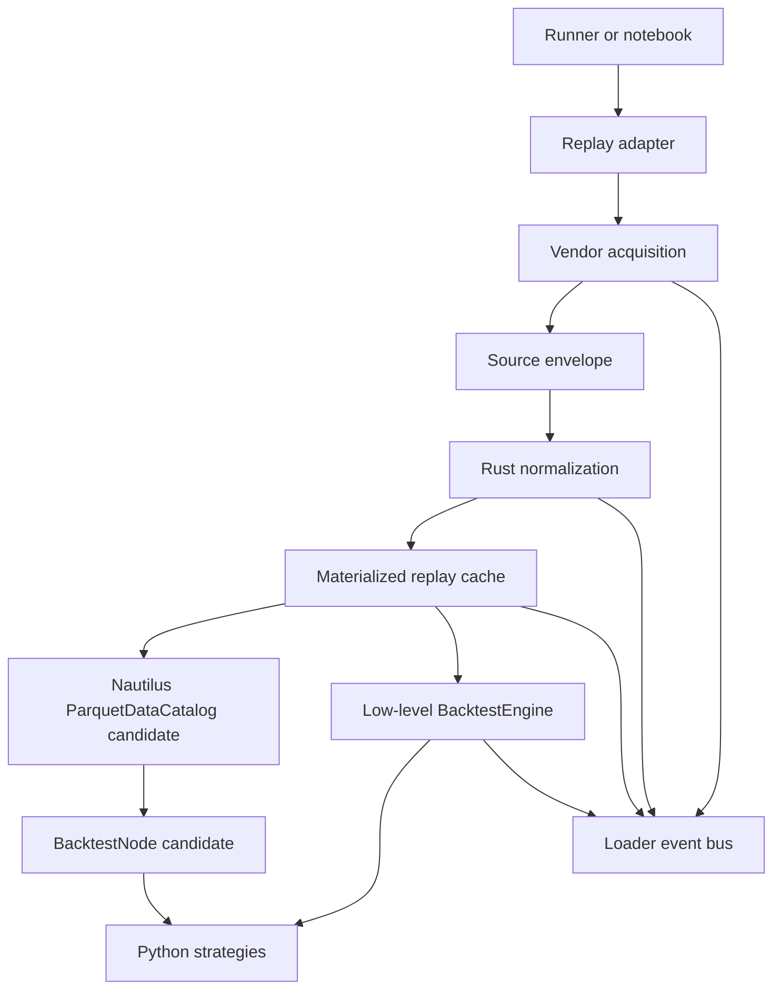

# V4 Rust Data Loading Plan

V4 should make backtests faster without making them less trustworthy. The main
change is not "rewrite everything in Rust." The main change is to make the data
path explicit, observable, unified after vendor fetch, and replaceable one
conversion function at a time.

The current Python layer remains valuable for runner ergonomics, strategy
authoring, experiment configuration, notebooks, reports, and high-level
realism policy. Rust should own the hot data path once bytes or Arrow tables
are on the machine.

## Goals

- Preserve maximum backtest realism while reducing wall-clock time.
- Account for every data source touch: local files, filtered caches, remote
  archives, Polymarket Gamma, Polymarket CLOB, public trade APIs, Telonex API,
  and Kalshi APIs.
- Emit structured, timestamped loader events for every stage that can affect
  trust or latency.
- Keep L2 book replay native. No downsampling into the engine.
- Integrate trade ticks into book replay for order matching.
- Make vendor-specific fetch logic converge into one normalized replay
  pipeline once data reaches the device.
- Use Rust for CPU-heavy conversion, validation, cache IO, sorting, and
  replay materialization.
- Evaluate Nautilus `ParquetDataCatalog` as the long-term replay store, not as
  a speculative rewrite.
- Replace one function at a time with parity tests against the Python
  implementation.

## Non-Goals

- Do not rewrite strategies in Rust during the first V4 data-loading phase.
- Do not replace Nautilus matching, portfolio, accounting, or strategy runtime
  unless a later benchmark proves the engine path is the bottleneck.
- Do not silently drop L2 depth, skip trade ticks, hide missing-hour gaps, or
  weaken timestamp checks for speed.
- Do not add backwards-compatible quote/trade replay aliases.
- Do not make progress output quiet by default.

## Realism Invariants

- Replay spec stays `BookReplay`.
- Data type stays `"book"`.
- Validation stays `min_book_events`, not quote or trade aliases.
- PMXT missing hours must warn and reset book state before applying later
  incremental deltas.
- `instrument.info` must not expose resolution result keys to strategies during
  simulation.
- Trade ticks remain interleaved with book deltas for execution matching.
- Normal runs should be warning-free except for warnings that identify real
  data coverage, API, cache, or simulation risk.
- Cache hits must be versioned and auditable; stale or mismatched cache files
  must be ignored or rebuilt loudly.

## Architecture

The V4 pipeline has five layers.

1. Vendor acquisition:
   vendor-specific network and local-source logic. This layer knows PMXT,
   Telonex, Polymarket, and Kalshi endpoint details.

2. Source envelope:
   source bytes or Arrow tables plus metadata. This layer records origin,
   source priority, byte counts, row counts, content hash when cheap enough,
   and elapsed time.

3. Normalization:
   Rust converts vendor schemas into canonical book/trade columns. This layer
   validates timestamps, token IDs, market IDs, sides, price bounds, and
   required columns.

4. Materialized replay:
   converted canonical data is persisted as replay-ready book delta and trade
   tick tables, with schema and converter versions in metadata.

5. Engine loading:
   Python or Nautilus catalog loads replay records into `BacktestEngine` or
   `BacktestNode`. This layer must preserve event ordering and call
   `sort_data()` exactly once for low-level multi-instrument loads.



## Current Loader Diagnosis

The 100-market Telonex runner exposed a contract problem that is easy to miss:
users naturally describe research windows as half-open ranges, such as April
21 to April 28 for one week, while several loader internals currently walk
calendar days inclusively. That can touch the boundary day, fetch empty book
data, fall back to public trade APIs, and skip otherwise usable markets when
the fallback hits Polymarket's historical offset ceiling.

That behavior is correct in one narrow sense: the runner refuses to trust
incomplete trade data. It is wrong as an ingestion architecture because window
semantics are duplicated across book loaders, trade loaders, timing progress,
and cache keys.

V4 should fix this before chasing speed. The unified ingestion layer must own
window planning once and make every vendor consume that same plan.

## Unified Ingestion Contract

Yes, the loader should be unified. Vendor acquisition stays vendor-specific,
but replay planning, source accounting, conversion, validation, cache writes,
and engine handoff should be one pipeline.

### Replay Load Request

Every runner replay should be normalized into a single request object before
PMXT, Telonex, Polymarket-native, or Kalshi code runs:

- `platform`
- `vendor`
- `data_type`
- `market_slug`
- `condition_id` when known
- `token_id` when known
- `token_index`
- `outcome`
- `requested_start_ns`
- `requested_end_ns`
- `window_semantics`: `half_open` or `inclusive`
- `required_books`: true for L2 replay
- `required_trades`: true when execution matching needs trade ticks
- `source_priority`
- `cache_policy`
- `replay_metadata`

Runner-facing APIs should prefer half-open windows. If a runner wants all of
April 21 through April 27, it can say:

```text
start = 2026-04-21T00:00:00Z
end = 2026-04-28T00:00:00Z
window_semantics = half_open
```

The ingestion plan then expands that into source-day work for April 21 through
April 27 only. Inclusive end timestamps can still exist for compatibility, but
they should be normalized before source IO starts.

### Replay Work Plan

The request is converted into a deterministic work plan:

- normalized replay window in nanoseconds
- source-day or source-hour partitions that overlap the window
- per-partition clipped start and end timestamps
- expected cache keys
- book/trade requirements
- source fallback order
- event labels for progress and trace output

This work plan is the contract shared by:

- progress bars
- loader events
- cache reads
- remote/local fetches
- trade fallback
- Rust conversion
- cache writes
- final engine loading

No vendor loader should independently decide which calendar days or hours to
load after the work plan exists.

### Source Envelope

Each vendor source returns a source envelope, not final replay data:

- request/work-plan ID
- vendor
- source kind: cache, local, remote, catalog
- source URI or cache path
- partition label
- raw bytes, Arrow table, or existing materialized record table
- row count and byte count
- elapsed time
- warnings and retry metadata

Rust normalization receives envelopes and produces canonical replay tables.

### Canonical Output

Every vendor converges to the same outputs:

- canonical book delta table
- canonical trade tick table
- replay manifest
- structured loader events

The Python layer can still build Nautilus objects at the boundary until the
catalog path is proven.

## Message Bus

All loader output should flow through a repo event bus before it reaches the
console. The console renderer is one sink, not the event system itself.

### Log Line Format

Human-readable output should use:

```text
2026-03-21T11:27:25.353784800Z [INFO] file_origin.function_name: Information here
```

Rules:

- Timestamps are UTC, nanosecond-formatted, and end in `Z`.
- Levels are `DEBUG`, `INFO`, `WARNING`, and `ERROR`.
- Origin is `module.function` for Python and `crate::module::function` for
  Rust.
- One event may render as one or more lines, but each rendered line gets its
  own timestamp.
- Warnings and errors must be explicit about whether data was skipped,
  partially loaded, invalidated, or retried.

### Event Schema

The internal event should be structured:

```python
LoaderEvent(
    level="INFO",
    stage="fetch",
    vendor="pmxt",
    source_kind="local",
    source="local:/Volumes/storage/pmxt_data",
    market_id="will-openais-market-cap...",
    token_id="...",
    window_start_ns=1772148680696317000,
    window_end_ns=1776133108127538300,
    rows=25000,
    bytes=4194304,
    elapsed_ms=123.4,
    status="complete",
    message="Loaded PMXT local raw hour",
    attrs={"hour": "2026-02-22T11:00:00Z"},
)
```

Required fields:

- `level`
- `stage`
- `vendor`
- `status`
- `message`
- `origin`
- `timestamp_ns`

Optional fields:

- `platform`
- `data_type`
- `source_kind`
- `source`
- `cache_path`
- `market_id`
- `market_slug`
- `token_id`
- `condition_id`
- `outcome`
- `window_start_ns`
- `window_end_ns`
- `rows`
- `book_events`
- `trade_ticks`
- `bytes`
- `elapsed_ms`
- `attempt`
- `attrs`

### Stages

- `discover`: market metadata lookup.
- `fetch`: network or local file read.
- `scan`: Arrow/Parquet scan.
- `decode`: JSON or vendor payload decode.
- `normalize`: vendor schema to canonical schema.
- `validate`: timestamp, token, side, price, and coverage checks.
- `cache_read`: materialized replay cache read.
- `cache_write`: materialized replay cache write.
- `catalog_read`: Nautilus catalog read.
- `catalog_write`: Nautilus catalog write.
- `merge`: book/trade interleave and sort.
- `engine_load`: adding data to Nautilus.
- `engine_run`: starting and completing simulation.
- `report`: artifact and HTML/report generation.

### Status Values

- `start`
- `progress`
- `complete`
- `skip`
- `retry`
- `fallback`
- `cache_hit`
- `cache_miss`
- `invalid`
- `error`

### Sinks

Initial sinks:

- Console renderer.
- Test capture sink.

Planned sinks:

- JSONL trace file under `output/traces/`.
- Progress bar adapter for PMXT/Telonex hour/day progress.
- Nautilus logger bridge for engine-adjacent status.
- Notebook capture sink that can be hidden or summarized without losing trace
  data.

### Rust Emission

Rust code should not print directly. It should emit one of these:

- a PyO3 callback that accepts event dictionaries,
- a batch of serialized `LoaderEvent` values returned to Python, or
- a lock-free queue drained by Python during long conversions.

The first implementation can use a PyO3 callback because it is simplest and
testable. Hot loops should batch progress events instead of calling Python on
every row.

## Unified Data Model

Vendor fetch stays vendor-specific. After fetch, each vendor should produce the
same canonical tables.

### Canonical Book Delta Table

Columns:

- `event_index`: int64
- `action`: uint8
- `side`: uint8
- `price`: int64 or decimal string, pending precision decision
- `size`: int64 or decimal string, pending precision decision
- `flags`: uint8
- `sequence`: int64
- `ts_event`: int64 nanoseconds
- `ts_init`: int64 nanoseconds
- `instrument_id`: string
- `source_vendor`: string
- `source_kind`: string

Notes:

- `event_index` groups rows that form one `OrderBookDeltas` event.
- `RecordFlag.F_LAST` must be correct within each event.
- Price/size precision must round-trip through Nautilus instrument factories.
- The table must be sorted by `(ts_event, event_priority, ts_init)` before
  engine loading.

### Canonical Trade Tick Table

Columns:

- `price`: int64 or decimal string, pending precision decision
- `size`: int64 or decimal string, pending precision decision
- `aggressor_side`: uint8
- `trade_id`: string
- `ts_event`: int64 nanoseconds
- `ts_init`: int64 nanoseconds
- `instrument_id`: string
- `source_vendor`: string
- `source_kind`: string

### Replay Manifest

Each materialized cache write includes a manifest row or sidecar metadata:

- schema version
- converter name and version
- git commit when available
- Python package version when available
- Rust crate version
- Nautilus version
- platform
- vendor
- data type
- market slug
- condition ID
- token ID
- outcome
- requested window
- loaded window
- source priority
- source files or URLs
- row counts
- book event count
- trade tick count
- warnings
- content hash for source files when practical

## Materialized Cache And Catalog Plan

### Short-Term Cache

Use a repo-owned materialized replay cache first because it gives full control
over parity and invalidation.

Candidate path:

```text
~/.cache/nautilus_trader/prediction-market-replay-v4/
  polymarket/
    pmxt/
      book/
        <condition_id>/<token_id>/<window_hash>/
          book_deltas.parquet
          trade_ticks.parquet
          manifest.json
    telonex/
      book/
        <market_slug>/<outcome_or_token>/<window_hash>/
          book_deltas.parquet
          trade_ticks.parquet
          manifest.json
```

Rules:

- Cache keys include vendor, market, token, window, data schema version, and
  converter version.
- Failed writes use temp files and atomic rename.
- Corrupt cache files are removed or quarantined with a warning.
- Cache hit output must say which cache file was used.

### Nautilus Catalog Evaluation

Nautilus documentation recommends the `ParquetDataCatalog` and streaming
`BacktestNode` path for large data and repeated runs. V4 should evaluate it
after the repo cache schema is stable.

Evaluation questions:

- Can the catalog store and query our `OrderBookDeltas` and `TradeTick` records
  without losing prediction-market instrument metadata?
- Can we avoid Python object reconstruction until the final engine boundary?
- Does catalog streaming preserve our book/trade event ordering?
- Can cache manifests record source realism metadata outside Nautilus catalog
  files?
- Does `BacktestNode` reduce peak memory for many-market research?

References:

- <https://nautilustrader.io/docs/latest/concepts/backtesting/>
- <https://nautilustrader.io/docs/latest/concepts/data/>
- <https://nautilustrader.io/docs/latest/concepts/rust/>

## Rust Crate Plan

Add a workspace:

```text
Cargo.toml
crates/
  core/
    Cargo.toml
    src/
      lib.rs
      events.rs
      windows.rs
      pmxt.rs
      telonex.rs
      trades.rs
      cache.rs
      validate.rs
      merge.rs
  python/
    Cargo.toml
    pyproject.toml
    src/
      lib.rs
prediction_market_extensions/
  _native.py
  _native_ext.*.so
```

Python package binding options:

- `pyo3` plus `maturin` for `prediction_market_extensions._native`.
- Keep native import optional in local dev until build packaging is stable.
- Release wheels should include native code or fail clearly for V4 native-only
  paths.

Current local-dev build:

```bash
make native-develop
```

This builds `crates/python` and installs the optional
`prediction_market_extensions._native_ext` extension for the active `uv`
environment. Python code imports through `prediction_market_extensions._native`
so the loader can fall back to the Python mirror when the extension is not
built, or fail fast with `PREDICTION_MARKET_NATIVE_REQUIRE=1`.

Rust dependencies to evaluate:

- `pyo3`
- `arrow`
- `parquet`
- `serde`
- `serde_json` or `simd-json`
- `thiserror`
- `tracing`
- `rayon`

Do not add all dependencies at once. Add only what the next conversion slice
uses.

## Conversion Inventory

Runners stay in Python. The conversion target is the loader, conversion,
validation, cache, and replay-materialization path underneath those runners.
This is the current file inventory for V4.

| File or module | V4 Rust plan | Current status |
| --- | --- | --- |
| `backtests/*.py` | Keep Python. Runner files remain user-editable experiment specs. | Out of Rust scope. |
| `backtests/*.ipynb` | Keep Python/notebook UX. Use native loaders underneath. | Out of Rust scope. |
| `prediction_market_extensions/_native.py` | Keep as the Python facade for native calls, fallback controls, and `PREDICTION_MARKET_NATIVE_REQUIRE`. | Active bridge. |
| `prediction_market_extensions/_runtime_log.py` | Keep Python event bus sink registry; add Rust event emission into it. | Active bridge. |
| `crates/core/src/windows.rs` | Own shared replay window, day, and hour planning. | Started: Telonex days and PMXT archive hours. |
| `crates/core/src/time.rs` | Own timestamp decimal parsing and timestamp unit conversion used in hot loader loops. | Started: PMXT seconds-to-nanoseconds and seconds-to-milliseconds conversion. |
| `crates/core/src/events.rs` | Define Rust-side loader event structs and serialization. | Started. |
| `crates/core/src/pmxt.rs` | Move PMXT payload decode, validation, token filtering, and snapshot/price-change conversion. | Started: payload sort-key extraction. |
| `crates/core/src/telonex.rs` | Move Telonex snapshot conversion, trade conversion, cache manifest validation, source accounting, cache path planning, and day assembly. | Started: source labels, date windows, API URLs, cache paths, and local path candidates. |
| `crates/core/src/trades.rs` | Move public Polymarket and Telonex trade row normalization. | Started: Polymarket public trade sort keys, side/price validation, event timestamp tie-breakers, and trade IDs. |
| `crates/core/src/cache.rs` | Move replay cache manifests, version checks, atomic writes, and corruption handling. | Planned. |
| `crates/core/src/validate.rs` | Move timestamp, side, price, size, token, and market validation. | Planned. |
| `crates/core/src/merge.rs` | Move book/trade interleave and stable replay sort. | Planned. |
| `crates/python/src/lib.rs` | Expose safe PyO3 bindings only; no business logic beyond conversion errors. | Active bridge. |
| `prediction_market_extensions/adapters/polymarket/pmxt.py` | Convert deterministic planning, PMXT timestamp conversion, JSON decode, Arrow filtering, snapshot/price-change-to-deltas, and missing-hour reset support. Keep source selection and Nautilus object boundary in Python until catalog path is proven. | Started: archive-hour planning, timestamp conversion, and payload sort keys. |
| `prediction_market_extensions/backtesting/data_sources/pmxt.py` | Convert PMXT raw/local/archive partition planning, source accounting, row-count summaries, and cache IO helpers. Keep source-priority config in Python. | Planned. |
| `prediction_market_extensions/backtesting/data_sources/telonex.py` | Convert day planning, Telonex parquet read/validate, snapshot-to-deltas, trade conversion, and materialized cache reads/writes. Keep API credential/source config in Python. | Started: source-day planning. |
| `prediction_market_extensions/backtesting/data_sources/replay_adapters.py` | Convert loaded-window calculation, book/trade day planning, book/trade merge, stable sort, and trade-cache normalization. Keep high-level orchestration in Python. | Started: trade day planning. |
| `prediction_market_extensions/adapters/polymarket/loaders.py` | Convert Polymarket public trade normalization and validation after API bytes arrive. Keep Gamma/CLOB HTTP calls in Python. | Started: public trade sorting, side/price validation, event timestamp tie-breakers, and trade ID generation. |
| `prediction_market_extensions/backtesting/data_sources/polymarket_native.py` | Convert Polymarket-native response normalization and replay planning. Keep endpoint selection in Python. | Planned after PMXT/Telonex. |
| `prediction_market_extensions/adapters/kalshi/loaders.py` | Convert Kalshi response normalization only after Polymarket loaders are stable. Keep API calls in Python. | Later. |
| `prediction_market_extensions/backtesting/data_sources/kalshi_native.py` | Convert Kalshi replay planning and validation only after Polymarket loaders are stable. | Later. |
| `prediction_market_extensions/backtesting/data_sources/_common.py` | Move shared request/work-plan dataclasses to a Rust-backed schema once stable. | Planned. |
| `prediction_market_extensions/backtesting/data_sources/registry.py` | Keep Python registry; it maps user-facing specs to loaders. | Mostly out of Rust scope. |
| `prediction_market_extensions/backtesting/data_sources/platforms.py` | Keep Python enums/constants unless shared schema generation needs Rust parity. | Mostly out of Rust scope. |
| `prediction_market_extensions/backtesting/data_sources/vendors.py` | Keep Python enums/constants unless shared schema generation needs Rust parity. | Mostly out of Rust scope. |
| `prediction_market_extensions/backtesting/data_sources/data_types.py` | Keep Python enums/constants; preserve `"book"` only. | Mostly out of Rust scope. |
| `prediction_market_extensions/backtesting/_prediction_market_backtest.py` | Keep Python orchestration, strategy config, and Nautilus integration. Use native loaders underneath. | Out of hot-path conversion except loader hooks. |
| `prediction_market_extensions/backtesting/_backtest_runtime.py` | Keep Python process/runtime wrapper; route native events into the bus. | Out of hot-path conversion. |
| `scripts/_pmxt_raw_download.py` | Later convert archive listing/download manifests and checksum validation if profiling shows it matters. | Later. |
| `scripts/_telonex_data_download.py` | Later convert bulk download manifest and parquet validation helpers. | Later. |
| `tests/test_native.py` | Add parity tests for every native function and fallback mirror. | Active. |
| `tests/test_polymarket_pmxt_cache.py` | Keep as PMXT parity and behavior safety net while moving functions to Rust. | Active. |
| `tests/test_pmxt_data_source.py` | Keep as source-priority and PMXT runner-loader safety net. | Active. |
| `tests/test_telonex_data_source.py` | Keep as Telonex parity and API/cache behavior safety net. | Active. |
| `tests/test_replay_adapter_architecture.py` | Keep as replay-contract safety net. | Active. |
| `tests/test_polymarket_native_data_source.py` | Keep as Polymarket-native loader safety net. | Active. |
| `tests/test_kalshi_native_data_source.py` | Keep as later Kalshi parity safety net. | Later. |

## Performance-Priority Conversion Targets

Early Rust helpers are useful for parity and interface hardening, but they are
not the main speed win. Benchmarks on the first helper slices showed that
small PyO3 calls around Python dictionaries can be slower than pure Python
because Python still owns allocation, JSON objects, and Nautilus object
construction. The remaining work should move larger chunks across the native
boundary.

Prioritize these conversions:

1. `prediction_market_extensions/backtesting/data_sources/telonex.py`
   day-level parquet/API payload loading through snapshot-to-delta and trade
   conversion. Rust should receive bytes or Arrow batches and return canonical
   replay tables.
2. `prediction_market_extensions/adapters/polymarket/pmxt.py` raw-hour
   filtering, payload JSON decode, book mutation, and PMXT
   `OrderBookDeltas` materialization. This is the biggest PMXT CPU loop.
3. `prediction_market_extensions/backtesting/data_sources/telonex.py`
   materialized cache read/write for book deltas and trade ticks. This should
   use Rust Arrow/parquet tables with schema/version metadata instead of
   pandas dataframes.
4. `prediction_market_extensions/backtesting/data_sources/replay_adapters.py`
   book/trade merge, replay sort, coverage-window calculation, and trade-cache
   normalization.
5. `prediction_market_extensions/backtesting/data_sources/pmxt.py` PMXT
   source planning, source accounting, and archive/local batch loading once
   the core PMXT converter has a stable Rust boundary.
6. `prediction_market_extensions/adapters/polymarket/loaders.py` public trade
   page normalization after API bytes arrive. This is secondary because the
   API is often network-bound, but it should share the same trade converter as
   Telonex.
7. `scripts/_pmxt_raw_download.py` and `scripts/_telonex_data_download.py`
   manifest/checksum/catalog helpers only after profiling shows download
   tooling is slowing repeated research.

Do not spend more time converting one-row helpers unless they unblock a larger
chunk boundary. The target unit of native work should be a source partition:
one Telonex day, one PMXT hour, one cached replay table, or one trade page.

## Conversion Roadmap

### Slice 0: Message Bus Foundation

Scope:

- Turn `_runtime_log.py` into a structured event bus.
- Add `LoaderEvent` dataclass or typed dict.
- Add console and test sinks.
- Route current progress/status output through event helpers.
- Preserve existing progress bar behavior.

Tests:

- Formatting tests.
- Event schema validation tests.
- Console sink tests.
- Existing PMXT/Telonex progress tests.

### Slice 1: Rust Smoke Module

Scope:

- Add Rust workspace and PyO3 module.
- Expose one non-loader function, such as `native_available()` or timestamp
  formatting.
- Wire build instructions into setup docs only after local install works.

Tests:

- Rust unit test.
- Python import test.
- Python fallback test.

### Slice 2: Canonical Replay Schema

Scope:

- Define the shared replay request and work-plan model in Python.
- Add Rust structs for the same request and work-plan fields.
- Add tests for half-open versus inclusive window expansion.
- Define Python schema constants.
- Define Rust schema builders.
- Add manifest format and validation.
- Add empty-table round-trip tests.

Tests:

- April 21 to April 28 half-open expands to April 21 through April 27 only.
- Inclusive one-day windows still load that day.
- Schema equality between Python and Rust.
- Manifest invalidation tests.
- Corrupt cache quarantine tests.

### Slice 3: Trade Tick Conversion

Scope:

- Convert Polymarket public trade rows and Telonex trade/onchain fill rows into
  canonical trade tick columns.
- Keep Python `TradeTick` object construction at the boundary at first.
- Consume the shared work plan instead of recomputing trade days.

Why first:

- Smaller state surface than book diffing.
- Easy parity: input rows to output rows.
- Covers the user's complaint that internal Polymarket API pulls were not
  visible enough.

Tests:

- Same trade IDs as Python.
- Same timestamp tie-breakers.
- Same aggressor-side behavior.
- Same invalid price skips and warnings.
- Same source logging.

### Slice 4: Telonex Snapshot-To-Deltas

Scope:

- Convert full-book snapshots to L2 deltas in Rust.
- Preserve first snapshot behavior.
- Preserve per-level diff semantics.
- Preserve bid/ask ordering and `F_LAST`.
- Consume the shared work plan instead of recomputing Telonex book days.

Tests:

- Python oracle on small hand-written books.
- Realistic fixture with nested and flat columns.
- Empty frame behavior.
- Timestamp bounds.
- Cache write/read parity.

### Slice 5: PMXT Payload Decode

Scope:

- Decode PMXT `book_snapshot` and `price_change` JSON payloads in Rust.
- Filter by condition ID and token ID.
- Produce canonical book delta columns.
- Preserve missing-hour reset behavior in Python orchestration or Rust state
  machine.

Tests:

- Snapshot parse parity.
- Price-change parse parity.
- Hour sorting parity.
- Missing-hour gap warning and book reset.
- Start/end bounds.
- Local raw, filtered cache, and remote archive source labels.

### Slice 6: Replay Merge And Sort

Scope:

- Merge canonical book and trade tables.
- Preserve ordering:
  book deltas before trade ticks at the same `ts_event`, then `ts_init`.
- Emit merged record counts and loaded window.

Tests:

- Mixed event ordering.
- Duplicate timestamp handling.
- Coverage window calculation.
- No event loss.

### Slice 7: Nautilus Object Boundary

Scope:

- Decide where Rust stops and Nautilus Python/PyO3 objects begin.
- Option A: Rust writes canonical Parquet, Python builds Nautilus objects.
- Option B: Rust returns PyO3 Nautilus objects.
- Option C: Rust writes Nautilus catalog-compatible Parquet.

Preferred sequence:

1. Option A for safety and parity.
2. Option C for performance and streaming.
3. Option B only if it materially reduces overhead and is maintainable.

Tests:

- Same `OrderBookDeltas` and `TradeTick` objects as current path.
- Same fills, PnL, drawdown, Brier metrics, and warnings on representative
  runners.

### Slice 8: Catalog Backtest Prototype

Scope:

- Write converted records into `ParquetDataCatalog`.
- Run one single-market PMXT replay from catalog.
- Run one joint-portfolio replay from catalog.
- Compare with low-level engine path.

Tests:

- Event count parity.
- Fill parity.
- PnL parity.
- Peak memory comparison.
- Wall-clock comparison.

### Slice 9: Optimizer Data Reuse

Scope:

- Pre-materialize each train/holdout window once.
- Reuse replay cache across parameter trials.
- Add configurable worker count for random-grid trials.

Tests:

- Same train/holdout ranking.
- Same median score semantics.
- Same joint-portfolio drawdown semantics.
- No stale data when parameter search windows change.

## Vendor-Specific Plans

### PMXT

Current sources:

- filtered cache
- local raw mirror
- remote archive fallback

V4 plan:

- Keep source priority behavior.
- Rust scans raw/filtered Arrow batches once available.
- Rust decodes JSON payloads.
- Python coordinates source selection until the Rust source envelope is mature.
- Missing hours remain first-class warnings and invalidate incremental book
  state.

### Telonex

Current sources:

- local Hive-partitioned mirror
- API-day cache
- API fallback
- materialized book-deltas and trade-ticks caches

V4 plan:

- Keep the local mirror and API fallback rules.
- Move snapshot differ and trade conversion to Rust.
- Keep manifest completeness checks before using local data.
- Preserve warnings for incomplete or unreadable partitions.

### Polymarket Native

Current sources:

- Gamma API for metadata.
- CLOB API for market details and fees.
- public data API for trades.

V4 plan:

- Every API request emits `start` and `complete` or `error`.
- Trade conversion moves to Rust.
- Public trade API offset ceiling remains a hard reliability concern when no
  better source exists.
- Native API pulls are not allowed to look like cache hits in output.

### Kalshi

Current sources:

- market API
- trade API
- candlestick API

V4 plan:

- Keep API fetching in Python initially.
- Add structured events for API pages and parse stages.
- Consider Rust trade/bar conversion only after Polymarket/Telonex book replay
  is stable.

## Verification Matrix

Every Rust replacement must pass:

- unit tests for the replaced function
- Python oracle parity tests
- source logging tests
- cache read/write tests when cache behavior changes
- one focused loader test file
- one representative runner smoke if replay semantics can change

Baseline commands:

```bash
uv run ruff check .
uv run ruff format --check .
uv run pytest tests/ -q
```

Representative smoke checks:

```bash
uv run python backtests/polymarket_book_ema_crossover.py
uv run python backtests/polymarket_book_joint_portfolio_runner.py
uv run python backtests/polymarket_telonex_book_joint_portfolio_runner.py
```

When touching docs navigation:

```bash
uv run mkdocs build --strict
```

## Rollout Controls

Use explicit feature flags during migration:

- `PREDICTION_MARKET_NATIVE=0`: force Python path.
- `PREDICTION_MARKET_NATIVE=1`: prefer native path where implemented.
- `PREDICTION_MARKET_NATIVE_REQUIRE=1`: fail if native path is unavailable.
- `PREDICTION_MARKET_TRACE_JSONL=/path/to/trace.jsonl`: write structured loader events.
- `PREDICTION_MARKET_REPLAY_CACHE=0`: disable materialized replay cache.
- `PREDICTION_MARKET_REPLAY_CACHE_DIR=/path`: override replay cache root.
- `PREDICTION_MARKET_CATALOG_EXPERIMENT=1`: use catalog prototype paths only.

Default during early V4:

- Python path remains available.
- Native path is opt-in for new slices until parity is proven.
- Once a slice is proven, native can become default with Python fallback.

## Performance Metrics

Each representative run should report:

- total wall time
- source fetch time
- scan time
- decode/normalize time
- cache read/write time
- Nautilus object construction time
- engine data load time
- engine run time
- report generation time
- rows scanned
- rows matched
- book events emitted
- trade ticks emitted
- cache hit/miss
- RSS peak when practical

Do not report a speedup without the matching realism parity summary.

## Open Decisions

- Price and size canonical representation: scaled integers, decimal strings,
  or Arrow decimal.
- Whether Rust should construct Nautilus PyO3 objects directly or only produce
  canonical Arrow tables.
- How soon to make `ParquetDataCatalog` the default for repeated runs.
- Whether JSONL tracing is always on for runners or opt-in by environment.
- How much source content hashing is practical for very large local mirrors.
- Packaging strategy for macOS/Linux wheels and local development.

## First Implementation Order

1. Expand `_runtime_log.py` into a structured event bus.
2. Add JSONL and test sinks.
3. Keep routing current Python loader events through the bus.
4. Add Rust workspace with a tiny smoke function.
5. Add the unified replay request and work-plan model.
6. Add Rust/Python parity tests for window expansion and partition planning.
7. Define canonical schemas and replay manifest.
8. Move trade conversion to Rust.
9. Move Telonex snapshot diffing to Rust.
10. Move PMXT JSON decoding to Rust.
11. Add materialized replay cache v4.
12. Prototype Nautilus catalog replay.
13. Optimize optimizer data reuse.
