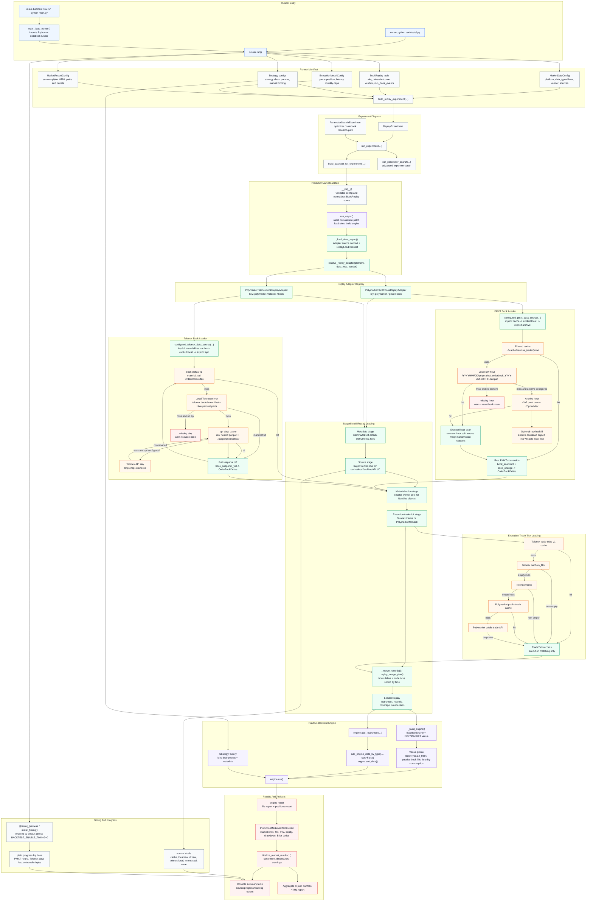

# Runner Execution Flow

```mermaid
flowchart TD
  classDef entry fill:#eef6ff,stroke:#2563eb,color:#111827
  classDef config fill:#f8fafc,stroke:#64748b,color:#111827
  classDef load fill:#ecfdf5,stroke:#059669,color:#111827
  classDef cache fill:#fff7ed,stroke:#ea580c,color:#111827
  classDef engine fill:#f5f3ff,stroke:#7c3aed,color:#111827
  classDef output fill:#fef2f2,stroke:#dc2626,color:#111827

  subgraph Entry["Runner Entry"]
    Direct["uv run python backtests/<runner>.py"]:::entry
    Menu["make backtest / uv run python main.py"]:::entry
    LoadRunner["main._load_runner()<br/>imports Python or notebook runner"]:::entry
    RunnerRun["runner.run()"]:::entry
    Direct --> RunnerRun
    Menu --> LoadRunner --> RunnerRun
  end

  subgraph Manifest["Runner Manifest"]
    DataConfig["MarketDataConfig<br/>platform, data_type=Book, vendor, sources"]:::config
    ReplaySpecs["BookReplay tuple<br/>slug, token/outcome, window, min_book_events"]:::config
    StrategyConfigs["Strategy configs<br/>strategy class, params, market binding"]:::config
    ExecutionConfig["ExecutionModelConfig<br/>queue position, latency, liquidity caps"]:::config
    ReportConfig["MarketReportConfig<br/>summary/joint HTML paths and panels"]:::config
    ExperimentBuild["build_replay_experiment(...)"]:::config
    RunnerRun --> DataConfig
    RunnerRun --> ReplaySpecs
    RunnerRun --> StrategyConfigs
    RunnerRun --> ExecutionConfig
    RunnerRun --> ReportConfig
    DataConfig --> ExperimentBuild
    ReplaySpecs --> ExperimentBuild
    StrategyConfigs --> ExperimentBuild
    ExecutionConfig --> ExperimentBuild
    ReportConfig --> ExperimentBuild
  end

  subgraph Experiment["Experiment Dispatch"]
    ReplayExperiment["ReplayExperiment"]:::config
    ParameterSearch["ParameterSearchExperiment<br/>optimizer / notebook research path"]:::config
    RunExperiment["run_experiment(...)"]:::config
    BuildBacktest["build_backtest_for_experiment(...)"]:::config
    Optimizer["run_parameter_search(...)<br/>advanced experiment path"]:::config
    ExperimentBuild --> ReplayExperiment --> RunExperiment
    ParameterSearch --> RunExperiment
    RunExperiment --> BuildBacktest
    RunExperiment --> Optimizer
  end

  subgraph Backtest["PredictionMarketBacktest"]
    Init["__init__()<br/>validates config and normalizes BookReplay specs"]:::config
    RunAsync["run_async()<br/>install commission patch, load sims, build engine"]:::engine
    LoadSims["_load_sims_async()<br/>adapter source context + ReplayLoadRequest"]:::load
    AdapterResolve["resolve_replay_adapter(platform, data_type, vendor)"]:::load
    BuildBacktest --> Init --> RunAsync --> LoadSims --> AdapterResolve
  end

  subgraph AdapterRegistry["Replay Adapter Registry"]
    PMXTAdapter["PolymarketPMXTBookReplayAdapter<br/>key: polymarket / pmxt / book"]:::load
    TelonexAdapter["PolymarketTelonexBookReplayAdapter<br/>key: polymarket / telonex / book"]:::load
    AdapterResolve --> PMXTAdapter
    AdapterResolve --> TelonexAdapter
  end

  subgraph Stages["Staged Multi-Replay Loading"]
    MetadataStage["Metadata stage<br/>Gamma/CLOB details, instruments, fees"]:::load
    SourceStage["Source stage<br/>larger worker pool for cache/local/archive/API I/O"]:::load
    MaterializeStage["Materialization stage<br/>smaller worker pool for Nautilus objects"]:::load
    TradeStage["Execution trade-tick stage<br/>Telonex trades or Polymarket fallback"]:::load
    MergeStage["_merge_records() / replay_merge_plan()<br/>book deltas + trade ticks sorted by time"]:::load
    LoadedReplay["LoadedReplay<br/>instrument, records, coverage, source stats"]:::load
    PMXTAdapter --> MetadataStage
    TelonexAdapter --> MetadataStage
    MetadataStage --> SourceStage --> MaterializeStage --> TradeStage --> MergeStage --> LoadedReplay
  end

  subgraph PMXT["PMXT Book Loader"]
    PMXTSources["configured_pmxt_data_source(...)<br/>implicit cache -> explicit local: -> explicit archive:"]:::load
    PMXTCache["Filtered cache<br/>~/.cache/nautilus_trader/pmxt"]:::cache
    PMXTLocal["Local raw hour<br/><root>/YYYY/MM/DD/polymarket_orderbook_YYYY-MM-DDTHH.parquet"]:::cache
    PMXTArchive["Archive hour<br/>r2v2.pmxt.dev or r2.pmxt.dev"]:::cache
    PMXTGroup["Grouped hour scan<br/>one raw hour split across many market/token requests"]:::load
    PMXTConvert["Rust PMXT conversion<br/>book_snapshot + price_change -> OrderBookDeltas"]:::load
    PMXTBackfill["Optional raw backfill<br/>archive download copied into writable local root"]:::cache
    PMXTAdapter --> PMXTSources
    PMXTSources --> PMXTCache
    PMXTCache -- hit --> PMXTConvert
    PMXTCache -- miss --> PMXTLocal
    PMXTLocal -- hit --> PMXTGroup
    PMXTLocal -- miss and archive configured --> PMXTArchive
    PMXTLocal -- miss and no archive --> PMXTMiss["missing hour<br/>warn + reset book state"]:::output
    PMXTArchive -- hit --> PMXTGroup
    PMXTArchive --> PMXTBackfill
    PMXTGroup --> PMXTConvert --> MaterializeStage
  end

  subgraph Telonex["Telonex Book Loader"]
    TelonexSources["configured_telonex_data_source(...)<br/>implicit materialized cache -> explicit local: -> explicit api:"]:::load
    DeltasCache["book-deltas-v1<br/>materialized OrderBookDeltas"]:::cache
    LocalMirror["Local Telonex mirror<br/>telonex.duckdb manifest + Hive parquet parts"]:::cache
    ApiDayCache["api-days cache<br/>raw nested parquet + .fast.parquet sidecar"]:::cache
    TelonexAPI["Telonex API day<br/>https://api.telonex.io"]:::cache
    SnapshotConvert["Full snapshot diff<br/>book_snapshot_full -> OrderBookDeltas"]:::load
    TelonexMiss["missing day<br/>warn / source none"]:::output
    TelonexAdapter --> TelonexSources
    TelonexSources --> DeltasCache
    DeltasCache -- hit --> MaterializeStage
    DeltasCache -- miss --> LocalMirror
    LocalMirror -- manifest hit --> SnapshotConvert
    LocalMirror -- miss --> ApiDayCache
    ApiDayCache -- hit --> SnapshotConvert
    ApiDayCache -- miss and api configured --> TelonexAPI
    TelonexAPI -- downloaded --> ApiDayCache
    ApiDayCache --> SnapshotConvert
    SnapshotConvert --> DeltasCache
    SnapshotConvert --> MaterializeStage
    LocalMirror -- miss and no api --> TelonexMiss
  end

  subgraph Trades["Execution Trade-Tick Loading"]
    TelonexTradeCache["Telonex trade-ticks-v1 cache"]:::cache
    OnchainFills["Telonex onchain_fills"]:::cache
    TelonexTrades["Telonex trades"]:::cache
    PolyTradeCache["Polymarket public trade cache"]:::cache
    PolyTradeAPI["Polymarket public trade API"]:::cache
    TradeTicks["TradeTick records<br/>execution matching only"]:::load
    TradeStage --> TelonexTradeCache
    TelonexTradeCache -- miss --> OnchainFills
    OnchainFills -- empty/miss --> TelonexTrades
    TelonexTrades -- empty/miss --> PolyTradeCache
    PolyTradeCache -- miss --> PolyTradeAPI
    TelonexTradeCache -- hit --> TradeTicks
    OnchainFills -- non-empty --> TradeTicks
    TelonexTrades -- non-empty --> TradeTicks
    PolyTradeCache -- hit --> TradeTicks
    PolyTradeAPI -- response --> TradeTicks
    TradeTicks --> MergeStage
  end

  subgraph Engine["Nautilus Backtest Engine"]
    BuildEngine["_build_engine()<br/>BacktestEngine + POLYMARKET venue"]:::engine
    Venue["Venue profile<br/>BookType.L2_MBP, passive book fills, liquidity consumption"]:::engine
    AddInstrument["engine.add_instrument(...)"]:::engine
    AddData["add_engine_data_by_type(..., sort=False)<br/>engine.sort_data()"]:::engine
    AddStrategies["StrategyFactory<br/>bind instruments + metadata"]:::engine
    EngineRun["engine.run()"]:::engine
    LoadedReplay --> BuildEngine --> Venue
    LoadedReplay --> AddInstrument --> AddData
    StrategyConfigs --> AddStrategies
    Venue --> EngineRun
    AddData --> EngineRun
    AddStrategies --> EngineRun
  end

  subgraph Results["Results And Artifacts"]
    EngineReports["engine result<br/>fills report + positions report"]:::output
    Artifacts["PredictionMarketArtifactBuilder<br/>market rows, fills, PnL, equity, drawdown, Brier series"]:::output
    Finalize["finalize_market_results(...)<br/>settlement, disclosures, warnings"]:::output
    Console["Console summary table<br/>source/progress/warning output"]:::output
    HTML["Aggregate or joint portfolio HTML report"]:::output
    EngineRun --> EngineReports --> Artifacts --> Finalize
    Finalize --> Console
    Finalize --> HTML
  end

  subgraph Observability["Timing And Progress"]
    TimingHarness["@timing_harness / install_timing()<br/>enabled by default unless BACKTEST_ENABLE_TIMING=0"]:::config
    ProgressLines["plain progress log lines<br/>PMXT hours / Telonex days / active transfer bytes"]:::config
    SourceLabels["source labels<br/>cache, local raw, r2 raw, telonex local, telonex api, none"]:::config
    RunnerRun --> TimingHarness
    TimingHarness --> ProgressLines
    SourceStage --> SourceLabels
    SourceLabels --> Console
    ProgressLines --> Console
  end
```
